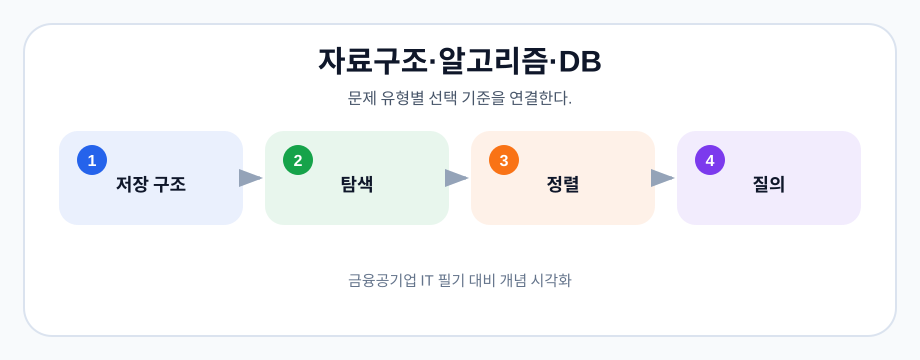

# 04-05. 자료구조·알고리즘·DB·금융IT

> 원본: `은행_공기업_IT_필기_핵심정리_가이드_.txt`
>
> 개인 학습용으로 위키독스 연동 저장소에 구조화한 필기 자료입니다. 원문 흐름을 보존하되, 페이지 단위가 아닌 학습 주제/기관 단위로 나누었습니다.

## 트리

> 중요도: **상** (★★★)

### 1. 개념

: 계층적 구조를 가진 데이터 구조로, 노드(Node)와 간선(Edge)으로 구성

### 2. 순회방법
- 전위 순회 (Pre-order Traversal): Root -> Left -> Right
- 중위 순회 (In-order Traversal): Left -> Root -> Right
- 후위 순회 (Post-order Traversal): Left -> Right -> Root

#### 트리 순회 예시

```text
        A
      /   \
     B     C
    / \   / \
   D   E F   G

전위 순회: A B D E C F G
중위 순회: D B E A F C G
후위 순회: D E B F G C A
```

| 순회 | 방문 순서 | 암기법 |
| --- | --- | --- |
| 전위 | Root → Left → Right | 루트가 먼저 |
| 중위 | Left → Root → Right | 루트가 가운데 |
| 후위 | Left → Right → Root | 루트가 마지막 |

### 3. 이진트리

**개념:** 각 노드가 최대 두 개의 자식 노드를 가지는 트리 구조임. 이진 트리는 매우 중요한 데이터
구조

응용
- 검색 알고리즘: 이진 검색 트리를 사용하여 빠른 검색, 삽입, 삭제 연산을 수행함.
- 힙(Heap): 우선순위 큐를 구현하는 데 사용됨.
- 최대힙(Max Heap) : 완전 이진 트리의 형태를 가진 데이터 구조
  Ex) 우선순위 큐, 힙 정렬, 그래프 알고리즘(다익스트라 알고리즘 등에서 최단경로 찾을때)
- 이진 표현식 트리(Binary Expression Tree): 수학적 표현을 트리 구조로 나타내는 데 사용됨.

> **출제 경향**   특히 공기업 필기 단골문제입니다. 트리의 전위/중위/후위 순회순서에 대한 문제가
90%고 가끔씩 이진트리 경로 구하는 문제됩니다.

> 그림: 문제 유형별 선택 기준을 연결한다.
> 출처: 이 저장소에서 생성한 학습용 다이어그램

## 인공지능

> 중요도: **중** (★★)

### 1. 약인공지능 (Weak AI)

  정의: 특정 작업이나 문제를 해결하는 데 특화된 인공지능으로, 제한된 기능과 응용 범위를 가짐.

  #### 특징
- 특정 작업에 특화: 특정한 작업이나 문제 해결에만 초점을 맞추며, 범용적인 지능을 가지지
  않음.
- 프로그래밍된 지식: 주어진 알고리즘과 데이터에 따라 동작하며, 스스로 학습하거나
  일반화된 지식을 가지지 않음.
- **예시:** 음성 인식 시스템, 추천 시스템, 챗봇, 이미지 인식, 자율주행 차의 특정 기능 등.

### 2. 강인공지능 (Strong AI)

  정의: 인간의 지능 수준에 도달하여 다양한 문제를 해결할 수 있는 범용 인공지능.

  #### 특징
- 범용 지능: 인간과 유사한 수준의 이해력과 문제 해결 능력을 가지며, 다양한 분야에서
  자율적으로 학습하고 적용할 수 있음.
- 자기 학습 능력: 새로운 상황이나 데이터를 스스로 학습하고, 기존 지식을 기반으로
  일반화할 수 있음.
- 의식과 자아: 일부 이론에서는 강인공지능이 자아와 의식을 가질 수 있다고 주장함.

### 3. 초인공지능 (Superintelligence)

 정의: 인간의 지능을 훨씬 초월하는 수준의 인공지능으로, 인간이 상상할 수 없는 수준의 문제
해결 능력을 가짐.

  #### 특징
- 극도로 높은 지능: 모든 인간 활동을 능가하는 지능을 가지며, 복잡한 문제를 이해하고
  해결하는 능력이 있음.
- 자기 개선 능력: 스스로를 개선하고 발전시켜 더 높은 수준의 지능을 지속적으로 얻을 수
  있음.
- 잠재적 위험성: 인간의 통제 범위를 넘어설 가능성이 있으며, 의도하지 않은 결과를 초래할
  수 있음.

#### 인공지능 유형 비교표

| 구분 | 범위 | 현재 실현 여부 | 예시/특징 |
| --- | --- | --- | --- |
| 약인공지능 | 특정 작업 | 실현 | 추천, 번역, 이미지 인식 |
| 강인공지능 | 인간 수준의 범용 지능 | 미실현 | 다양한 문제를 스스로 이해·학습 |
| 초인공지능 | 인간을 초월 | 미실현 | 자기 개선, 통제 위험 |

> **출제 경향**   각 인공지능의 특징을 물어보는 문제가 꽤 출제됩니다. 어렵지 않은 개념이니 꼭
숙지하기!

## 가상화 기술

> 중요도: **중** (★★)

### 1. 서버 가상화 기술

**개념:** 하나의 물리적 서버를 여러 개의 가상 서버로 나누어 사용하는 기술.

Ex) 하이퍼바이저

서버 가상화의 장점
- 자원 효율성: 물리적 서버 자원을 더 효과적으로 사용함.
- 유연성: 다양한 운영 체제와 애플리케이션을 동시에 실행 가능.
- 비용 절감: 하드웨어 구매 및 유지보수 비용을 절감함.
- 관리 용이성: 가상 머신을 쉽게 배포, 백업 및 복구할 수 있음.

서버 가상화의 단점
- 복잡성 증가: 관리와 설정이 복잡할 수 있음.
- 오버헤드: 하이퍼바이저의 오버헤드로 인해 성능이 일부 저하될 수 있음.

### 2. 컨테이너 기반 가상화 기술

**개념:** 애플리케이션과 그 의존성을 하나의 패키지로 묶어 격리된 환경에서 실행하는 기술임.
컨테이너는 가상 머신과 달리 하이퍼바이저를 사용하지 않고, 호스트 운영 체제의 커널을 공유하여
동작함.

Ex) Docker(도커)

컨테이너의 특징
- 경량화: 가상 머신보다 훨씬 가볍고, 빠르게 실행됨.
- 이식성: 한 환경에서 다른 환경으로 쉽게 이동 가능.
- 독립성: 각 컨테이너는 독립적으로 실행되며, 서로 격리됨.

컨테이너의 장점
- 빠른 시작 시간: 컨테이너는 가상 머신보다 빠르게 시작됨.
- 높은 자원 효율성: 호스트 운영 체제의 커널을 공유하여 자원 사용이 효율적임.
- 이식성: 개발 환경과 운영 환경 간의 일관성을 유지할 수 있음.

컨테이너의 단점
- 보안: 커널을 공유하므로, 가상 머신보다 보안 격리가 약할 수 있음.
- 복잡성: 대규모 컨테이너 관리가 복잡할 수 있음.
- 호환성: 특정 애플리케이션은 컨테이너화하기 어려울 수 있음.

#### VM vs 컨테이너 구조 비교

```text
가상 머신(VM)
[App] [App]
[Guest OS] [Guest OS]
[Hypervisor]
[Host OS]
[Hardware]

컨테이너
[App+Lib] [App+Lib]
[Container Runtime]
[Host OS Kernel 공유]
[Hardware]
```

| 구분 | 가상 머신 | 컨테이너 |
| --- | --- | --- |
| 격리 단위 | Guest OS 포함 | 애플리케이션과 의존성 |
| 커널 | 각 VM이 별도 OS 사용 | 호스트 커널 공유 |
| 시작 속도 | 상대적으로 느림 | 빠름 |
| 자원 사용 | 큼 | 작음 |
| 보안 격리 | 강함 | 상대적으로 약함 |

> **출제 경향**   가상화 관련 문제는 종종 출제됩니다. 객관식으로도 나오고 금융감독원 약술에서도
출제된 이력이 있으니 공기업을 준비한다면 참고하세요!

## 정렬알고리즘

> 중요도: **중** (★★)

### 1. 버블 정렬 (Bubble Sort):
- **설명:** 인접한 두 요소를 비교하여 순서가 맞지 않으면 서로 교환하며 정렬하는 방식
- **특징:** 간단하지만 효율성이 낮음 (시간 복잡도: O(n^2))

### 2. 선택 정렬 (Selection Sort):
- **설명:** 리스트에서 가장 작은 요소를 찾아 첫 번째 위치로 이동시키고, 이를 반복하여
  정렬하는 방식
- **특징:** 단순하지만 비효율적 (시간 복잡도: O(n^2))

### 3. 삽입 정렬 (Insertion Sort):
- **설명:** 정렬된 부분과 정렬되지 않은 부분을 나누고, 정렬되지 않은 요소를 올바른 위치에
  삽입하는 방식
- **특징:** 작은 데이터 세트에 효율적 (시간 복잡도: O(n^2))

### 4. 퀵 정렬 (Quick Sort):
- **설명:** 피벗을 선택하고 피벗보다 작은 요소와 큰 요소로 분할하여 재귀적으로 정렬하는 방식
- **특징:** 평균적으로 매우 빠름 (시간 복잡도: O(n log n)), 최악의 경우 O(n^2)

### 5. 병합 정렬 (Merge Sort):
- **설명:** 리스트를 반으로 나누고 각각을 재귀적으로 정렬한 후 병합하는 방식
- **특징:** 안정적이고 효율적 (시간 복잡도: O(n log n)), 추가 메모리 필요

### 6. 힙 정렬 (Heap Sort):
- **설명:** 최대 힙 또는 최소 힙을 구성하여 정렬하는 방식
- **특징:** 시간 복잡도 O(n log n), 추가 메모리 사용이 적음

#### 정렬 알고리즘 시간복잡도 표

| 알고리즘 | 평균 | 최악 | 안정성 | 핵심 아이디어 |
| --- | --- | --- | --- | --- |
| 버블 정렬 | O(n^2) | O(n^2) | 안정 | 인접 원소 교환 |
| 선택 정렬 | O(n^2) | O(n^2) | 불안정 | 최솟값 선택 |
| 삽입 정렬 | O(n^2) | O(n^2) | 안정 | 정렬된 구간에 삽입 |
| 퀵 정렬 | O(n log n) | O(n^2) | 불안정 | 피벗 기준 분할 |
| 병합 정렬 | O(n log n) | O(n log n) | 안정 | 분할 후 병합 |
| 힙 정렬 | O(n log n) | O(n log n) | 불안정 | 힙 구성 후 추출 |

> **암기 포인트**   퀵 정렬은 평균은 빠르지만 피벗이 나쁘면 최악 `O(n^2)`가 될 수 있습니다.

### 예시 문제

### 1. 퀵 정렬(Quick Sort)의 시간 복잡도는 평균적으로 어떻게 되는가?
1. O(n)
2. O(n^2)
3. O(n log n)
4. O(log n)

**정답:** 3. O(n log n)

> **출제 경향**   정렬알고리즘 코드를 주거나 상세한 설명을 묻는것보다는 아래 알고리즘은 어떤걸
뜻하는가? 또는 정렬알고리즘별 시간 복잡도를 묻는 문제가 나옵니다.
생각보다 자주 출제되니 각 정렬 알고리즘별 시간복잡도는 암기하는게 한문제라도 더 맞힐수 있는
기회입니다.

## 데이터베이스

> 중요도: **중** (★★)

### 1. 데이터베이스 구성요소
- 릴레이션 : 데이터베이스 내의 테이블을 의미함. 릴레이션은 행(튜플)과 열(속성)으로 구성됨.
- 튜플 : 릴레이션의 한 행을 의미하며, 하나의 개체 또는 레코드를 나타냄. 튜플은 여러
  속성들의 값으로 구성됨
- 속성 : 릴레이션의 한 열을 의미하며, 데이터의 한가지 특성을 나타냄. 각 속성은 특정
  도메인을 가짐, 즉 특정 유향의 값을 포함함.

### 2. 예시

| 학번(ID) | 이름(Name) | 전공(Major) | 학년(Year) |
| --- | --- | --- | --- |
| 1 | 홍길동 | 컴퓨터공학 | 2 |
| 2 | 이영희 | 수학 | 3 |
| 3 | 김철수 | 물리학 | 1 |
- 릴레이션: '학생' 테이블 전체.
- 튜플: 각 학생의 정보. 예를 들어, 첫 번째 튜플은 (1, 홍길동, 컴퓨터공학, 2).
- 속성: '학번', '이름', '전공', '학년'.

```text
릴레이션 = 테이블 전체

속성(Attribute)
  ↓      ↓      ↓      ↓
+------+------+------+-----+
| 학번 | 이름 | 전공 | 학년 |
+------+------+------+-----+
|  1   | 홍길동 | 컴공 |  2  |  ← 튜플(Tuple)
|  2   | 이영희 | 수학 |  3  |  ← 튜플(Tuple)
+------+------+------+-----+
```

### 3. 데이터베이스 관리자(DBA)

**개념:** 데이터베이스 시스템의 설계, 구현, 유지보수, 보안을 담당하는 전문가

역할
- 데이터베이스 설계 및 구축: 데이터베이스 구조를 설계하고, 새로운 데이터베이스 시스템을
  구축함.
- 성능 모니터링 및 최적화: 데이터베이스의 성능을 지속적으로 모니터링하고, 성능을
  최적화하기 위한 조치를 취함.
- 백업 및 복구: 데이터 손실에 대비해 정기적으로 데이터베이스 백업을 수행하고, 필요 시
  데이터를 복구함.
- 보안 관리: 데이터베이스에 대한 접근 제어를 설정하고, 데이터의 기밀성, 무결성, 가용성을
  보장함.
- 사용자 관리: 데이터베이스 사용자 계정을 생성하고, 권한을 부여하며, 사용자 활동을
  모니터링함.
- 업데이트 및 패치 적용: 데이터베이스 소프트웨어의 최신 업데이트와 보안 패치를 적용하여
  시스템을 최신 상태로 유지함.
- 문제 해결: 데이터베이스 관련 문제를 신속하게 진단하고 해결함.

### 4. 정규화

**개념:** 데이터베이스 설계에서 데이터를 구조화하여 중복을 최소화하고, 데이터 무결성을 유지하기
위한 프로세스

정규화 단계
- 제 1 정규형 (1NF):
  모든 열이 원자값을 가져야 함.
  중복된 열이나 반복되는 그룹이 없어야 함.
- 제 2 정규형 (2NF):
  제 1 정규형을 만족해야 함.
  기본 키가 아닌 모든 속성이 기본 키 전체에 종속적이어야 함.
  부분 종속성을 제거해야 함.
- 제 3 정규형 (3NF):
  제 2 정규형을 만족해야 함.
  기본 키가 아닌 모든 속성이 기본 키에 이행적으로 종속되지 않아야 함.
- BCNF (Boyce-Codd Normal Form):
  제 3 정규형을 강화한 형태임.
  모든 결정자가 후보 키여야 함.
- 제 4 정규형 (4NF):
  BCNF 를 만족해야 함.
  다치 종속성이 없어야 함.
- 제 5 정규형 (5NF):
  제 4 정규형을 만족해야 함.
  조인 종속성이 없어야 함.

#### 정규화 단계 요약표

| 단계 | 제거 대상 | 핵심 판단 기준 |
| --- | --- | --- |
| 1NF | 반복 그룹 | 모든 속성이 원자값인가? |
| 2NF | 부분 함수 종속 | 기본키 일부에만 종속된 속성이 없는가? |
| 3NF | 이행 함수 종속 | 일반 속성이 다른 일반 속성에 종속되지 않는가? |
| BCNF | 후보키가 아닌 결정자 | 모든 결정자가 후보키인가? |
| 4NF | 다치 종속 | 독립적인 다중값 종속이 없는가? |
| 5NF | 조인 종속 | 불필요한 조인 종속이 없는가? |

```text
1NF → 2NF → 3NF → BCNF → 4NF → 5NF
반복 제거 → 부분 종속 제거 → 이행 종속 제거 → 결정자 정리
```

정규화의 장점
- 데이터 중복 감소: 데이터 중복을 최소화하여 저장 공간을 절약하고, 데이터 일관성을 유지
- 데이터 무결성 보장: 데이터의 정확성과 일관성을 유지하여 데이터 무결성 보장
- 데이터 변경 시 이상 현상 방지: 데이터 삽입, 삭제, 갱신 시 발생할 수 있는 이상 현상을
  방지

정규화의 단점
- 복잡성 증가: 정규화가 진행될수록 데이터베이스 구조가 복잡해질 수 있음
- 성능 저하 가능성: 여러 테이블 간의 조인 연산이 증가하여 쿼리 성능이 저하될 수 있음.

> **출제 경향**   은근 나오는 문제유형! 보통은 데이터베이스 구성요소들의 특징 또는 개념, 정규화
 특징에 대해 묻는 경우가 대다수

## RAID

> 중요도: **하** (★)

### 1. 개념

: 여러 개의 물리적 하드 디스크 드라이브를 하나의 논리적 장치로 결합하여 데이터의 신뢰성, 성능
또는 둘 다를 개선하는 기술. RAID 는 주로 데이터 저장 장치의 성능을 향상시키고, 데이터 손실
방지를 위한 중복성을 제공

### 2. RAID 레벨

#### RAID 0 (스트라이핑)
- **설명:** 데이터를 여러 디스크에 분할하여 병렬로 저장함.
- **장점:** 성능이 크게 향상됨.
- **단점:** 중복성이 없어서 하나의 디스크가 실패하면 모든 데이터가 손실됨.

#### RAID 1 (미러링)
- **설명:** 동일한 데이터를 두 개 이상의 디스크에 중복 저장함.
- **장점:** 높은 데이터 신뢰성, 하나의 디스크가 실패해도 데이터 손실 없음.
- **단점:** 저장 용량이 절반으로 줄어듦.

#### RAID 5 (스트라이핑 + 패리티)
- **설명:** 데이터를 스트라이핑하여 여러 디스크에 저장하고, 패리티 정보를 분산 저장하여
  데이터 복구 가능.
- **장점:** 성능과 신뢰성의 균형, 하나의 디스크가 실패해도 데이터 복구 가능.
- **단점:** 패리티 계산으로 인해 쓰기 성능 저하.

#### RAID 6 (스트라이핑 + 이중 패리티)
- **설명:** 데이터를 스트라이핑하여 여러 디스크에 저장하고, 두 개의 패리티 정보를 분산
  저장함.
- **장점:** 두 개의 디스크가 동시에 실패해도 데이터 복구 가능.
- **단점:** 패리티 계산으로 인해 쓰기 성능이 RAID 5 보다 더 저하됨.

#### RAID 레벨 비교표

| 레벨 | 방식 | 장점 | 단점 | 장애 허용 |
| --- | --- | --- | --- | --- |
| RAID 0 | 스트라이핑 | 성능 향상 | 중복성 없음 | 없음 |
| RAID 1 | 미러링 | 신뢰성 높음 | 용량 효율 낮음 | 1개 이상 가능 |
| RAID 5 | 스트라이핑+패리티 | 성능·신뢰성 균형 | 쓰기 성능 저하 | 1개 |
| RAID 6 | 스트라이핑+이중 패리티 | 더 높은 장애 허용 | 쓰기 성능 더 저하 | 2개 |

```text
RAID 0: 빠름, 위험
RAID 1: 복제, 안전
RAID 5: 패리티 1개
RAID 6: 패리티 2개
```

> **출제 경향**   생소한 개념이지만 금융공기업에서 종종 출제되는 문제입니다! 생소하더라도 각
개념별 특징을 꼭 숙지하여 남들보다 1 문제 더 맞히도록 해보세요!

## NoSQL(Not Only SQL)

> 중요도: **하** (★)

### 1. 개념

: 전통적인 관계형 데이터베이스 관리 시스템(RDBMS)과는 다른 방식으로 데이터를 저장하고
관리하는 데이터베이스

### 2. 특징
- 유연한 데이터 모델:
  스키마가 고정되어 있지 않으며, 데이터 구조를 필요에 따라 유연하게 변경할 수 있음.
  다양한 데이터 모델을 지원함(키-값, 문서, 그래프, 컬럼 패밀리 등).
- 확장성:
  수평 확장(Scale-out)이 용이함. 즉, 서버를 추가하여 용량과 성능을 확장할 수 있음.
  대규모 데이터를 분산된 환경에서 효율적으로 처리할 수 있음.
- 고성능:
  대량의 읽기/쓰기 작업을 빠르게 처리할 수 있음.
  인덱싱, 캐싱 등 다양한 성능 최적화 기법을 제공함.
- 가용성:
  분산 환경에서 데이터 복제를 통해 높은 가용성을 보장함.
  장애 발생 시에도 서비스 중단 없이 지속적으로 운영 가능함.

### 3. 예시

: MongoDB, CouchDB, Apache Cassandra, HBase

### 4. NoSQL 이 적합한 경우
- 대규모 데이터 처리: 페타바이트(Petabyte) 이상의 데이터를 처리해야 하는 경우.
- 높은 확장성 요구: 서버 추가를 통해 손쉽게 확장이 필요한 경우.
- 유연한 데이터 모델: 데이터 구조가 자주 변경되거나 유연한 스키마가 필요한 경우.
- 고성능 요구: 매우 높은 읽기/쓰기 성능이 필요한 경우.

> **출제 경향**   잘 출제되지 않지만 가~끔 NoSQL 특징에 대한 문제가 출제되기도합니다. NoSQL 이
뭐고, 예시로는 어떤게 있는지는 가볍게 숙지하세요.

## 블랙박스 vs 화이트박스

> 중요도: **하** (★)

### 1. 블랙박스
**개념:** 소프트웨어의 내부 구조나 작동 방식에 대한 지식 없이, 외부에서 입력과 출력만을 확인하여
기능을 검증하는 테스트 방법
특징
- 외부 관점: 소프트웨어의 내부 코드나 구조를 알 필요 없이, 입력과 예상 출력만으로
  테스트를 수행함.
- 사용자 관점: 실제 사용자가 소프트웨어를 사용하는 방식으로 테스트를 수행하여,
  소프트웨어가 기대한 기능을 수행하는지 검증함.
- 테스트 케이스: 주로 기능 명세서, 요구사항 문서 등을 바탕으로 작성됨.

### 2. 화이트박스
**개념:** 소프트웨어의 내부 구조와 작동 방식을 이해하고, 내부 코드의 논리와 흐름을 중심으로
테스트하는 방법
특징
- 내부 관점: 소프트웨어의 내부 코드와 구조를 분석하여 테스트를 수행함.
- 개발자 관점: 개발자가 작성한 코드의 정확성과 논리적 오류를 검증함.
- 테스트 케이스: 주로 소스 코드, 제어 흐름 그래프, 데이터 흐름 분석 등을 바탕으로 작성됨.
- 적용 범위: 단위 테스트, 통합 테스트 등에 주로 사용됨.

> **출제 경향**   가~끔 나오는 문제입니다. 각 개념의 정의를 물어보거나 또는 특징에 대한 문제가
출제되니 숙지하세요!

## 하노이탑

> 중요도: **하** (★)

### 1. 개념

: 재귀적 알고리즘의 예시로 자주 사용됨.

### 2. 예시

```python
#### def hanoi(n, source, target, auxiliary)
#### if n == 1
        print(f"Move disk 1 from {source} to {target}")
        return

    hanoi(n - 1, source, auxiliary, target)
    print(f"Move disk {n} from {source} to {target}")
    hanoi(n - 1, auxiliary, target, source)

# 예시 사용
n = 3
hanoi(n, 'A', 'C', 'B')
```

### 3. 시간복잡도

하노이 탑 문제의 시간 복잡도는 지수 시간 복잡도입니다. 정확하게는, N 개의 디스크를 옮기기 위해
필요한 최소 이동 횟수는 2N-1

> **출제 경향**   맞추기 어려운 문제입니다. 안나올것같지만 공기업 필기에서는 종종 출제되기도 했고,
실제로는 하노이탑에 대한 코드를 주면서 빈칸에 들어갈 알맞은 코드는? 식으로 문제가 출제됩니다.

## CBDC

> 중요도: **하** (★)

### 1. CBDC 의 개념
- CBDC(Central Bank Digital Currency)는 중앙은행이 발행하는 디지털 형태의 법정 통화. 기존의
현금 및 전자화폐와는 달리, 중앙은행이 직접 발행하고 관리함으로써 안정성과 신뢰성을 제공

### 2. CBDC 특징
- 중앙은행 발행: 중앙은행이 직접 발행하고 관리하는 디지털 통화로, 국가의 법정 통화와
  동일한 가치를 가짐.
- 디지털 형식: 물리적인 현금이 아닌 디지털 형태로 존재하여 전자적 방식으로 거래됨.
- 안정성: 중앙은행이 발행하므로 기존의 전자화폐보다 신뢰성과 안정성이 높음.
- 포용성: 금융 시스템에 접근하기 어려운 사람들에게도 금융 서비스 제공이 가능함.

### 3. 예시
- 중국의 디지털 위안화 (e-CNY): 중국 인민은행이 발행하는 디지털 통화로, 여러 도시에서
  시범 운영 중임.
- 유럽중앙은행의 디지털 유로 (Digital Euro): 유럽중앙은행이 연구 중인 디지털 통화로, 유럽
  내 디지털 결제 시스템을 개선하는 것을 목표로 함.

### 예상 문제

CBDC 의 주요 특징 중 하나는 무엇인가?
1. 민간 기업이 발행한다
2. 물리적인 현금 형태로 존재한다
3. 중앙은행이 발행하고 관리한다
4. 암호화폐와 동일한 방식으로 운영된다

**정답:** 3번

> **출제 경향**   아무래도 최근 몇 년사이에 계속 화두가 되고 있는 이슈라 나올 수 있습니다. 보통 은행
필기에서 제출되는 편입니다.

## 로보어드바이저

> 중요도: **하** (★)

### 1. 로보어드바이저 개념
- 인공지능과 알고리즘을 활용하여 자동으로 투자 포트폴리오를 관리하고, 투자 조언을 제공하는
온라인 금융 서비스

### 2. 특징
- 자동화된 투자 관리: 인공지능과 알고리즘을 통해 투자 전략을 수립하고, 자동으로
  포트폴리오를 관리함.
- 저렴한 비용: 전통적인 투자 자문 서비스보다 비용이 낮아, 소액 투자자들도 쉽게 접근
  가능함.
- 맞춤형 서비스: 사용자의 투자 목표, 위험 성향, 재정 상황 등을 고려하여 맞춤형 투자
  전략을 제공함.
- 투명성: 투자 과정이 투명하게 공개되어 있어 사용자가 투자 현황을 쉽게 파악할 수 있음.

## 약어 풀이

- 1NF: First Normal Form, 제1정규형
- 2NF: Second Normal Form, 제2정규형
- 3NF: Third Normal Form, 제3정규형
- AI: Artificial Intelligence, 인공지능
- BCNF: Boyce-Codd Normal Form, 보이스-코드 정규형
- CBDC: Central Bank Digital Currency, 중앙은행 디지털화폐
- DB: Database, 데이터베이스
- IT: Information Technology, 정보기술
- OS: Operating System, 운영체제
- RAID: Redundant Array of Independent Disks, 독립 디스크 중복 배열
- SQL: Structured Query Language, 구조화 질의어
