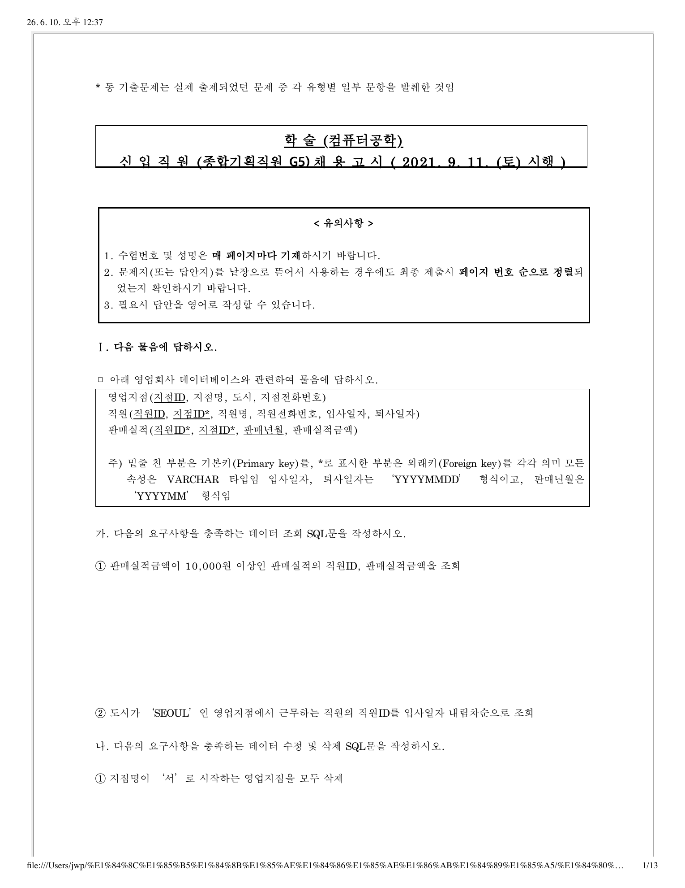
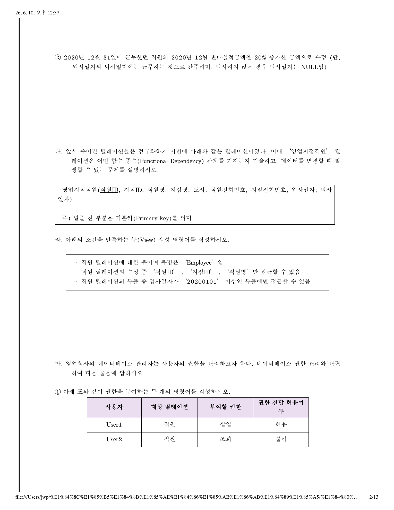
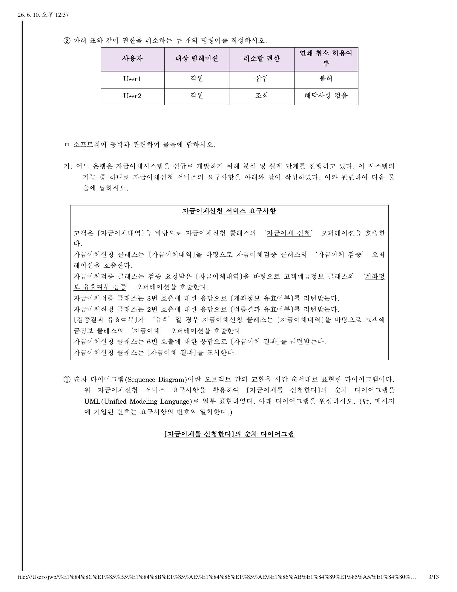
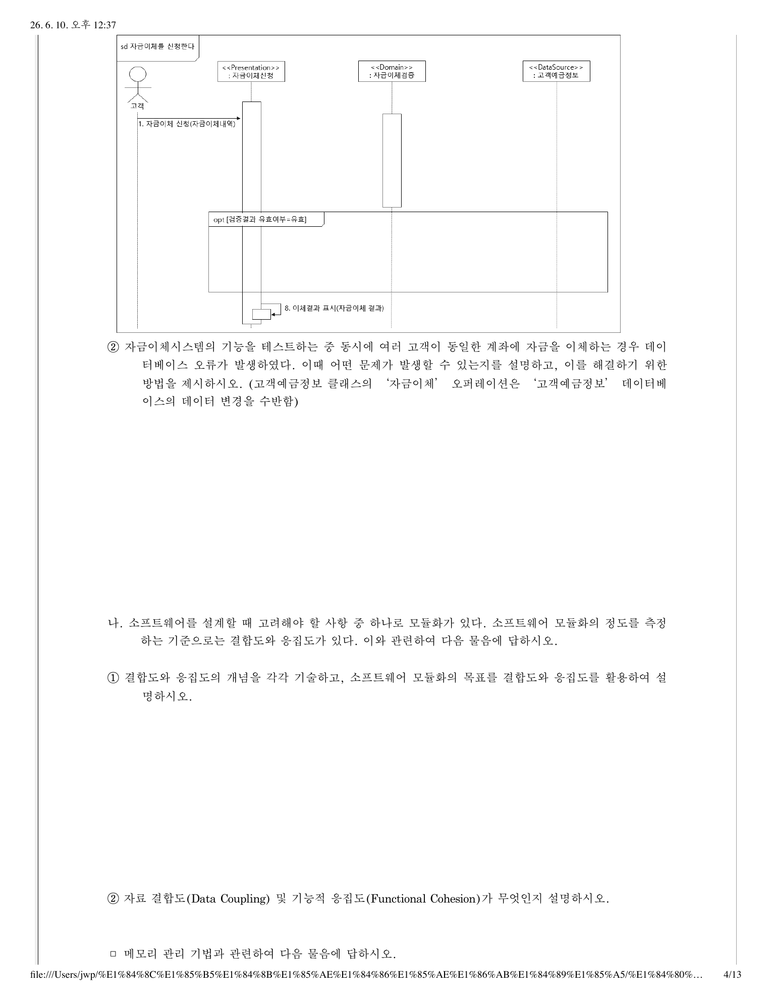
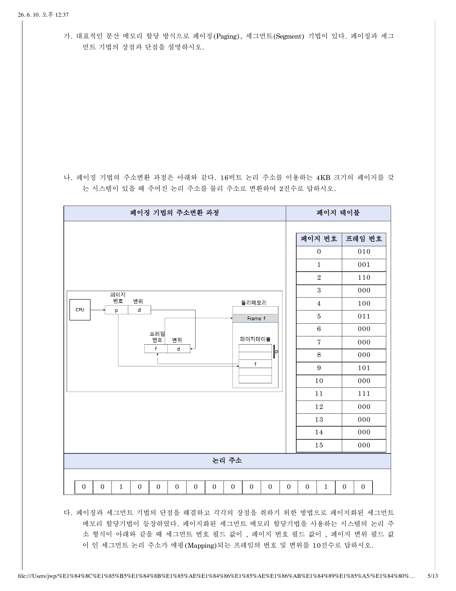
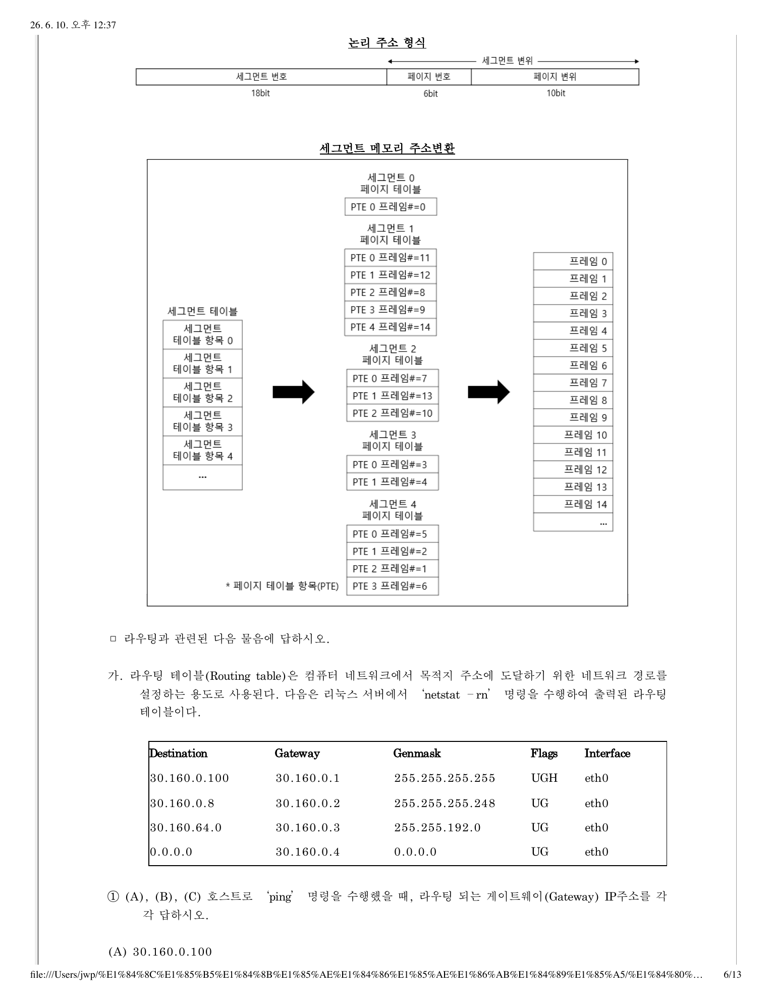
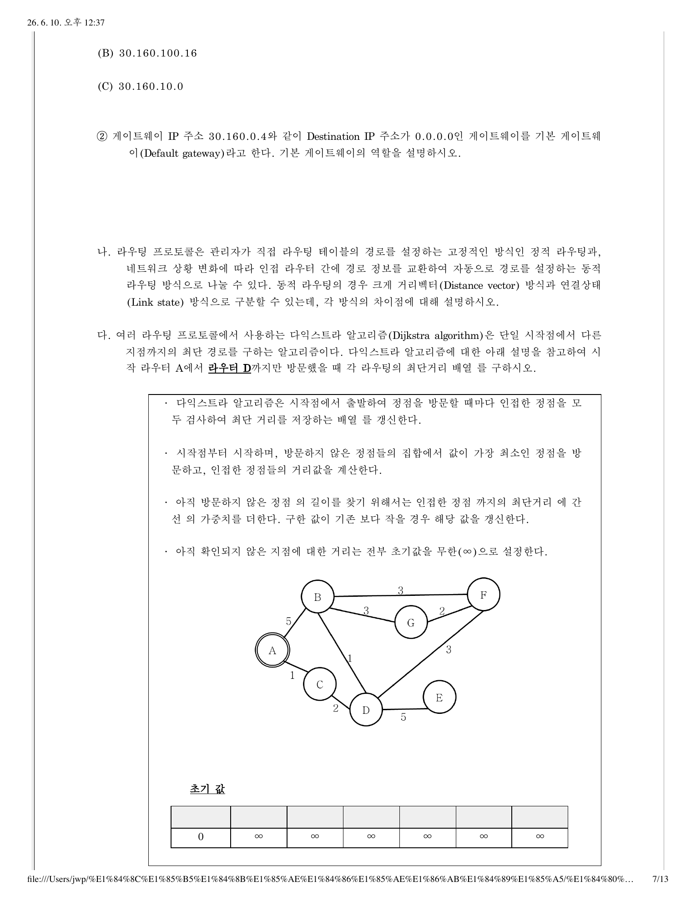
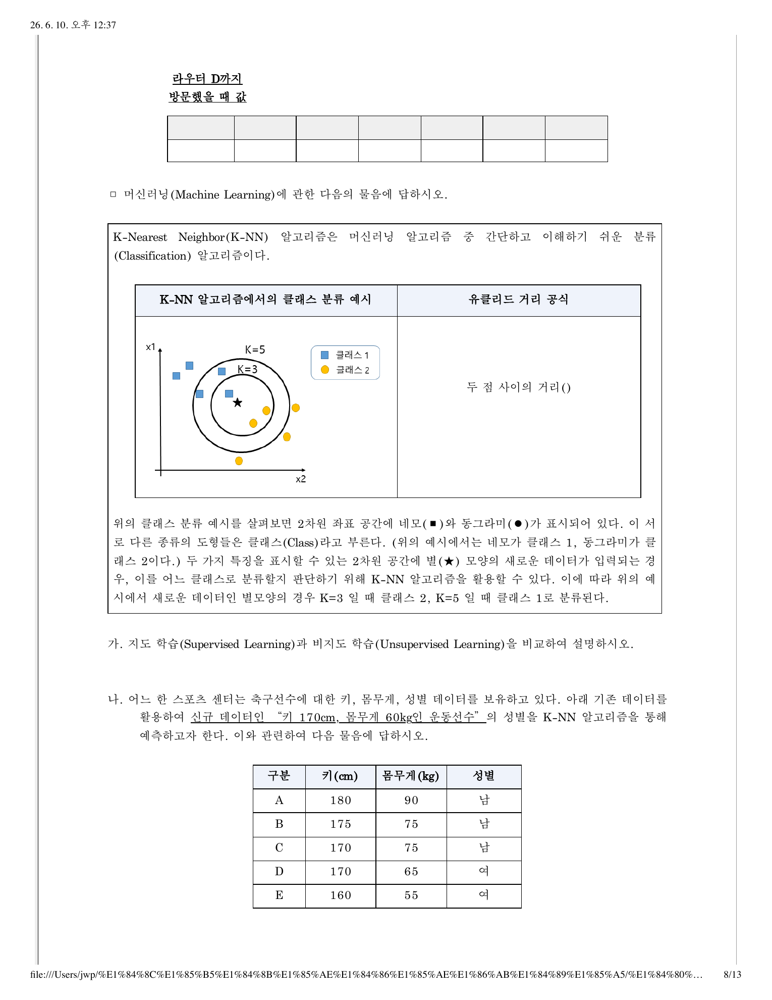
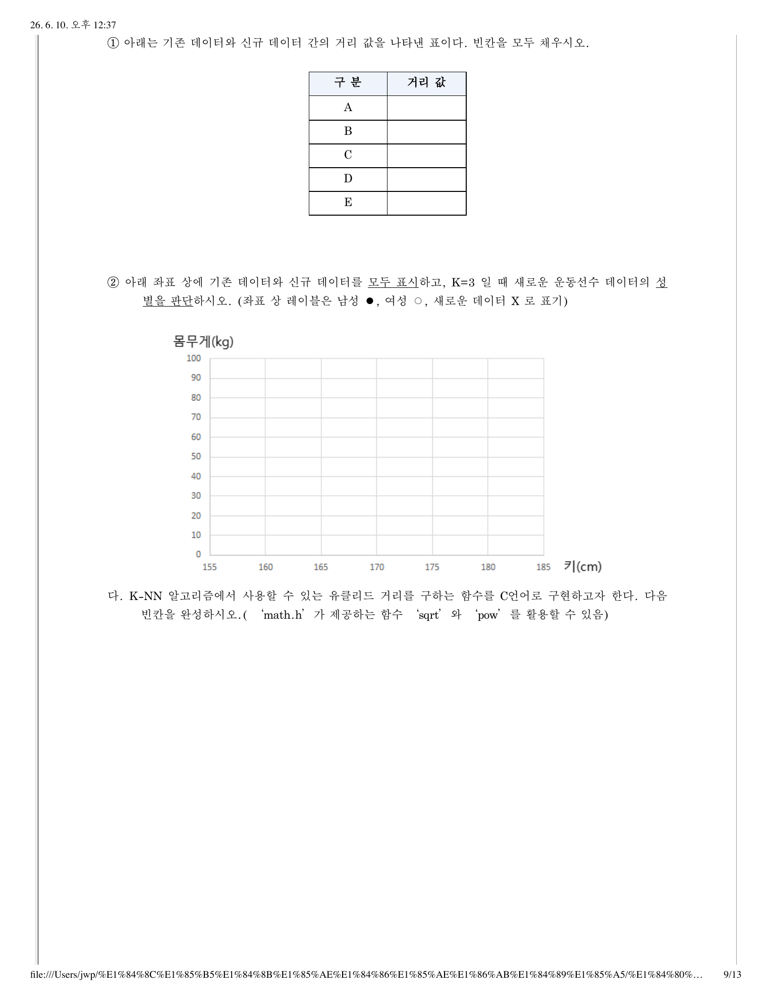

# 05-14-06. 한국은행 2022 컴퓨터공학 학술 파트 I

> 원자료: `../준비자료/한국은행 기출/hwp_md/한국은행_2022_컴퓨터공학_학술_문제.md`  
> 페이지용 분리 기준: 한국은행 컴퓨터공학 학술 기출의 대문항/주제 문항 단위  
> 학습 메모: 9월 전까지는 실전 풀이보다 출제 스타일·빈출 개념 파악용으로 활용한다.

## 2022 파트 I

### 1. 영업회사 데이터베이스

아래 영업회사 데이터베이스와 관련하여 물음에 답하시오.

```text
영업지점(지점ID, 지점명, 도시, 지점전화번호)
직원(직원ID, 지점ID*, 직원명, 직원전화번호, 입사일자, 퇴사일자)
판매실적(직원ID*, 지점ID*, 판매년월, 판매실적금액)
```

주) 밑줄 친 부분은 기본키(primary key), `*`는 외래키(foreign key)를 의미한다. 모든 속성은 `VARCHAR` 타입이며, 입사일자·퇴사일자는 `YYYYMMDD`, 판매년월은 `YYYYMM` 형식이다.

#### 가.

다음 요구사항을 충족하는 데이터 조회 SQL문을 작성하시오.

1. 판매실적금액이 10,000원 이상인 판매실적의 직원ID, 판매실적금액을 조회
2. 도시가 `SEOUL`인 영업지점에서 근무하는 직원의 직원ID를 입사일자 내림차순으로 조회

#### 나.

다음 요구사항을 충족하는 데이터 수정 및 삭제 SQL문을 작성하시오.

1. 지점명이 `서`로 시작하는 영업지점을 모두 삭제
2. 2020년 12월 31일에 근무했던 직원의 2020년 12월 판매실적금액을 20% 증가한 금액으로 수정
   - 입사일자와 퇴사일자에는 해당 날짜에 근무하는 것으로 간주
   - 퇴사하지 않은 경우 퇴사일자는 `NULL`

#### 다.

앞서 주어진 릴레이션들은 정규화하기 이전에 아래와 같은 릴레이션이었다. 이때 `영업지점직원` 릴레이션은 어떤 함수 종속(Functional Dependency) 관계를 가지는지 기술하고, 데이터를 변경할 때 발생할 수 있는 문제를 설명하시오.

```text
영업지점직원(직원ID, 지점ID, 직원명, 지점명, 도시, 직원전화번호, 지점전화번호, 입사일자, 퇴사일자)
```

#### 라.

아래 조건을 만족하는 뷰(View) 생성 명령어를 작성하시오.

- 직원 릴레이션에 대한 뷰이며 뷰명은 `Employee`
- 직원 릴레이션의 속성 중 `직원ID`, `지점ID`, `직원명`만 접근 가능
- 직원 릴레이션의 튜플 중 입사일자가 `20200101` 이상인 튜플에만 접근 가능

#### 마.

데이터베이스 권한 관리와 관련하여 다음 물음에 답하시오.

1. 아래 표와 같이 권한을 부여하는 두 개의 명령어를 작성하시오.

| 사용자 | 대상 릴레이션 | 부여할 권한 | 권한 전달 허용 여부 |
|---|---|---|---|
| User1 | 직원 | 삽입 | 허용 |
| User2 | 직원 | 조회 | 불허 |

2. 아래 표와 같이 권한을 취소하는 두 개의 명령어를 작성하시오.

| 사용자 | 대상 릴레이션 | 취소할 권한 | 연쇄 취소 허용 여부 |
|---|---|---|---|
| User1 | 직원 | 삽입 | 불허 |
| User2 | 직원 | 조회 | 해당사항 없음 |

### 2. 소프트웨어 공학

소프트웨어 공학과 관련하여 물음에 답하시오.

#### 가.

어느 은행은 자금이체시스템을 신규로 개발하기 위해 분석 및 설계 단계를 진행하고 있다. 이 시스템의 기능 중 하나로 자금이체신청 서비스의 요구사항을 아래와 같이 작성하였다. 이와 관련하여 다음 물음에 답하시오.

```text
고객은 [자금이체내역]을 바탕으로 자금이체신청 클래스의 '자금이체 신청' 오퍼레이션을 호출한다.
자금이체신청 클래스는 [자금이체내역]을 바탕으로 자금이체검증 클래스의 '자금이체 검증' 오퍼레이션을 호출한다.
자금이체검증 클래스는 검증 요청받은 [자금이체내역]을 바탕으로 고객예금정보 클래스의 '계좌정보 유효여부 검증' 오퍼레이션을 호출한다.
자금이체검증 클래스는 3번 호출에 대한 응답으로 [계좌정보 유효여부]를 리턴받는다.
자금이체신청 클래스는 2번 호출에 대한 응답으로 [검증결과 유효여부]를 리턴받는다.
[검증결과 유효여부]가 '유효'일 경우 자금이체신청 클래스는 [자금이체내역]을 바탕으로 고객예금정보 클래스의 '자금이체' 오퍼레이션을 호출한다.
자금이체신청 클래스는 6번 호출에 대한 응답으로 [자금이체 결과]를 리턴받는다.
자금이체신청 클래스는 [자금이체 결과]를 표시한다.
```

1. 위 요구사항을 활용하여 `[자금이체를 신청한다]`의 순차 다이어그램을 UML로 일부 표현하였다. 아래 다이어그램을 완성하시오. (메시지에 기입된 번호는 요구사항 번호와 일치)
2. 자금이체시스템 기능 테스트 중 동시에 여러 고객이 동일한 계좌에 자금을 이체하는 경우 데이터베이스 오류가 발생하였다. 어떤 문제가 발생할 수 있는지를 설명하고, 이를 해결하기 위한 방법을 제시하시오. (고객예금정보 클래스의 `자금이체` 오퍼레이션은 데이터베이스 변경을 수반함)

> 그림: `[자금이체를 신청한다]` 순차 다이어그램 참고

#### 나.

소프트웨어 모듈화와 관련하여 다음 물음에 답하시오.

1. 결합도와 응집도의 개념을 각각 기술하고, 소프트웨어 모듈화의 목표를 결합도와 응집도를 활용하여 설명하시오.
2. 자료 결합도(Data Coupling) 및 기능적 응집도(Functional Cohesion)가 무엇인지 설명하시오.

### 3. 메모리 관리 기법

메모리 관리 기법과 관련하여 다음 물음에 답하시오.

#### 가.

대표적인 분산 메모리 할당 방식인 페이징(Paging), 세그먼트(Segment) 기법의 장점과 단점을 설명하시오.

#### 나.

페이징 기법의 주소변환 과정은 아래와 같다. 16비트 논리 주소를 이용하는 4KB 크기의 페이지를 갖는 시스템이 있을 때 주어진 논리 주소를 물리 주소로 변환하여 2진수로 답하시오.

##### 페이지 테이블

| 페이지 번호 | 프레임 번호 |
|---:|---|
| 0 | 010 |
| 1 | 001 |
| 2 | 110 |
| 3 | 000 |
| 4 | 100 |
| 5 | 011 |
| 6 | 000 |
| 7 | 000 |
| 8 | 000 |
| 9 | 101 |
| 10 | 000 |
| 11 | 111 |
| 12 | 000 |
| 13 | 000 |
| 14 | 000 |
| 15 | 000 |

##### 논리 주소

```text
0 0 1 0 0 0 0 0 0 0 0 0 0 1 0 0
```

#### 다.

페이징과 세그먼트 기법의 단점을 해결하고 각각의 장점을 취하기 위한 방법으로 페이지화된 세그먼트 메모리 할당기법이 등장하였다. 페이지화된 세그먼트 메모리 할당기법을 사용하는 시스템의 논리 주소 형식이 아래와 같을 때, 세그먼트 번호·페이지 번호·페이지 변위 필드 값이 주어진 세그먼트 논리 주소가 매핑되는 프레임 번호 및 변위를 10진수로 답하시오.

> 그림: 논리 주소 형식 / 세그먼트 메모리 주소변환 참고

### 4. 라우팅

라우팅과 관련된 다음 물음에 답하시오.

#### 가.

다음은 리눅스 서버에서 `netstat -rn` 명령을 수행하여 출력된 라우팅 테이블이다.

| Destination | Gateway | Genmask | Flags | Interface |
|---|---|---|---|---|
| 30.160.0.100 | 30.160.0.1 | 255.255.255.255 | UGH | eth0 |
| 30.160.0.8 | 30.160.0.2 | 255.255.255.248 | UG | eth0 |
| 30.160.64.0 | 30.160.0.3 | 255.255.192.0 | UG | eth0 |
| 0.0.0.0 | 30.160.0.4 | 0.0.0.0 | UG | eth0 |

1. 아래 호스트로 `ping` 명령을 수행했을 때, 라우팅되는 게이트웨이 IP 주소를 각각 답하시오.
   - (A) `30.160.0.100`
   - (B) `30.160.100.16`
   - (C) `30.160.10.0`
2. 기본 게이트웨이(Default gateway)의 역할을 설명하시오.

#### 나.

라우팅 프로토콜 중 동적 라우팅의 거리벡터(Distance Vector) 방식과 연결상태(Link State) 방식의 차이점을 설명하시오.

#### 다.

다익스트라 알고리즘(Dijkstra algorithm)에 대한 설명을 참고하여, 시작 라우터 `A`에서 라우터 `D`까지만 방문했을 때 각 라우터의 최단거리 배열을 구하시오.

##### 초기 값

| A | B | C | D | E | F | G |
|---|---|---|---|---|---|---|
| 0 | ∞ | ∞ | ∞ | ∞ | ∞ | ∞ |

> 그림: 라우터 D까지 방문했을 때 값 참고

### 5. 머신러닝

K-Nearest Neighbor(K-NN) 알고리즘은 머신러닝 알고리즘 중 간단하고 이해하기 쉬운 분류(Classification) 알고리즘이다. 다음 물음에 답하시오.

#### 가.

지도 학습(Supervised Learning)과 비지도 학습(Unsupervised Learning)을 비교하여 설명하시오.

#### 나.

어느 한 스포츠 센터는 축구선수에 대한 키, 몸무게, 성별 데이터를 보유하고 있다. 아래 기존 데이터를 활용하여 신규 데이터인 `키 170cm, 몸무게 60kg인 운동선수`의 성별을 K-NN 알고리즘을 통해 예측하고자 한다.

| 구분 | 키(cm) | 몸무게(kg) | 성별 |
|---|---:|---:|---|
| A | 180 | 90 | 남 |
| B | 175 | 75 | 남 |
| C | 170 | 75 | 남 |
| D | 170 | 65 | 여 |
| E | 160 | 55 | 여 |

1. 기존 데이터와 신규 데이터 간 거리 값을 나타낸 표의 빈칸을 모두 채우시오.
2. 좌표 상에 기존 데이터와 신규 데이터를 모두 표시하고, `K=3`일 때 새로운 운동선수 데이터의 성별을 판단하시오. (좌표 상 레이블: 남성 `●`, 여성 `○`, 새로운 데이터 `X`)

#### 다.

K-NN 알고리즘에서 사용할 수 있는 유클리드 거리를 구하는 함수를 C 언어로 구현하고자 한다. 다음 빈칸을 완성하시오. (`math.h`의 `sqrt`, `pow` 활용 가능)

```c
#include <stdio.h>
#include <math.h>

struct Point{
    int x, y;
};

int main( ){
    struct Point start, end;
    double distance;
    scanf_s("%d %d", &start.x, &start.y);
    scanf_s("%d %d", &end.x, &end.y);

    distance =
    printf("두 점 사이의 거리는 %f입니다.\n", distance);
    return 0;
}
```

## 원문 이미지

### 원문 PDF 1페이지



### 원문 PDF 2페이지



### 원문 PDF 3페이지



### 원문 PDF 4페이지



### 원문 PDF 5페이지



### 원문 PDF 6페이지



### 원문 PDF 7페이지



### 원문 PDF 8페이지



### 원문 PDF 9페이지



---
