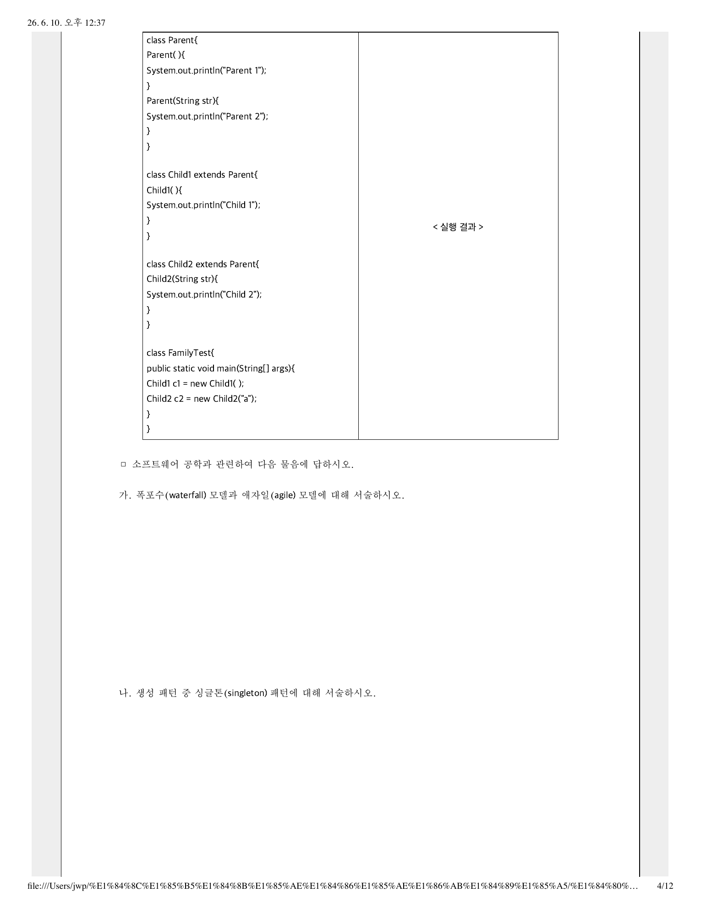

# 05-14-14. 한국은행 2025 컴퓨터공학 학술 4. 소프트웨어 공학

> 원자료: `../준비자료/한국은행 기출/hwp_md/한국은행_2025_컴퓨터공학_학술_문제.md`  
> 페이지용 분리 기준: 한국은행 컴퓨터공학 학술 기출의 대문항/주제 문항 단위  
> 학습 메모: 9월 전까지는 실전 풀이보다 출제 스타일·빈출 개념 파악용으로 활용한다.

## 4. 소프트웨어 공학

소프트웨어 공학과 관련하여 다음 물음에 답하시오.

### 가.

폭포수(waterfall) 모델과 애자일(agile) 모델에 대해 서술하시오.

### 나.

생성 패턴 중 싱글톤(singleton) 패턴에 대해 서술하시오.

### 다.

알파 테스트와 베타 테스트에 대해 서술하시오.

## 원문 이미지

### 원문 PDF 4페이지

---
