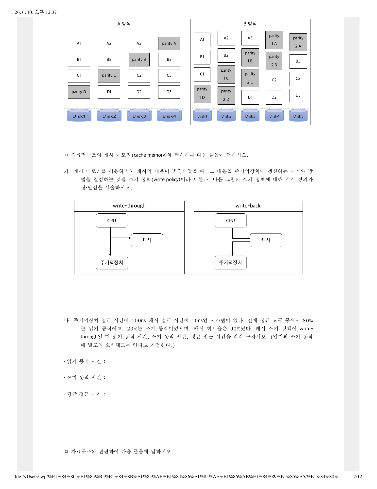

# 05-14-19. 한국은행 2025 컴퓨터공학 학술 9. 컴퓨터구조: 캐시 메모리

> 원자료: `../준비자료/한국은행 기출/hwp_md/한국은행_2025_컴퓨터공학_학술_문제.md`  
> 페이지용 분리 기준: 한국은행 컴퓨터공학 학술 기출의 대문항/주제 문항 단위  
> 학습 메모: 9월 전까지는 실전 풀이보다 출제 스타일·빈출 개념 파악용으로 활용한다.

## 9. 컴퓨터구조: 캐시 메모리

컴퓨터구조의 캐시 메모리(cache memory)와 관련하여 다음 물음에 답하시오.

### 가.

캐시 메모리를 사용하면서 캐시의 내용이 변경되었을 때, 그 내용을 주기억장치에 갱신하는 시기와 방법을 결정하는 것을 쓰기 정책(write policy)이라고 한다. 다음 그림의 쓰기 정책에 대해 각각 정의와 장·단점을 서술하시오.

| write-through | write-back |
|---|---|
| CPU가 캐시와 주기억장치에 동시에 기록하는 방식 | CPU가 우선 캐시에 기록하고, 이후 필요한 시점에 주기억장치에 반영하는 방식 |

### 나.

주기억장치 접근 시간이 100ns, 캐시 접근 시간이 10ns인 시스템이 있다. 전체 접근 요구 중에서 80%는 읽기 동작이고, 20%는 쓰기 동작이었으며, 캐시 히트율은 90%였다. 캐시 쓰기 정책이 **write-through**일 때 읽기 동작 시간, 쓰기 동작 시간, 평균 접근 시간을 각각 구하시오.  
읽기와 쓰기 동작에 별도의 오버헤드는 없다고 가정한다.

```text
· 읽기 동작 시간:
· 쓰기 동작 시간:
· 평균 접근 시간:
```

## 원문 이미지

### 원문 PDF 7페이지



---
