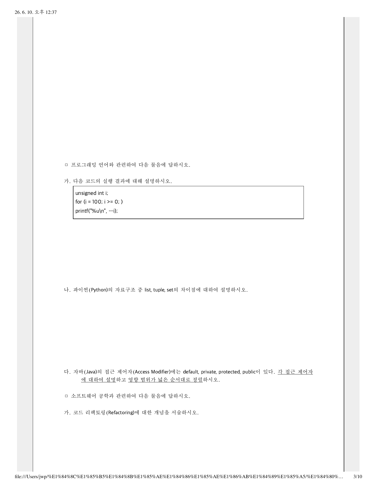

# 05-14-28. 한국은행 2026 컴퓨터공학 학술 3. 프로그래밍 언어

> 원자료: `../준비자료/한국은행 기출/hwp_md/한국은행_2026_컴퓨터공학_학술_문제.md`  
> 페이지용 분리 기준: 한국은행 컴퓨터공학 학술 기출의 대문항/주제 문항 단위  
> 학습 메모: 9월 전까지는 실전 풀이보다 출제 스타일·빈출 개념 파악용으로 활용한다.

## 3. 프로그래밍 언어

### 3-가.

다음 코드의 실행 결과에 대해 설명하시오.

```c
unsigned int i;
for (i = 100; i >= 0; )
    printf("%u\n", --i);
```

### 3-나.

파이썬(Python)의 자료구조 중 list, tuple, set의 차이점에 대하여 설명하시오.

### 3-다.

자바(Java)의 접근 제어자(Access Modifier)에는 default, private, protected, public이 있다. 각 접근 제어자에 대하여 설명하고 영향 범위가 넓은 순서대로 정렬하시오.

## 원문 이미지

### 원문 PDF 3페이지



---
