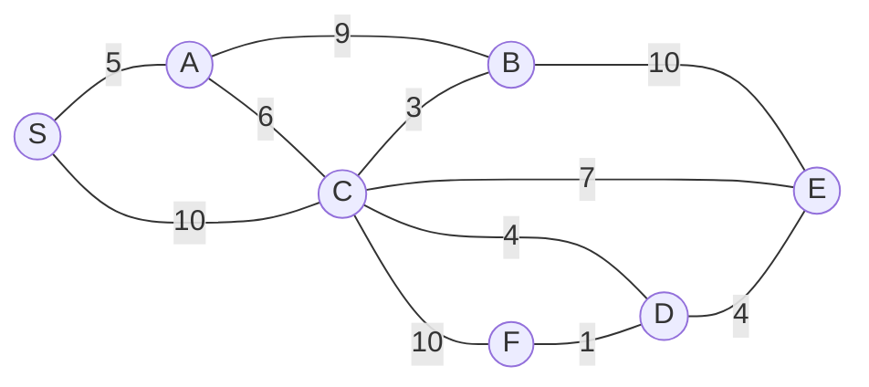

# 05-14-30. 한국은행 2026 컴퓨터공학 학술 5. 그래프 알고리즘 및 정렬

> 원자료: `../준비자료/한국은행 기출/hwp_md/한국은행_2026_컴퓨터공학_학술_문제.md`  
> 페이지용 분리 기준: 한국은행 컴퓨터공학 학술 기출의 대문항/주제 문항 단위  
> 학습 메모: 9월 전까지는 실전 풀이보다 출제 스타일·빈출 개념 파악용으로 활용한다.

## 5. 그래프 알고리즘 및 정렬

**5 문제용 그래프**


다음 그래프를 보고, 물음에 답하시오.

### 그래프



그래프의 간선은 다음과 같다.

| 간선 | 가중치 |
|---|---:|
| S-A | 5 |
| S-C | 10 |
| A-B | 9 |
| A-C | 6 |
| C-B | 3 |
| B-E | 10 |
| C-E | 7 |
| C-D | 4 |
| C-F | 10 |
| F-D | 1 |
| D-E | 4 |

### 5-가.

**5-가 크루스칼 알고리즘 그림**


크루스칼(Kruskal’s) 알고리즘으로 생성된 경로를 그리시오.

### 5-나.

단일 시작점에서 다른 지점까지의 최단 경로(shortest-path)를 구하는 알고리즘으로 다익스트라(Dijkstra) 알고리즘이 있다. 위 그래프의 S부터 시작해서 다익스트라 알고리즘으로 계산되는 값(dist)을 단계별로 표현하시오. 단, 업데이트되지 않는 과정은 생략.

#### 답변 예시

| step | S | A | B | C | D | E | F |
|---:|---|---|---|---|---|---|---|
| 1 | - | ∞ | ∞ | ∞ | ∞ | ∞ | ∞ |
| 2 |  |  |  |  |  |  |  |
| … |  |  |  |  |  |  |  |

### 5-다.

다익스트라(Dijkstra) 알고리즘이 다른 최단 경로 알고리즘과 비교할 때 가지는 한계와 대체할 수 있는 알고리즘을 제시하고, 다익스트라 알고리즘과 비교해서 제시한 알고리즘의 동작방식이 어떻게 다른지 설명하시오.

### 5-라.

데이터를 순서대로 정렬하기 위해 다음과 같이 동일한 평균 시간복잡도를 갖는 두 가지 코드를 작성하였다. 각 코드에서 발생할 수 있는 최악의 시간복잡도를 제시하시오. 그리고, 평균 시간복잡도와 최악의 시간복잡도가 차이나는 경우 그 이유에 대하여 설명하시오.

#### A정렬\*

```c
int partition(int A[], int first, int last) {
    int low, high, p;
    p = A[last];
    low = first;
    high = last - 1;

    while (low < high) {
        while (p > A[low]) low++;
        while (p < A[high]) high--;
        if (low < high)
            swap(&A[low], &A[high]);
    }

    swap(&A[low], &A[last]);
    return low;
}

void aSort(int A[], int first, int last) {
    if (first < last) {
        int pivotIndex = partition(A, first, last);
        aSort(A, first, pivotIndex - 1);
        aSort(A, pivotIndex + 1, last);
    }
}
```

#### B정렬\*\*

```c
int sorted[MAX];

void _bSort(int list[], int left, int mid, int right) {
    int i, j, k, l;
    i = left;
    j = mid + 1;
    k = left;

    while (i <= mid && j <= right) {
        if (list[i] <= list[j])
            sorted[k++] = list[i++];
        else
            sorted[k++] = list[j++];
    }

    if (i > mid) {
        for (l = j; l <= right; l++)
            sorted[k++] = list[l];
    } else {
        for (l = i; l <= mid; l++)
            sorted[k++] = list[l];
    }

    for (l = left; l <= right; l++)
        list[l] = sorted[l];
}

void bSort(int A[], int first, int last) {
    int mid;
    if (first < last) {
        mid = (first + last) / 2;
        bSort(A, first, mid);
        bSort(A, mid + 1, last);
        _bSort(A, first, mid, last);
    }
}
```

> \* swap은 첫 번째와 두 번째 인자의 값을 서로 교환하는 함수  
> \*\* MAX는 충분히 큰 값임
