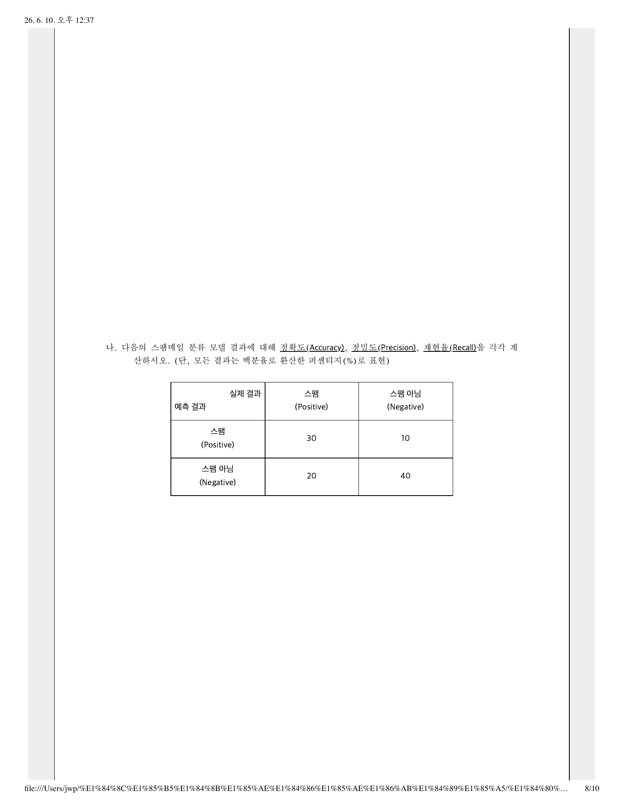

# 05-14-33. 한국은행 2026 컴퓨터공학 학술 8. 머신 러닝

> 원자료: `../준비자료/한국은행 기출/hwp_md/한국은행_2026_컴퓨터공학_학술_문제.md`  
> 페이지용 분리 기준: 한국은행 컴퓨터공학 학술 기출의 대문항/주제 문항 단위  
> 학습 메모: 9월 전까지는 실전 풀이보다 출제 스타일·빈출 개념 파악용으로 활용한다.

## 8. 머신 러닝

### 8-가.

비지도 학습(Unsupervised Learning)의 대표적인 알고리즘 중 하나인 K-means 알고리즘은 주어진 n개의 관측값을 k개의 클러스터로 분할하는 알고리즘으로, 관측값들은 거리가 최소인 클러스터로 분류된다. K-means 알고리즘은 데이터에 대한 사전 정보 없이도 데이터를 군집화할 수 있다는 장점이 있지만, 몇 가지 한계를 가진다. K-means 알고리즘의 한계를 세 가지 서술하시오.

### 8-나.

다음의 스팸메일 분류 모델 결과에 대해 정확도(Accuracy), 정밀도(Precision), 재현율(Recall)을 각각 계산하시오. 단, 모든 결과는 백분율로 환산한 퍼센티지(%)로 표현.

| 예측 결과 \ 실제 결과 | 스팸(Positive) | 스팸 아님(Negative) |
|---|---:|---:|
| 스팸(Positive) | 30 | 10 |
| 스팸 아님(Negative) | 20 | 40 |

## 원문 이미지

### 원문 PDF 8페이지

---
