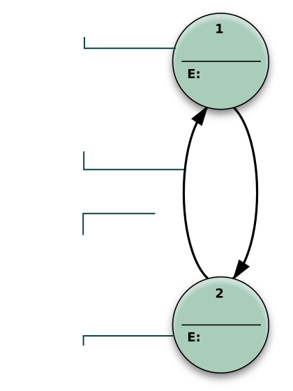

# 06-03. 동기화와 교착상태

> 학습 목적: 동기화 필요성과 교착상태 해결 방법을 연결한다.
> 관련 기출: [05-9-운영체제-기출-모음](05-09-운영체제-기출-모음.md)
> 연결 핵심정리: [04-3-소프트웨어공학-운영체제-컴퓨터구조](04-03-소프트웨어공학-운영체제-컴퓨터구조.md)

## 핵심 개념

- 임계구역은 동시에 접근하면 안 되는 공유 자원 영역이다.
- 교착상태는 상호배제, 점유대기, 비선점, 순환대기 조건이 필요하다.
- 해결은 예방, 회피, 탐지 및 복구, 무시로 나뉜다.

## 쉽게 이해하기

- 동기화는 여러 사람이 같은 문서를 고칠 때 순서를 정하는 규칙이다. 규칙이 없으면 마지막 저장이 앞선 수정을 덮어쓸 수 있다.
- 교착상태는 서로가 가진 자원을 놓지 않은 채 상대 자원을 기다리는 상황이다. A는 프린터를 들고 스캐너를 기다리고, B는 스캐너를 들고 프린터를 기다리는 식이다.
- 교착상태 문제는 네 가지 발생 조건과 예방·회피·탐지·복구 방법을 세트로 외우면 쉽다.

> 그림: 상태 전이도 예시 기반으로 동기화와 교착상태 개념을 시각적으로 확인한다.
> 출처: https://commons.wikimedia.org/wiki/File:Finite_state_machine_example_with_comments.svg
## 빈출 포인트

- 정의와 특징을 구분하는 객관식 문항
- 비슷한 개념 간 차이 비교
- 실제 기출 키워드와 연결한 빠른 복습

## 기출 연결
- [05-9-운영체제-기출-모음](05-09-운영체제-기출-모음.md)에 관련 문항을 색인한다.

## 오답 포인트

- 용어의 이름보다 적용 조건을 먼저 확인한다.
- 예외와 반례가 있는 선지를 주의한다.
- 계산형 주제는 중간 과정을 생략하지 않는다.

## 빠른 점검

- 핵심 정의를 한 문장으로 설명할 수 있는가?
- 비슷한 개념과 차이를 말할 수 있는가?
- 관련 기출 키워드를 바로 떠올릴 수 있는가?
