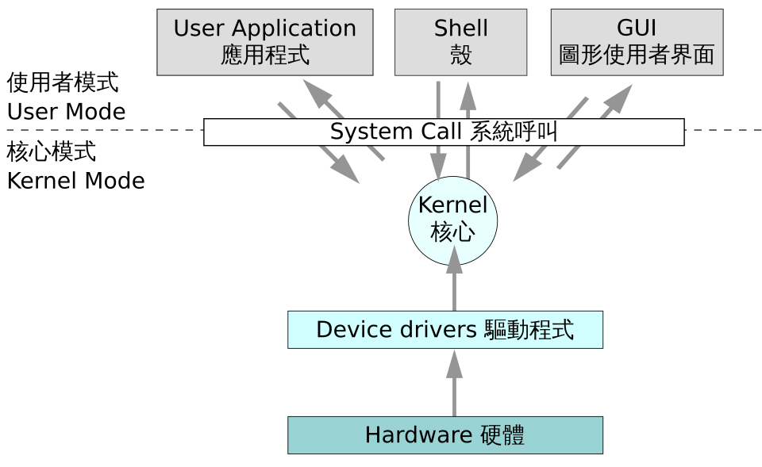

# 06. 운영체제

> 핵심: 프로세스, 스레드, CPU 스케줄링, 동기화, 교착상태, 메모리, 가상메모리

## 학습 순서

- [06-01. 프로세스와 스레드](06-01-00-프로세스와-스레드.md)
- [06-02. CPU 스케줄링](06-02-00-CPU-스케줄링.md)
- [06-03. 동기화와 교착상태](06-03-동기화와-교착상태.md)
- [06-04. 메모리와 가상메모리](06-04-메모리와-가상메모리.md)

> 그림: 운영체제 아키텍처 기반으로 운영체제 전체 구조 개념을 시각적으로 확인한다.
> 출처: https://commons.wikimedia.org/wiki/File:Operating_system_architecture.svg

## 연결 핵심정리

- [04-3-소프트웨어공학-운영체제-컴퓨터구조](04-03-소프트웨어공학-운영체제-컴퓨터구조.md)

## 복습 포인트

- 스케줄링 계산 문제는 FCFS, SJF, HRN, RR을 우선 정리한다.
- 메모리 관리는 단편화, 페이징, 세그먼트를 비교해서 암기한다.
- 교착상태는 발생 조건과 해결 방법을 함께 정리한다.

## 약어 풀이

- CPU: Central Processing Unit, 중앙처리장치
- FCFS: First-Come, First-Served, 선입선처리
- HRN: Highest Response-ratio Next, 최고 응답률 우선
- SJF: Shortest Job First, 최단 작업 우선
