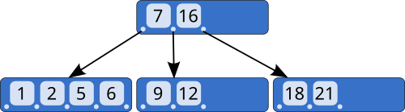

# 07-01-01. 릴레이션-튜플-속성

> 학습 목적: 릴레이션 용어를 표준 용어로 암기한다.
> 관련 기출: [05-10-데이터베이스-기출-모음](05-10-데이터베이스-기출-모음.md)
> 연결 핵심정리: [04-5-자료구조-알고리즘-DB-금융IT](04-05-자료구조-알고리즘-DB-금융IT.md)

## 핵심 개념

- 릴레이션은 중복 튜플을 허용하지 않는 테이블 개념이다.
- 튜플 순서는 의미가 없고 속성 이름은 유일해야 한다.
- 도메인은 속성이 가질 수 있는 값의 범위다.

## 쉽게 이해하기

- 릴레이션은 표, 튜플은 행, 속성은 열이다. 이 대응만 정확히 잡아도 기본 용어 문제는 쉽게 풀린다.
- 도메인은 각 열에 들어갈 수 있는 값의 범위다. 예를 들어 나이 열에는 문자보다 숫자가 들어가야 한다.
- 관계형 모델은 표의 모양보다 “각 값이 어떤 의미와 제약을 갖는가”를 중요하게 본다.

> 그림: 관계형 데이터베이스 구조 기반으로 관계형 데이터베이스 구조 개념을 시각적으로 확인한다.
> 출처: 공개 이미지 출처 기록 누락
## 빈출 포인트

- 정의와 특징을 구분하는 객관식 문항
- 비슷한 개념 간 차이 비교
- 실제 기출 키워드와 연결한 빠른 복습

## 기출 연결
- [05-10-데이터베이스-기출-모음](05-10-데이터베이스-기출-모음.md)에 관련 문항을 색인한다.

## 오답 포인트

- 용어의 이름보다 적용 조건을 먼저 확인한다.
- 예외와 반례가 있는 선지를 주의한다.
- 계산형 주제는 중간 과정을 생략하지 않는다.

## 빠른 점검

- 핵심 정의를 한 문장으로 설명할 수 있는가?
- 비슷한 개념과 차이를 말할 수 있는가?
- 관련 기출 키워드를 바로 떠올릴 수 있는가?

## 약어 풀이

- DB: Database, 데이터베이스
