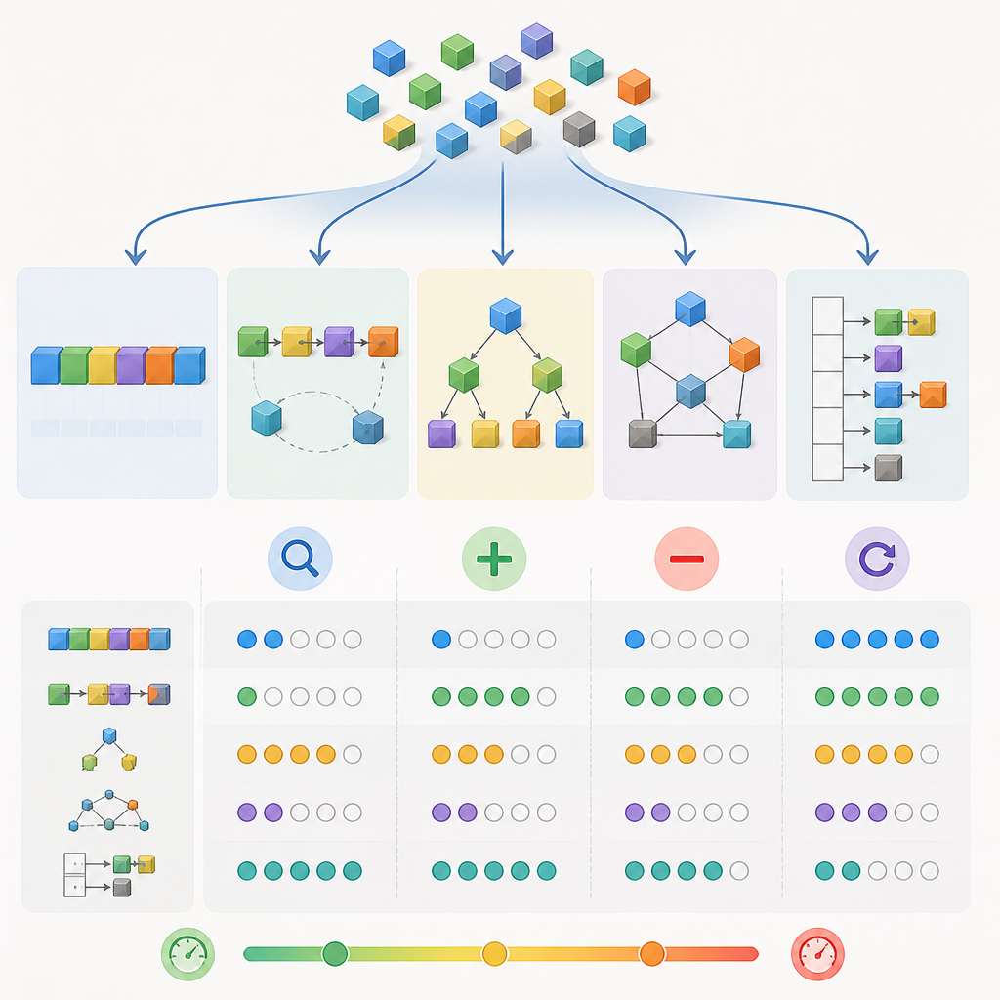

# 09. 자료구조/알고리즘

> 핵심: 선형 자료구조, 트리, 그래프, 정렬, 탐색, 동적계획법, 재귀

## 학습 순서

- [09-01. 선형 자료구조](09-01-00-선형-자료구조.md)
- [09-02. 트리와 그래프](09-02-00-트리와-그래프.md)
- [09-03. 정렬과 탐색](09-03-정렬과-탐색.md)
- [09-04. 동적계획법과 재귀](09-04-동적계획법과-재귀.md)

> 그림: AI 생성 시각 자료. 선형 구조, 트리, 그래프처럼 저장 모양이 바뀌면 연산 방식이 어떻게 달라지는지 감으로 잡는다.
> 출처: 내부 생성 자산 (`assets/ai-generated-visual-aids/09-data-structure-overview-ai.png`)

## 확장 요약 (시험 대비형)

이 장의 목표는 다음을 확실히 하는 것이다:

- 각 자료구조의 핵심 연산(삽입, 삭제, 탐색 등)과 그 연산의 시간·공간 복잡도를 암기하고 문제에 적용할 수 있다.
- 트리와 그래프의 표현(인접리스트/인접행렬), 탐색(BFS/DFS), 주요 알고리즘(MST, 최단경로 등)의 목적과 동작방식을 이해한다.
- 대표 정렬 알고리즘(버블/삽입/선택/병합/퀵/힙)의 시간·공간 특성, 안정성, 사용처를 구분할 수 있다.
- 동적계획법(DP)과 재귀 문제를 패턴(메모이제이션, 상태 정의)을 통해 풀 수 있다.

시험에서 자주 묻는 유형:

- 시간복잡도(평균/최악/공간)를 계산·비교하라.
- 자료구조를 골라 특정 연산(많은 삽입/빈번한 검색 등)에 적합함을 설명하라.
- 주어진 코드(또는 의사코드)의 결과/복잡도를 분석하라.
- 구현 문제: 특정 자료구조(스택, 큐, 연결리스트, 해시맵 등)나 알고리즘(BFS/DFS, 퀵정렬 등)을 작성하라.
- 재귀를 DP로 최적화하는 과정(중복 부분 문제 식별, 상태 정의, 전이식 작성)을 서술하라.

## 빠른 복습 포인트

- 자료구조는 연산별 시간복잡도와 함께 정리한다. (예: 삽입/삭제/검색/접근)
- 트리와 그래프는 표현(인접리스트/행렬)과 탐색 방식(BFS/DFS)을 연결해 암기한다.
- 정렬·탐색은 코드 출력 문제나 작은 입력 예시를 직접 적어보며 연습한다.

## 핵심 시간복잡도(대표 표)

| 자료구조/알고리즘 | 접근 | 검색 | 삽입 | 삭제 | 추가 메모 |
|---|---:|---:|---:|---:|---|
| 배열 (순차) | O(1) | O(n) | O(n) | O(n) | 인덱스 접근 O(1)
| 연결 리스트 (단일) | O(n) | O(n) | O(1) (헤드) | O(1) (헤드) | 임의 접근 느림
| 스택/큐 (배열/연결리스트) | O(1) | O(n) | O(1) | O(1) | LIFO/FIFO 특성
| 해시 테이블 (평균) | O(1) | O(1) | O(1) | O(1) | 최악 O(n) (충돌)
| 이진 탐색 트리 (평균) | O(log n) | O(log n) | O(log n) | O(log n) | 최악(편향) O(n)
| 균형 이진 트리(AVL, Red-Black) | O(log n) | O(log n) | O(log n) | O(log n) | 항상 균형 보장
| 힙 (우선순위 큐) | - | O(n) | O(log n) | O(log n) | 최댓값/최솟값 추출 O(log n)
| 병합 정렬 | - | - | - | - | 시간 O(n log n), 공간 O(n), 안정적
| 퀵 정렬 (평균) | - | - | - | - | 평균 O(n log n), 최악 O(n^2), 주로 in-place
| 이분 탐색 (정렬된 자료) | - | - | - | - | O(log n), 입력은 정렬되어 있어야 함

(시험에서는 평균/최악/공간을 케이스 별로 정확히 적어야 함)

## 선형 자료구조 핵심 정리

- 배열 vs 연결리스트: 랜덤 액세스 필요하면 배열, 빈번한 삽입/삭제(특히 중간/앞쪽)면 연결리스트.
- 스택/큐: DFS/탐색의 상태 관리, BFS 구현.
- 해시맵: 키-값 조회가 많은 문제에 사용, 충돌 처리(체이닝, 오픈 어드레싱) 이해 필요.

시험 포인트 예:

- "O(1)인 자료구조를 3가지 쓰고 실제 사용 예를 설명하라." 같은 서술형.
- 연결리스트에서 특정 노드 삭제 시 포인터 처리 과정을 그림으로 설명하라.

## 트리와 그래프 핵심 정리

- 트리: 전위/중위/후위 순회(재귀/스택), 이진탐색트리(BST)의 삽입/삭제/검색 규칙.
- 힙: 완전이진트리 기반, 우선순위 큐의 구현.
- 그래프 표현: 인접행렬(O(V^2) 공간), 인접리스트(O(V+E) 공간). 문제 크기에 따라 선택.
- 그래프 탐색: BFS(최단 간선 경로, 큐 사용), DFS(경로 탐색, 재귀/스택). 사이클 탐지, 위상정렬(위상 정렬은 DAG에만 적용).

주요 알고리즘(시험서술 요지):

- 다익스트라: 가중치가 비음수일 때 최단경로, 우선순위 큐로 구현.
- 벨만-포드: 음수 간선 허용, O(VE)
- 프림/크루스칼: 최소 신장 트리(MST), 프림은 우선순위 큐, 크루스칼은 간선 정렬 + 유니온파인드.

## 정렬과 탐색 핵심 정리

- 정렬 알고리즘 분류: 비교 기반 정렬(병합, 퀵, 힙 등)과 비교 비의존 정렬(계수정렬, 기수정렬).
- 안정성: 안정 정렬은 값이 같은 요소의 상대적 순서를 유지(예: 병합정렬은 안정적, 퀵정렬은 일반적으로 불안정).
- 이분 탐색: 반드시 정렬된 배열에서 사용. 경계(왼쪽/오른쪽 포함 여부) 처리에 주의.

간단한 의사코드 예 — 이분 탐색:

```
function binary_search(A, target):
  lo = 0
  hi = len(A) - 1
  while lo <= hi:
    mid = (lo + hi) // 2
    if A[mid] == target: return mid
    if A[mid] < target: lo = mid + 1
    else: hi = mid - 1
  return -1
```

(시험에서는 경계 조건을 틀리는 실수가 잦음 — 예: while 조건, mid 계산, 정렬 전제 확인)

## 동적계획법(DP)과 재귀 핵심 정리

- DP 단계: (1) 상태 정의, (2) 전이식(점화식), (3) 초기값(기저 사례), (4) 계산 순서(탑다운/바텀업), (5) 공간 최적화 가능성.
- 메모이제이션(탑다운) vs 타뷸레이션(바텀업): 구현 편의성과 재귀 깊이 한계 고려.
- 공통 패턴: 최적 부분구조, 중복 부분문제(예: 피보나치, 배낭 문제, 최장 증가 부분 수열 등).

재귀 → 메모이제이션 예시(피보나치):

```
# 재귀(비효율)
function fib(n):
  if n <= 1: return n
  return fib(n-1) + fib(n-2)

# 메모이제이션
memo = dict()
function fib_memo(n):
  if n <= 1: return n
  if n in memo: return memo[n]
  memo[n] = fib_memo(n-1) + fib_memo(n-2)
  return memo[n]
```

시험 팁: 재귀를 사용할 때는 항상 기저 사례(base case)와 상태 수(메모이제이션 테이블 크기)를 고려해 복잡도를 계산하라.

## 시험 대비 체크리스트

- [ ] 각 자료구조의 대표 연산과 시간복잡도를 한 장 요약지로 만들었다.
- [ ] 트리(전위/중위/후위 순회), BFS/DFS를 스스로 2번 이상 구현해 보았다.
- [ ] 퀵/병합/힙 정렬의 동작 원리, 평균/최악 시간복잡도를 외웠다.
- [ ] 이분 탐색의 경계 조건(왼쪽/오른쪽 포함)을 직접 테스트해보았다.
- [ ] DP 문제(최장 증가 부분 수열, 배낭 문제, 동전 거스름 등)를 3문제 이상 풀었다.
- [ ] 유니온파인드(Union-Find) 구조의 경로 압축 및 랭크 기법을 구현해보았다.
- [ ] 최소 신장 트리(프림/크루스칼), 다익스트라의 아이디어와 계산 복잡도를 설명할 수 있다.

## 예상 문제 (모의 문제와 간단 해설)

1) "단일 연결리스트에서 임의 위치에 노드를 삽입하는 알고리즘의 시간복잡도는? 이유를 쓰고, 삽입 코드(의사코드)를 작성하라." 
   - 해설: 위치를 찾는 데 O(n), 삽입 자체는 포인터 조작 O(1) → 전체 O(n).

2) "퀵 정렬의 평균 시간복잡도와 최악 시간복잡도, 최악이 발생하는 입력 예시를 쓰고 최악을 피하는 방법을 설명하라."
   - 해설: 평균 O(n log n), 최악 O(n^2) (이미 정렬된 배열을 피벗으로 선택 시 발생). 무작위 피벗 선택 또는 피벗을 중간값으로 선택해 개선.

3) "그래프가 인접리스트로 주어졌을 때 BFS와 DFS의 시간복잡도는 무엇인가? (정점 수 V, 간선 수 E)"
   - 해설: 인접리스트 기준으로 둘 다 O(V + E).

4) "다음 재귀 코드를 메모이제이션을 사용하여 최적화하라." (짧은 재귀 함수 제공)
   - 해설: 중복 호출되는 부분에 대해 캐시(배열 또는 해시맵)를 사용해 각 상태를 한 번만 계산하도록 변경.

간단한 모범 답안 예(문제 1 의사코드):

```
function insert_after(node, new_node):
  if node is None: return new_node
  new_node.next = node.next
  node.next = new_node
```

## 연결 핵심정리

- [04-5-자료구조-알고리즘-DB-금융IT](04-05-자료구조-알고리즘-DB-금융IT.md)

## 추가 복습 포인트

- 코드 문제는 작은 입력으로 직접 디버깅해보자(종종 손으로 따라가면 로직 실수가 드러남).
- 복잡도 표기(빅-오 표기법)뿐 아니라 빅-세타/빅-오메가의 의미도 간단히 알고 있으면 좋음.

## 약어 풀이

- DB: Database, 데이터베이스

---

(이 문서는 시험 대비를 위해 주요 개념을 정리하고, 반복 출제되는 유형과 실전 팁을 강조하였다. 각 세부 주제는 학습 순서의 상대 링크를 따라가 보다 상세히 학습하라.)
