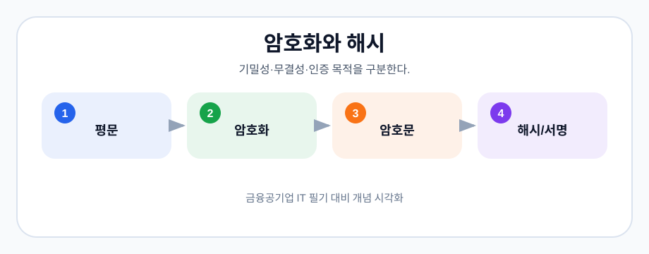

# 10-01. 암호화와 해시

> 학습 목적: 암호화와 해시의 목적 차이를 구분한다.
> 관련 기출: [05-12-보안-기출-모음](05-12-보안-기출-모음.md)
> 연결 핵심정리: [04-4-네트워크-프로토콜-보안](04-04-네트워크-프로토콜-보안.md)

## 핵심 개념

- 암호화는 복호화를 전제로 데이터를 보호한다.
- 해시는 일방향 요약값을 만든다.
- 대칭키와 공개키 방식의 키 사용 차이를 암기한다.

## 쉽게 이해하기

- 암호화는 자물쇠가 있는 상자에 내용을 넣는 것이다. 열쇠가 있으면 다시 원문을 볼 수 있다.
- 해시는 내용물을 고정 길이 지문으로 바꾸는 것이다. 지문으로 원문을 되돌리기는 어렵다.
- 비밀번호 저장에는 복호화가 필요 없는 해시가 적합하고, 메시지 보호에는 암호화가 필요하다.

> 그림: 기밀성·무결성·인증 목적을 구분한다.
> 출처: 이 저장소에서 생성한 학습용 다이어그램
## 빈출 포인트

- 정의와 특징을 구분하는 객관식 문항
- 비슷한 개념 간 차이 비교
- 실제 기출 키워드와 연결한 빠른 복습

## 기출 연결
- [05-12-보안-기출-모음](05-12-보안-기출-모음.md)에 관련 문항을 색인한다.

## 오답 포인트

- 용어의 이름보다 적용 조건을 먼저 확인한다.
- 예외와 반례가 있는 선지를 주의한다.
- 계산형 주제는 중간 과정을 생략하지 않는다.

## 빠른 점검

- 핵심 정의를 한 문장으로 설명할 수 있는가?
- 비슷한 개념과 차이를 말할 수 있는가?
- 관련 기출 키워드를 바로 떠올릴 수 있는가?
