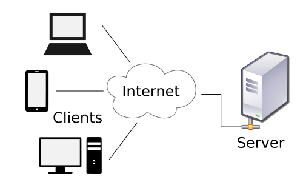

# 10. 보안

> 핵심: 암호화, 해시, 인증, 인가, 접근통제, 웹 공격, 네트워크 공격, 로그 감사

## 학습 순서

- [10-01. 암호화와 해시](10-01-암호화와-해시.md)
- [10-02. 인증-인가-접근통제](10-02-인증-인가-접근통제.md)
- [10-03. 웹-네트워크 공격](10-03-00-웹-네트워크-공격.md)
- [10-04. IDS-IPS-로그-감사](10-04-IDS-IPS-로그-감사.md)

> 그림: 클라이언트-서버 모델 기반으로 암호화와 해시 개념을 시각적으로 확인한다.
> 출처: https://commons.wikimedia.org/wiki/File:Client-server-model.svg

## 연결 핵심정리

- [04-4-네트워크-프로토콜-보안](04-04-네트워크-프로토콜-보안.md)

## 복습 포인트

- 공격명은 원리와 대응을 한 줄로 정리한다.
- 인증서·CA·TLS는 네트워크와 함께 복습한다.
- DDoS, XSS, SQL Injection은 기출 연결이 많다.

## 약어 풀이

- CA: Certificate Authority, 인증기관
- DDoS: Distributed Denial of Service, 분산 서비스 거부 공격
- IDS: Intrusion Detection System, 침입 탐지 시스템
- IPS: Intrusion Prevention System, 침입 방지 시스템
- SQL: Structured Query Language, 구조화 질의어
- XSS: Cross-Site Scripting, 교차 사이트 스크립팅
