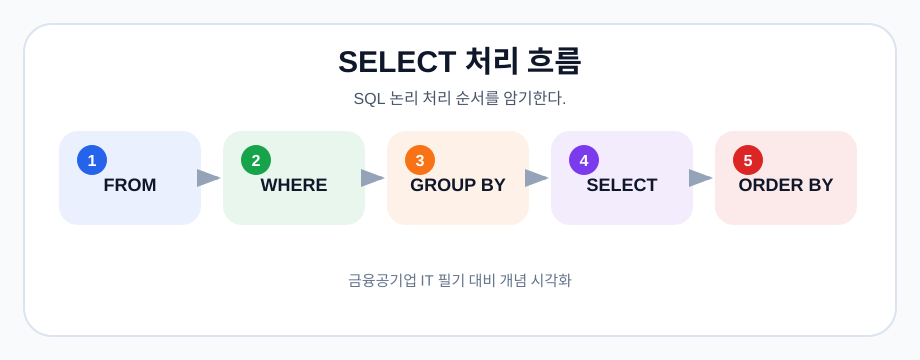

# 13-01-01. SELECT-WHERE-GROUP-BY

> 학습 목적: SQL 조회 기본 절을 손으로 해석한다.
> 관련 기출: [05-10-데이터베이스-기출-모음](05-10-데이터베이스-기출-모음.md)
> 연결 핵심정리: [04-2-프로그래밍-SQL-분산-클라우드](04-02-프로그래밍-SQL-분산-클라우드.md)

## 핵심 개념

- WHERE는 그룹화 전 조건이다.
- GROUP BY는 같은 값을 묶어 집계한다.
- HAVING은 그룹화 후 조건이다.

## 쉽게 이해하기

- WHERE는 개별 행을 걸러내는 체이고, GROUP BY는 남은 행을 묶는 바구니다.
- COUNT, SUM, AVG 같은 집계 함수는 그룹 단위로 계산할 때 자주 쓴다.
- HAVING은 그룹을 만든 뒤 그 그룹에 조건을 거는 절이다.

> 그림: SQL 논리 처리 순서를 암기한다.
> 출처: 이 저장소에서 생성한 학습용 다이어그램
## 빈출 포인트

- 정의와 특징을 구분하는 객관식 문항
- 비슷한 개념 간 차이 비교
- 실제 기출 키워드와 연결한 빠른 복습

## 기출 연결
- [05-10-데이터베이스-기출-모음](05-10-데이터베이스-기출-모음.md)에 관련 문항을 색인한다.

## 오답 포인트

- 용어의 이름보다 적용 조건을 먼저 확인한다.
- 예외와 반례가 있는 선지를 주의한다.
- 계산형 주제는 중간 과정을 생략하지 않는다.

## 빠른 점검

- 핵심 정의를 한 문장으로 설명할 수 있는가?
- 비슷한 개념과 차이를 말할 수 있는가?
- 관련 기출 키워드를 바로 떠올릴 수 있는가?

## 약어 풀이

- SELECT: SQL 조회 명령
- SQL: Structured Query Language, 구조화 질의어
