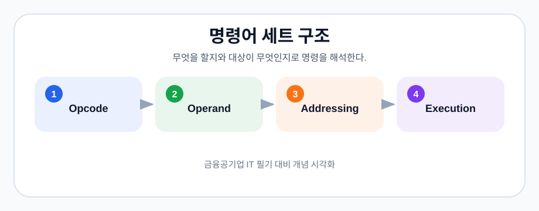

# 15-3. 명령어 세트

## ISA의 의미

명령어 세트 아키텍처(ISA)는 하드웨어와 소프트웨어 사이의 약속입니다. CPU가 이해하는 명령어, 레지스터, 주소 지정 방식, 데이터 형식을 정의합니다.

> 그림: 무엇을 할지와 대상이 무엇인지로 명령을 해석한다.
> 출처: 이 저장소에서 생성한 학습용 다이어그램

## RISC vs CISC

| 구분 | RISC | CISC |
|---|---|---|
| 명령어 | 단순하고 길이가 비교적 일정 | 복잡하고 다양한 길이 |
| 실행 | 파이프라인에 유리 | 명령 하나가 많은 일을 수행 |
| 예 | ARM, RISC-V | x86 계열 |
| 장점 | 전력 효율, 단순한 제어 | 코드 밀도, 하위 호환성 |

RISC가 항상 빠르고 CISC가 항상 느린 것은 아닙니다. 현대 CPU는 내부적으로 복잡한 명령을 마이크로 연산으로 변환해 실행하기도 합니다.

## 어드레싱 모드

- 즉시 주소 지정: 명령어 안에 상수 값 포함
- 직접 주소 지정: 명령어가 메모리 주소를 직접 지정
- 간접 주소 지정: 지정된 주소에 실제 주소가 저장
- 레지스터 주소 지정: 레지스터에 피연산자 저장
- 인덱스 주소 지정: 기준 주소와 인덱스를 더해 접근

## 기출 포인트

어드레싱 모드는 주소 계산 방식과 메모리 접근 횟수를 묻는 문제가 많습니다. RISC/CISC 비교는 단순 암기보다 파이프라인·전력·호환성 관점으로 정리해야 합니다.

## 약어 풀이

- CISC: Complex Instruction Set Computer, 복합 명령어 집합 컴퓨터
- RISC: Reduced Instruction Set Computer, 축소 명령어 집합 컴퓨터
