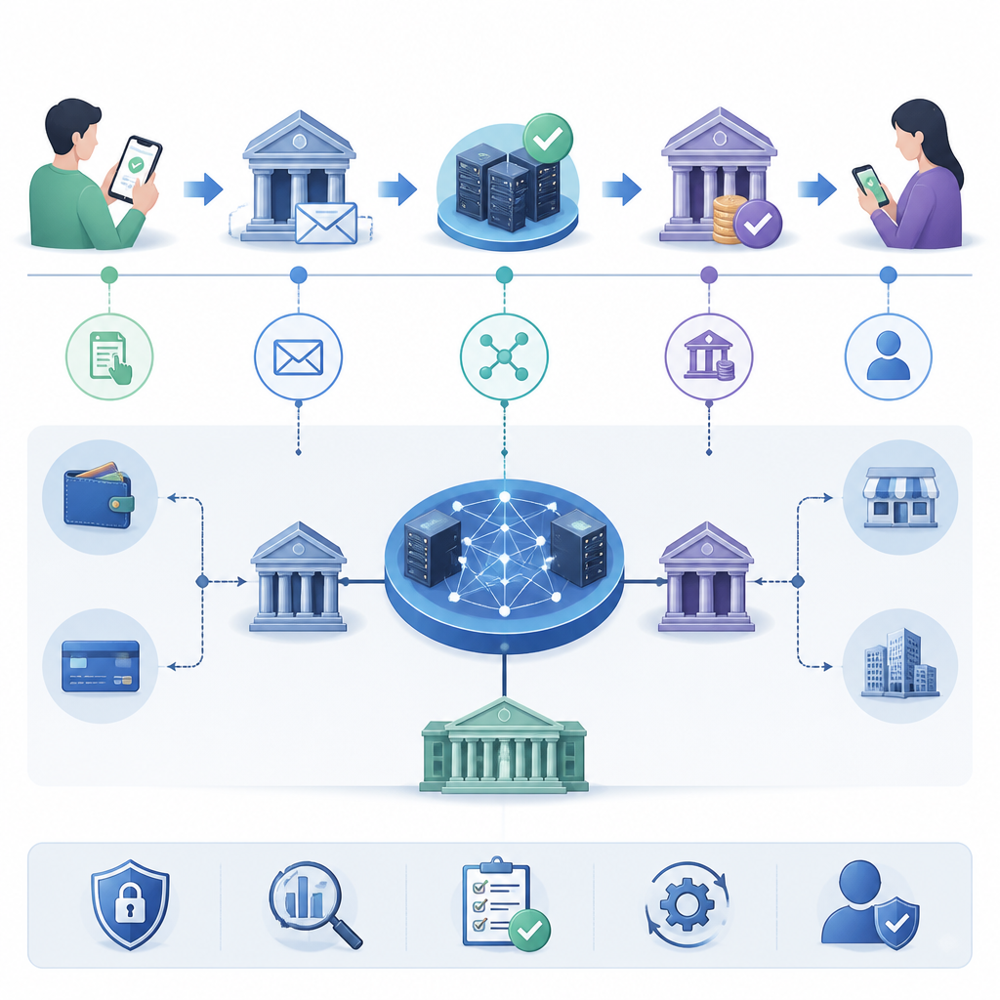

# 15. 금융 도메인 지식

금융공기업 IT 직무는 기술 지식만으로는 부족합니다. 기관이 운영하는 금융 인프라와 규제 환경을 이해해야 시스템 설계·장애 대응·면접 답변이 설득력을 갖습니다. 이 장은 핀테크, 결제 인프라, CBDC, 금융 규제, 디지털자산을 한 흐름으로 정리합니다.

> 그림: AI 생성 시각 자료. 거래 요청, 지급결제, 정산, 보고가 금융 인프라에서 어떻게 이어지는지 흐름으로 잡는다.
> 출처: 내부 생성 자산 (`assets/ai-generated-visual-aids/15-finance-domain-overview-ai.png`)

## 핵심 개념

- 금융 도메인은 지급결제, 금융데이터, 규제, 보안, 신기술을 연결해 이해해야 한다.
- 한국은행 직무 관점에서는 RTGS, 청산·결제, CBDC, 금융망 안정성, 장애 대응, 보안 통제가 핵심이다.
- 기술 답안은 API, 암호, 데이터, 운영통제를 금융 인프라의 신뢰성과 최종성으로 연결하면 설득력이 높아진다.
- 금융 시스템은 단순한 기능 개발보다 거래 확정성, 감사 가능성, 장애 복구 가능성을 먼저 만족해야 한다.

## 왜 금융 도메인 이해가 중요한가

금융공기업 시스템은 거래를 빠르게 처리하는 것만으로 충분하지 않습니다. 서비스가 멈추지 않아야 하고, 거래가 왜 승인·거절되었는지 추적할 수 있어야 하며, 규제기관과 내부감사에 설명 가능한 로그를 남겨야 합니다. 그래서 같은 API 개발 경험이라도 금융권에서는 다음 연결이 중요합니다.

- **업무 흐름 이해**: 조회·이체·정산·보고가 어떤 순서로 이어지는지 알아야 장애 영향을 판단할 수 있다.
- **리스크 관점**: 보안 사고, 중복 거래, 정산 불일치, 지연 전파가 기관 신뢰와 직접 연결된다.
- **운영 관점**: 변경관리, 배포 승인, 접근통제, DR 훈련까지 포함해 설명해야 실무형 답변이 된다.

## 지급결제와 청산·결제

지급결제는 거래 요청이 들어온 뒤 자금 이동이 확정되기까지의 전체 흐름을 뜻합니다. 이 흐름을 설명할 때는 청산과 결제를 분리해서 말하면 구조가 선명해집니다.

- **청산(clearing)**: 거래 정보를 모아 채권·채무를 계산하고, 누구에게 얼마를 지급해야 하는지 확정하는 단계
- **결제(settlement)**: 실제 자금이 이전되어 채무가 소멸하는 단계
- **최종성(finality)**: 결제가 완료된 뒤 취소되지 않고 확정되는 성질

면접에서는 "청산은 계산, 결제는 자금 이동, 최종성은 확정성"으로 먼저 짧게 정의한 뒤 RTGS와 DNS의 차이를 연결하면 좋습니다. 여기에 멱등성, 원장 정합성, 감사 로그 같은 기술 요소를 붙이면 IT 직무 답변으로 자연스럽게 이어집니다.

## 금융데이터·규제·보안

금융 데이터는 개인정보이면서 동시에 거래 증빙 자료입니다. 그래서 수집·저장·전송 전 과정에서 규제와 보안 요구사항을 함께 봐야 합니다.

| 관점 | 중요 질문 | 구현 포인트 |
| --- | --- | --- |
| 데이터 | 어떤 데이터를 왜 보관하는가 | 최소수집, 보존주기, 마스킹, 접근기록 |
| 규제 | 누가 언제 무엇을 했는지 설명 가능한가 | 감사 로그, 승인 이력, 변경관리 |
| 보안 | 거래와 정보가 위·변조되지 않았는가 | 인증·인가, 암호화, 키 관리, 무결성 검증 |
| 운영 | 장애가 나도 복구 가능한가 | 백업, 재처리 절차, RTO/RPO, 모니터링 |

특히 금융공기업은 "기능이 된다"보다 "통제 가능한 상태로 운영된다"가 더 중요합니다. 접근권한 분리, 로그 보존, 배치 재실행 절차, 장애 보고 체계 같은 운영 통제가 설계 단계부터 들어가야 합니다.

## CBDC와 디지털자산을 보는 관점

CBDC와 디지털자산은 모두 디지털 형태의 가치 이전을 다루지만, 제도적 위치와 설계 목적이 다릅니다.

- **CBDC**는 중앙은행이 발행하는 디지털 법정화폐로, 결제 최종성·법적 안정성·기존 지급결제 인프라와의 연계를 우선 고려한다.
- **디지털자산**은 거래·보관·토큰화 구조가 다양해 규제 지위, 보관 책임, 키 유출 위험, 시장 변동성을 함께 봐야 한다.
- 두 영역 모두 계정 기반/토큰 기반 구조, 프라이버시와 규제 준수의 균형, 대규모 처리 성능, 복구 절차가 핵심 설계 논점이다.

한국은행 지원 맥락에서는 "새로운 기술" 자체보다 기존 금융 인프라와 어떻게 안전하게 연결할지 설명하는 편이 더 설득력 있습니다.

## 금융공기업 IT 면접 답변 연결 포인트

- 결제 시스템을 설명할 때는 **신뢰성·최종성·감사 가능성**을 함께 언급한다.
- API를 설명할 때는 인증·인가뿐 아니라 **호출 한도, 로그, 장애 재처리**까지 묶어서 말한다.
- 데이터 활용을 말할 때는 분석 가치와 함께 **동의, 최소수집, 보존정책**을 붙인다.
- 장애 대응 질문에서는 탐지 → 격리 → 복구 → 사후 분석 흐름으로 구조화한다.

### 빠른 복습 체크리스트

- [ ] RTGS와 DNS의 차이를 유동성·위험 관점에서 설명할 수 있다.
- [ ] 청산, 결제, 최종성을 각각 한 문장으로 구분할 수 있다.
- [ ] 금융 데이터 처리에서 감사 로그가 왜 필요한지 말할 수 있다.
- [ ] 장애 대응 답변에 모니터링, 재처리, DR을 포함할 수 있다.

## 약어 풀이

- CBDC: Central Bank Digital Currency, 중앙은행 디지털화폐
- IT: Information Technology, 정보기술
- RTGS: Real-Time Gross Settlement, 실시간 총액결제
- DNS: Deferred Net Settlement, 이연차액결제
- DR: Disaster Recovery, 재해 복구
- RTO: Recovery Time Objective, 목표 복구 시간
- RPO: Recovery Point Objective, 목표 복구 시점
