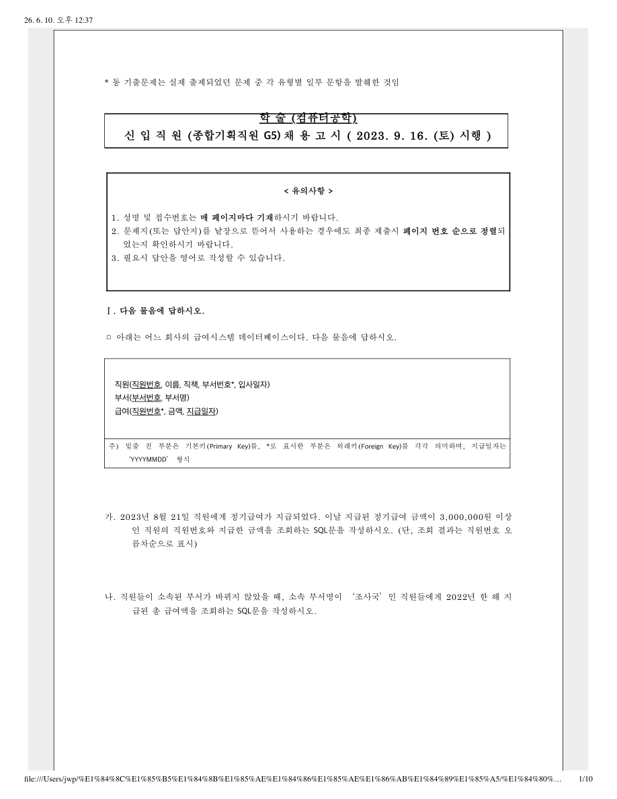
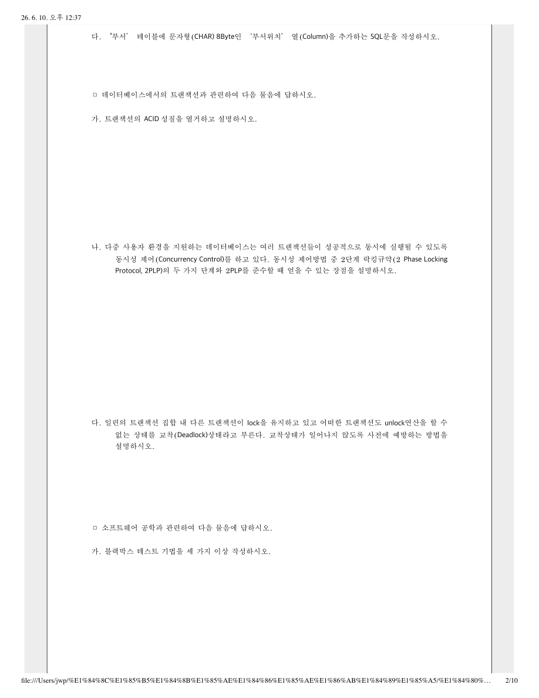
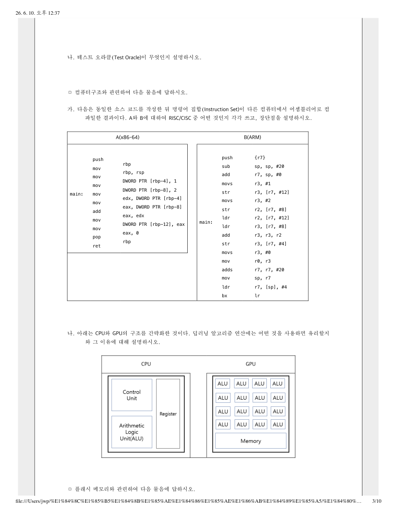
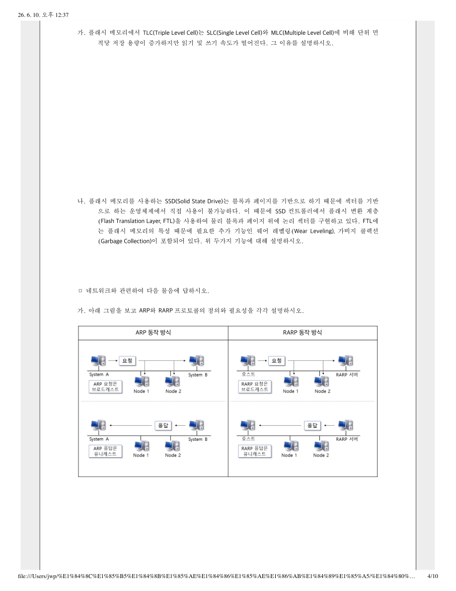
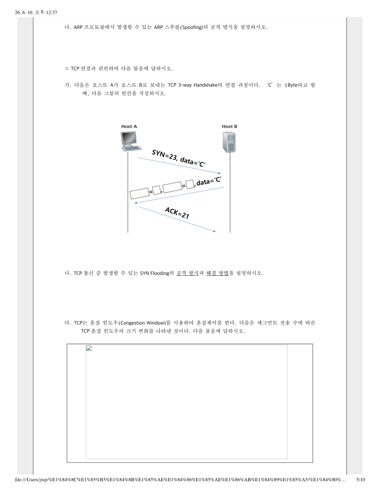
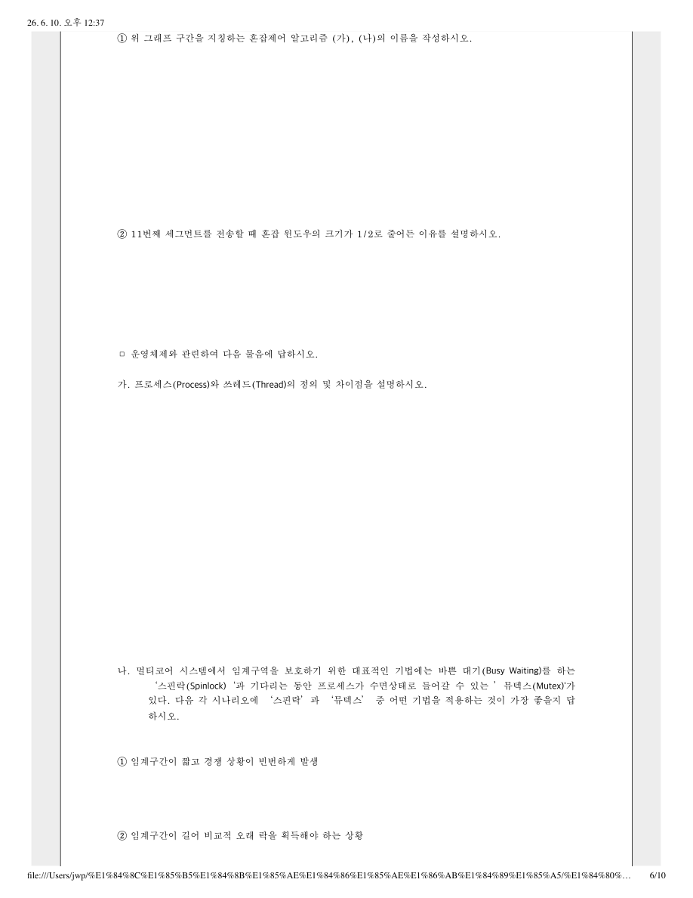
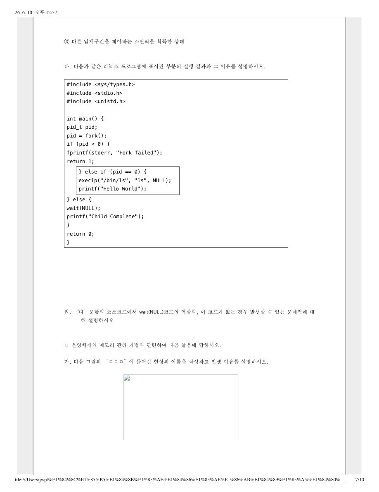
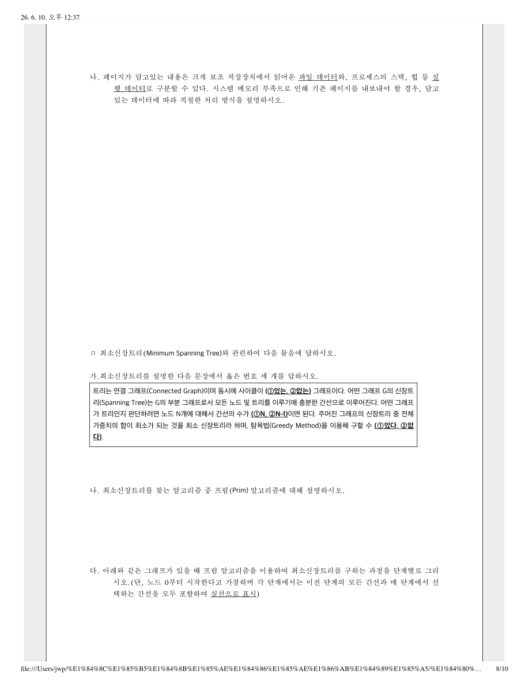
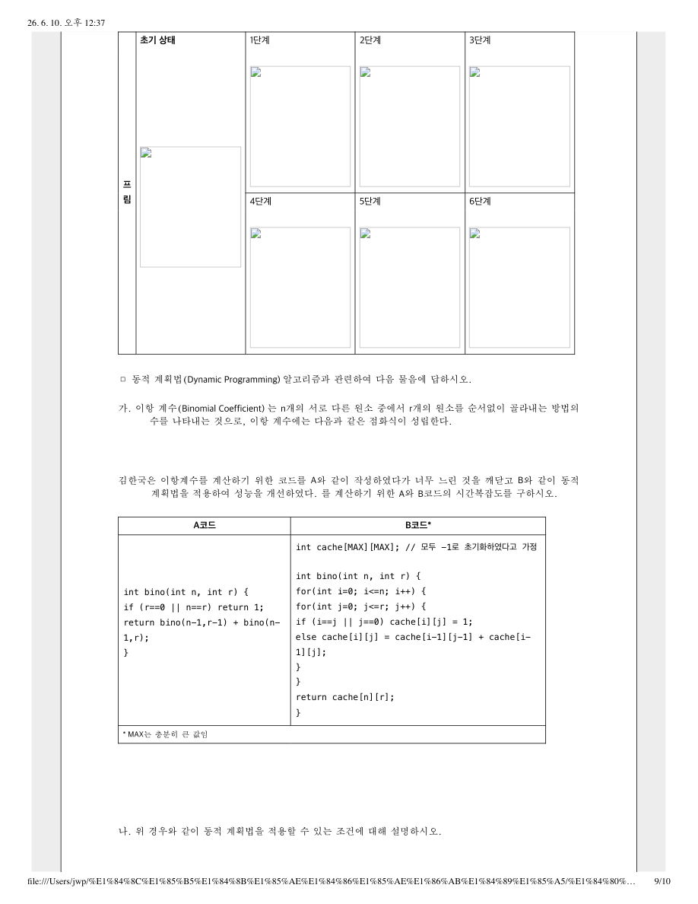
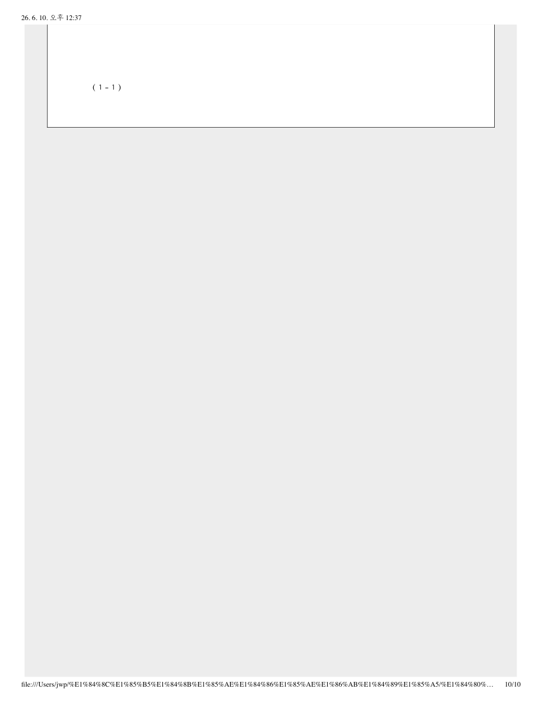

# 한국은행 2024 컴퓨터공학 학술 문제

- 원본 파일: `한국은행_2024_컴퓨터공학_학술.pdf`
- 총 페이지: 10
- 구성: 페이지별 원본 이미지 + 추출 텍스트


---

## Page 1



### 추출 텍스트

```text
학 술 (컴퓨터공학)
신 입 직 원 (종합기획직원 G5) 채 용 고 시 ( 2023. 9. 16. (토) 시행 )
< 유의사항 >
1. 성명 및 접수번호는 매 페이지마다 기재하시기 바랍니다.
2. 문제지(또는 답안지)를 낱장으로 뜯어서 사용하는 경우에도 최종 제출시 페이지 번호 순으로 정렬되
었는지 확인하시기 바랍니다.
3. 필요시 답안을 영어로 작성할 수 있습니다.
Ⅰ. 다음 물음에 답하시오.
□ 아래는 어느 회사의 급여시스템 데이터베이스이다. 다음 물음에 답하시오.
직원(직원번호, 이름, 직책, 부서번호*, 입사일자)
부서(부서번호, 부서명)
급여(직원번호*, 금액, 지급일자)
주) 밑줄 친 부분은 기본키(Primary Key)를, *로 표시한 부분은 외래키(Foreign Key)를 각각 의미하며, 지급일자는
‘YYYYMMDD’ 형식
가. 2023년 8월 21일 직원에게 정기급여가 지급되었다. 이날 지급된 정기급여 금액이 3,000,000원 이상
인 직원의 직원번호와 지급한 금액을 조회하는 SQL문을 작성하시오. (단, 조회 결과는 직원번호 오
름차순으로 표시)
나. 직원들이 소속된 부서가 바뀌지 않았을 때, 소속 부서명이 ‘조사국’인 직원들에게 2022년 한 해 지
급된 총 급여액을 조회하는 SQL문을 작성하시오.
* 동 기출문제는 실제 출제되었던 문제 중 각 유형별 일부 문항을 발췌한 것임
26. 6. 10. 오후 12:37
file:///Users/jwp/%E1%84%8C%E1%85%B5%E1%84%8B%E1%85%AE%E1%84%86%E1%85%AE%E1%86%AB%E1%84%89%E1%85%A5/%E1%84%80%…
1/10
```


---

## Page 2



### 추출 텍스트

```text
다. ‘부서’ 테이블에 문자형(CHAR) 8Byte인 ‘부서위치’ 열(Column)을 추가하는 SQL문을 작성하시오.
□ 데이터베이스에서의 트랜잭션과 관련하여 다음 물음에 답하시오.
가. 트랜잭션의 ACID 성질을 열거하고 설명하시오.
나. 다중 사용자 환경을 지원하는 데이터베이스는 여러 트랜잭션들이 성공적으로 동시에 실행될 수 있도록
동시성 제어(Concurrency Control)를 하고 있다. 동시성 제어방법 중 2단계 락킹규약(2 Phase Locking
Protocol, 2PLP)의 두 가지 단계와 2PLP를 준수할 때 얻을 수 있는 장점을 설명하시오.
다. 일련의 트랜잭션 집합 내 다른 트랜잭션이 lock을 유지하고 있고 어떠한 트랜잭션도 unlock연산을 할 수
없는 상태를 교착(Deadlock)상태라고 부른다. 교착상태가 일어나지 않도록 사전에 예방하는 방법을
설명하시오.
□ 소프트웨어 공학과 관련하여 다음 물음에 답하시오.
가. 블랙박스 테스트 기법을 세 가지 이상 작성하시오.
26. 6. 10. 오후 12:37
file:///Users/jwp/%E1%84%8C%E1%85%B5%E1%84%8B%E1%85%AE%E1%84%86%E1%85%AE%E1%86%AB%E1%84%89%E1%85%A5/%E1%84%80%…
2/10
```


---

## Page 3



### 추출 텍스트

```text
나. 테스트 오라클(Test Oracle)이 무엇인지 설명하시오.
□ 컴퓨터구조와 관련하여 다음 물음에 답하시오.
가. 다음은 동일한 소스 코드를 작성한 뒤 명령어 집합(Instruction Set)이 다른 컴퓨터에서 어셈블리어로 컴
파일한 결과이다. A와 B에 대하여 RISC/CISC 중 어떤 것인지 각각 쓰고, 장단점을 설명하시오.
A(x86-64)
B(ARM)
main:
push
mov
mov
mov
mov
mov
add
mov
mov
pop
ret
rbp
rbp, rsp
DWORD PTR [rbp-4], 1
DWORD PTR [rbp-8], 2
edx, DWORD PTR [rbp-4]
eax, DWORD PTR [rbp-8]
eax, edx
DWORD PTR [rbp-12], eax
eax, 0
rbp
main:
push
sub
add
movs
str
movs
str
ldr
ldr
add
str
movs
mov
adds
mov
ldr
bx
{r7}
sp, sp, #20
r7, sp, #0
r3, #1
r3, [r7, #12]
r3, #2
r2, [r7, #8]
r2, [r7, #12]
r3, [r7, #8]
r3, r3, r2
r3, [r7, #4]
r3, #0
r0, r3
r7, r7, #20
sp, r7
r7, [sp], #4
lr
나. 아래는 CPU와 GPU의 구조를 간략화한 것이다. 딥러닝 알고리즘 연산에는 어떤 것을 사용하면 유리할지
와 그 이유에 대해 설명하시오.
CPU
GPU
□ 플래시 메모리와 관련하여 다음 물음에 답하시오.
26. 6. 10. 오후 12:37
file:///Users/jwp/%E1%84%8C%E1%85%B5%E1%84%8B%E1%85%AE%E1%84%86%E1%85%AE%E1%86%AB%E1%84%89%E1%85%A5/%E1%84%80%…
3/10
```


---

## Page 4



### 추출 텍스트

```text
가. 플래시 메모리에서 TLC(Triple Level Cell)는 SLC(Single Level Cell)와 MLC(Multiple Level Cell)에 비해 단위 면
적당 저장 용량이 증가하지만 읽기 및 쓰기 속도가 떨어진다. 그 이유를 설명하시오.
나. 플래시 메모리를 사용하는 SSD(Solid State Drive)는 블록과 페이지를 기반으로 하기 때문에 섹터를 기반
으로 하는 운영체제에서 직접 사용이 불가능하다. 이 때문에 SSD 컨트롤러에서 플래시 변환 계층
(Flash Translation Layer, FTL)을 사용하여 물리 블록과 페이지 위에 논리 섹터를 구현하고 있다. FTL에
는 플래시 메모리의 특성 때문에 필요한 추가 기능인 웨어 레벨링(Wear Leveling), 가비지 콜렉션
(Garbage Collection)이 포함되어 있다. 위 두가지 기능에 대해 설명하시오.
□ 네트워크와 관련하여 다음 물음에 답하시오.
가. 아래 그림을 보고 ARP와 RARP 프로토콜의 정의와 필요성을 각각 설명하시오.
ARP 동작 방식
RARP 동작 방식
26. 6. 10. 오후 12:37
file:///Users/jwp/%E1%84%8C%E1%85%B5%E1%84%8B%E1%85%AE%E1%84%86%E1%85%AE%E1%86%AB%E1%84%89%E1%85%A5/%E1%84%80%…
4/10
```


---

## Page 5



### 추출 텍스트

```text
나. ARP 프로토콜에서 발생할 수 있는 ARP 스푸핑(Spoofing)의 공격 방식을 설명하시오.
□ TCP 연결과 관련하여 다음 물음에 답하시오.
가. 다음은 호스트 A가 호스트 B로 보내는 TCP 3-way Handshake의 연결 과정이다. ‘C’는 1Byte라고 할
때, 다음 그림의 빈칸을 작성하시오.
나. TCP 통신 중 발생할 수 있는 SYN Flooding의 공격 방식과 해결 방법을 설명하시오.
다. TCP는 혼잡 윈도우(Congestion Window)를 사용하여 혼잡제어를 한다. 다음은 세그먼트 전송 수에 따른
TCP 혼잡 윈도우의 크기 변화를 나타낸 것이다. 다음 물음에 답하시오.
26. 6. 10. 오후 12:37
file:///Users/jwp/%E1%84%8C%E1%85%B5%E1%84%8B%E1%85%AE%E1%84%86%E1%85%AE%E1%86%AB%E1%84%89%E1%85%A5/%E1%84%80%…
5/10
```


---

## Page 6



### 추출 텍스트

```text
① 위 그래프 구간을 지칭하는 혼잡제어 알고리즘 (가), (나)의 이름을 작성하시오.
② 11번째 세그먼트를 전송할 때 혼잡 윈도우의 크기가 1/2로 줄어든 이유를 설명하시오.
□ 운영체제와 관련하여 다음 물음에 답하시오.
가. 프로세스(Process)와 쓰레드(Thread)의 정의 및 차이점을 설명하시오.
나. 멀티코어 시스템에서 임계구역을 보호하기 위한 대표적인 기법에는 바쁜 대기(Busy Waiting)를 하는
‘스핀락(Spinlock)‘과 기다리는 동안 프로세스가 수면상태로 들어갈 수 있는 ’뮤텍스(Mutex)'가
있다. 다음 각 시나리오에 ‘스핀락’과 ‘뮤텍스’ 중 어떤 기법을 적용하는 것이 가장 좋을지 답
하시오.
① 임계구간이 짧고 경쟁 상황이 빈번하게 발생
② 임계구간이 길어 비교적 오래 락을 획득해야 하는 상황
26. 6. 10. 오후 12:37
file:///Users/jwp/%E1%84%8C%E1%85%B5%E1%84%8B%E1%85%AE%E1%84%86%E1%85%AE%E1%86%AB%E1%84%89%E1%85%A5/%E1%84%80%…
6/10
```


---

## Page 7



### 추출 텍스트

```text
③ 다른 임계구간을 제어하는 스핀락을 획득한 상태
다. 다음과 같은 리눅스 프로그램에 표시된 부분의 실행 결과와 그 이유를 설명하시오.
#include <sys/types.h>
#include <stdio.h>
#include <unistd.h>
int main() {
pid_t pid;
pid = fork();
if (pid < 0) {
fprintf(stderr, "Fork failed");
return 1;
} else if (pid == 0) {
execlp("/bin/ls", "ls", NULL);
printf("Hello World");
} else {
wait(NULL);
printf("Child Complete");
}
return 0;
}
라. ‘다’문항의 소스코드에서 wait(NULL)코드의 역할과, 이 코드가 없는 경우 발생할 수 있는 문제점에 대
해 설명하시오.
□ 운영체제의 메모리 관리 기법과 관련하여 다음 물음에 답하시오.
가. 다음 그림의 “□□□”에 들어갈 현상의 이름을 작성하고 발생 이유를 설명하시오.
26. 6. 10. 오후 12:37
file:///Users/jwp/%E1%84%8C%E1%85%B5%E1%84%8B%E1%85%AE%E1%84%86%E1%85%AE%E1%86%AB%E1%84%89%E1%85%A5/%E1%84%80%…
7/10
```


---

## Page 8



### 추출 텍스트

```text
나. 페이지가 담고있는 내용은 크게 보조 저장장치에서 읽어온 파일 데이터와, 프로세스의 스택, 힙 등 실
행 데이터로 구분할 수 있다. 시스템 메모리 부족으로 인해 기존 페이지를 내보내야 할 경우, 담고
있는 데이터에 따라 적절한 처리 방식을 설명하시오.
□ 최소신장트리(Minimum Spanning Tree)와 관련하여 다음 물음에 답하시오.
가.최소신장트리를 설명한 다음 문장에서 옳은 번호 세 개를 답하시오.
트리는 연결 그래프(Connected Graph)이며 동시에 사이클이 (①있는, ②없는) 그래프이다. 어떤 그래프 G의 신장트
리(Spanning Tree)는 G의 부분 그래프로서 모든 노드 및 트리를 이루기에 충분한 간선으로 이루어진다. 어떤 그래프
가 트리인지 판단하려면 노드 N개에 대해서 간선의 수가 (①N, ②N-1)이면 된다. 주어진 그래프의 신장트리 중 전체
가중치의 합이 최소가 되는 것을 최소 신장트리라 하며, 탐욕법(Greedy Method)을 이용해 구할 수 (①있다, ②없
다).
나. 최소신장트리를 찾는 알고리즘 중 프림(Prim) 알고리즘에 대해 설명하시오.
다. 아래와 같은 그래프가 있을 때 프림 알고리즘을 이용하여 최소신장트리를 구하는 과정을 단계별로 그리
시오.(단, 노드 0부터 시작한다고 가정하며 각 단계에서는 이전 단계의 모든 간선과 매 단계에서 선
택하는 간선을 모두 포함하여 실선으로 표시)
26. 6. 10. 오후 12:37
file:///Users/jwp/%E1%84%8C%E1%85%B5%E1%84%8B%E1%85%AE%E1%84%86%E1%85%AE%E1%86%AB%E1%84%89%E1%85%A5/%E1%84%80%…
8/10
```


---

## Page 9



### 추출 텍스트

```text
프
림
초기 상태
1단계
2단계
3단계
4단계
5단계
6단계
□ 동적 계획법(Dynamic Programming) 알고리즘과 관련하여 다음 물음에 답하시오.
가. 이항 계수(Binomial Coefficient) 는 n개의 서로 다른 원소 중에서 r개의 원소를 순서없이 골라내는 방법의
수를 나타내는 것으로, 이항 계수에는 다음과 같은 점화식이 성립한다.
김한국은 이항계수를 계산하기 위한 코드를 A와 같이 작성하였다가 너무 느린 것을 깨닫고 B와 같이 동적
계획법을 적용하여 성능을 개선하였다. 를 계산하기 위한 A와 B코드의 시간복잡도를 구하시오.
A코드
B코드*
int bino(int n, int r) {
if (r==0 || n==r) return 1;
return bino(n-1,r-1) + bino(n-
1,r);
}
int cache[MAX][MAX]; // 모두 -1로 초기화하였다고 가정
int bino(int n, int r) {
for(int i=0; i<=n; i++) {
for(int j=0; j<=r; j++) {
if (i==j || j==0) cache[i][j] = 1;
else cache[i][j] = cache[i-1][j-1] + cache[i-
1][j];
}
}
return cache[n][r];
}
* MAX는 충분히 큰 값임
나. 위 경우와 같이 동적 계획법을 적용할 수 있는 조건에 대해 설명하시오.
26. 6. 10. 오후 12:37
file:///Users/jwp/%E1%84%8C%E1%85%B5%E1%84%8B%E1%85%AE%E1%84%86%E1%85%AE%E1%86%AB%E1%84%89%E1%85%A5/%E1%84%80%…
9/10
```


---

## Page 10



### 추출 텍스트

```text
( 1 - 1 )
26. 6. 10. 오후 12:37
file:///Users/jwp/%E1%84%8C%E1%85%B5%E1%84%8B%E1%85%AE%E1%84%86%E1%85%AE%E1%86%AB%E1%84%89%E1%85%A5/%E1%84%80%…
10/10
```
