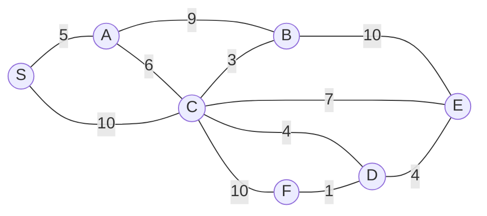

# 한국은행 2026 컴퓨터공학 학술 문제

신입직원(종합기획직원 G5) 채용 고시  
시행일: 2025. 9. 13. (토)

> 동 기출문제는 실제 출제되었던 문제 중 각 유형별 일부 문항을 발췌한 것임

---

## 유의사항

1. 성명 및 접수번호는 매 페이지마다 기재하시기 바랍니다.
2. 시험지를 낱장으로 뜯어서 사용하는 경우에도 최종 제출시 페이지 번호 순으로 정렬되었는지 확인하시기 바랍니다.
3. 검정색 또는 파란색 펜만 사용 가능하며, 수정액 또는 수정테이프는 사용할 수 없으므로 수정이 필요한 부분은 펜으로 두 줄 긋고 다시 작성하시기 바랍니다.
4. 필요시 답안을 영어로 작성할 수 있습니다.
5. 본 시험지는 1교시 전공학술 시험지이며, 2교시 논술(공통) 시험지는 별도로 제공됩니다.

---

# Ⅰ. 다음 물음에 답하시오.

## 1. 데이터베이스 스키마

다음은 각 부서의 IT요청을 관리하기 위한 테이블의 레이아웃과 데이터 목록이다.

### 부서

| 부서ID | 부서명 |
|---|---|
| D01 | 기술지원부 |
| D02 | 고객관리부 |
| D03 | 인사부 |

### 직원

| 직원ID | 직원명 | 부서ID* |
|---|---|---|
| E01 | 김한국 | D01 |
| E02 | 이은행 | D01 |
| E03 | 박물가 | D02 |
| E04 | 최안정 | D03 |
| E05 | 정금융 | D02 |

### 요청

| 요청ID | 제목 | 상태 | 직원ID* |
|---:|---|---|---|
| 1 | 네트워크 접속 오류 | 접수 | E01 |
| 2 | 신규 S/W설치 문의 | 처리중 | E01 |
| 3 | 개인정보 변경 | 완료 | E03 |
| 4 | 업무용 계정 생성 | 접수 | E04 |
| 5 | 프린터 토너 교체 | 완료 | E03 |
| 6 | VDI 접속 문제 | 접수 | E02 |

> 주) 밑줄 친 부분은 기본키(primary key)를, `*`로 표시한 부분은 외래키(foreign key)를 각각 의미

### 1-가.

다음 SQL문을 실행하면 오류가 발생하는데, 그 원인에 대하여 설명하시오.

```sql
DELETE FROM 부서 WHERE 부서ID='D01';
```

### 1-나.

각 부서별로 접수된 요청의 수를 구하려고 한다. 요청 수가 2건 이상인 부서의 부서명과 해당 부서의 총 요청 수를 예상 결과와 같이 조회하는 SQL문을 작성하시오.

#### 예상 결과

| 부서명 | 총요청수 |
|---|---:|
| 기술지원부 | 3 |
| 고객관리부 | 2 |

---

## 2. 데이터베이스

### 2-가.

데이터베이스 장애가 일어났을 때 일관성을 유지하는 상태로 복원하는 리커버리(Recovery) 방법에는 Redo와 Undo가 있다. 이에 대하여 각각 어떤 방식으로 복원하는지 설명하시오.

### 2-나.

트리거(Trigger)는 데이터베이스에서 INSERT, UPDATE, DELETE와 같은 이벤트가 발생할 때 자동으로 실행되는 동작이다. 이러한 트리거를 사용할 때 주의해야 할 사항을 두 가지 서술하시오.

---

## 3. 프로그래밍 언어

### 3-가.

다음 코드의 실행 결과에 대해 설명하시오.

```c
unsigned int i;
for (i = 100; i >= 0; )
    printf("%u\n", --i);
```

### 3-나.

파이썬(Python)의 자료구조 중 list, tuple, set의 차이점에 대하여 설명하시오.

### 3-다.

자바(Java)의 접근 제어자(Access Modifier)에는 default, private, protected, public이 있다. 각 접근 제어자에 대하여 설명하고 영향 범위가 넓은 순서대로 정렬하시오.

---

## 4. 소프트웨어 공학

### 4-가.

코드 리팩토링(Refactoring)에 대한 개념을 서술하시오.

### 4-나.

소프트웨어 개발 모델 중 V모델은 폭포수(Waterfall) 모델의 변형으로, 테스트 단계를 추가 확장해 테스트 단계가 분석 및 설계와 어떻게 관련되어 있는지를 나타내는 모델이다. V모델의 설계 단계 중 ①과 ②가 어떤 설계인지 빈칸을 채우고, 단위 테스트와 통합 테스트 단계에서는 각각 어떤 테스트를 수행하는지 서술하시오.

```text
요구분석 → ① → ② → 구현 → 단위 테스트 → 통합 테스트 → 시스템 테스트 → 인수 테스트
```

### 4-다.

최근 소프트웨어 개발의 신속성과 효율성을 목적으로 오픈소스를 활용하는 사례가 증가하고 있다. 오픈소스를 활용할 때 주의해야 할 사항 세 가지를 서술하시오.

---

## 5. 그래프 알고리즘 및 정렬

다음 그래프를 보고, 물음에 답하시오.

### 그래프



그래프의 간선은 다음과 같다.

| 간선 | 가중치 |
|---|---:|
| S-A | 5 |
| S-C | 10 |
| A-B | 9 |
| A-C | 6 |
| C-B | 3 |
| B-E | 10 |
| C-E | 7 |
| C-D | 4 |
| C-F | 10 |
| F-D | 1 |
| D-E | 4 |

### 5-가.

크루스칼(Kruskal’s) 알고리즘으로 생성된 경로를 그리시오.

### 5-나.

단일 시작점에서 다른 지점까지의 최단 경로(shortest-path)를 구하는 알고리즘으로 다익스트라(Dijkstra) 알고리즘이 있다. 위 그래프의 S부터 시작해서 다익스트라 알고리즘으로 계산되는 값(dist)을 단계별로 표현하시오. 단, 업데이트되지 않는 과정은 생략.

#### 답변 예시

| step | S | A | B | C | D | E | F |
|---:|---|---|---|---|---|---|---|
| 1 | - | ∞ | ∞ | ∞ | ∞ | ∞ | ∞ |
| 2 |  |  |  |  |  |  |  |
| … |  |  |  |  |  |  |  |

### 5-다.

다익스트라(Dijkstra) 알고리즘이 다른 최단 경로 알고리즘과 비교할 때 가지는 한계와 대체할 수 있는 알고리즘을 제시하고, 다익스트라 알고리즘과 비교해서 제시한 알고리즘의 동작방식이 어떻게 다른지 설명하시오.

### 5-라.

데이터를 순서대로 정렬하기 위해 다음과 같이 동일한 평균 시간복잡도를 갖는 두 가지 코드를 작성하였다. 각 코드에서 발생할 수 있는 최악의 시간복잡도를 제시하시오. 그리고, 평균 시간복잡도와 최악의 시간복잡도가 차이나는 경우 그 이유에 대하여 설명하시오.

#### A정렬\*

```c
int partition(int A[], int first, int last) {
    int low, high, p;
    p = A[last];
    low = first;
    high = last - 1;

    while (low < high) {
        while (p > A[low]) low++;
        while (p < A[high]) high--;
        if (low < high)
            swap(&A[low], &A[high]);
    }

    swap(&A[low], &A[last]);
    return low;
}

void aSort(int A[], int first, int last) {
    if (first < last) {
        int pivotIndex = partition(A, first, last);
        aSort(A, first, pivotIndex - 1);
        aSort(A, pivotIndex + 1, last);
    }
}
```

#### B정렬\*\*

```c
int sorted[MAX];

void _bSort(int list[], int left, int mid, int right) {
    int i, j, k, l;
    i = left;
    j = mid + 1;
    k = left;

    while (i <= mid && j <= right) {
        if (list[i] <= list[j])
            sorted[k++] = list[i++];
        else
            sorted[k++] = list[j++];
    }

    if (i > mid) {
        for (l = j; l <= right; l++)
            sorted[k++] = list[l];
    } else {
        for (l = i; l <= mid; l++)
            sorted[k++] = list[l];
    }

    for (l = left; l <= right; l++)
        list[l] = sorted[l];
}

void bSort(int A[], int first, int last) {
    int mid;
    if (first < last) {
        mid = (first + last) / 2;
        bSort(A, first, mid);
        bSort(A, mid + 1, last);
        _bSort(A, first, mid, last);
    }
}
```

> \* swap은 첫 번째와 두 번째 인자의 값을 서로 교환하는 함수  
> \*\* MAX는 충분히 큰 값임

---

## 6. 네트워크

### 6-가.

여러 대의 PC가 있고, 공유기를 이용하여 사설 네트워크를 구성하려고 한다. 이때, 사설 IP주소를 할당받은 PC는 어떻게 외부 인터넷과 통신하는지 그 구성을 기술하고, IPv4 체계에서 사설 IP주소를 구분함으로써 가질 수 있는 이점을 설명하시오.

### 6-나.

허브와 L2스위치의 차이점을 기술하시오.

### 6-다.

L2스위치와 라우터의 차이점을 기술하시오.

---

## 7. 보안

### 7-가.

공개키(Public key)와 개인키(Private key) 쌍을 이용하여 암호화하는 방식을 비대칭키(Asymmetric key) 방식이라고 한다. 비대칭키 방식은 대칭키 방식에 비해 통신속도가 느리므로, 주로 대칭키(Symmetric key) 교환을 안전하게 수행하기 위한 용도로 사용한다. 이때, 비대칭키를 이용하여 대칭키를 교환하는 과정을 순서대로 나열하시오.

### 7-나.

Cross Site Scripting(XSS)과 Cross Site Request Forgery(CSRF) 두 가지 공격방식에 대응하기 위하여 웹서비스 제공자의 입장에서 취할 수 있는 보호조치를 각각 기술하시오.

---

## 8. 머신 러닝

### 8-가.

비지도 학습(Unsupervised Learning)의 대표적인 알고리즘 중 하나인 K-means 알고리즘은 주어진 n개의 관측값을 k개의 클러스터로 분할하는 알고리즘으로, 관측값들은 거리가 최소인 클러스터로 분류된다. K-means 알고리즘은 데이터에 대한 사전 정보 없이도 데이터를 군집화할 수 있다는 장점이 있지만, 몇 가지 한계를 가진다. K-means 알고리즘의 한계를 세 가지 서술하시오.

### 8-나.

다음의 스팸메일 분류 모델 결과에 대해 정확도(Accuracy), 정밀도(Precision), 재현율(Recall)을 각각 계산하시오. 단, 모든 결과는 백분율로 환산한 퍼센티지(%)로 표현.

| 예측 결과 \ 실제 결과 | 스팸(Positive) | 스팸 아님(Negative) |
|---|---:|---:|
| 스팸(Positive) | 30 | 10 |
| 스팸 아님(Negative) | 20 | 40 |

---

## 9. 정규 표현식 및 텍스트 마이닝

### 9-가.

정규 표현식(Regular Expression)은 특정한 규칙을 가진 문자열 집합을 표현하기 위해 사용되는 형식 언어다. 다음은 정규 표현식 규칙 중 일부분이다.

#### 정규 표현식 규칙

| 기호 | 의미 | 정규 표현식 예시 | 문자열 예시 | 결과 |
|---|---|---|---|---|
| `?` | 0회 또는 1회 표현 | `colou?r` | `colour` | 매칭 |
| `?` | 0회 또는 1회 표현 | `colou?r` | `color` | 매칭 |
| `?` | 0회 또는 1회 표현 | `colou?r` | `colur` | 매칭 안 됨 |
| `*` | 0회 이상 반복 | `wo*w` | `ww` | 매칭 |
| `*` | 0회 이상 반복 | `wo*w` | `wow` | 매칭 |
| `*` | 0회 이상 반복 | `wo*w` | `wooow` | 매칭 |
| `*` | 0회 이상 반복 | `wo*w` | `ow` | 매칭 안 됨 |
| `+` | 1회 이상 반복 | `wo+w` | `ww` | 매칭 안 됨 |
| `+` | 1회 이상 반복 | `wo+w` | `wow` | 매칭 |
| `+` | 1회 이상 반복 | `wo+w` | `wooow` | 매칭 |
| `+` | 1회 이상 반복 | `wo+w` | `wo` | 매칭 안 됨 |
| `( )` | 그룹화 | `ba(na)+na` | `bana` | 매칭 안 됨 |
| `( )` | 그룹화 | `ba(na)+na` | `banana` | 매칭 |
| `( )` | 그룹화 | `ba(na)+na` | `banaana` | 매칭 안 됨 |

이를 활용하여 (A)~(D)의 문자열이 아래에 제시된 정규 표현식에 매칭되는지를 각각 적으시오.

| 정규 표현식 | 문자열 |
|---|---|
| `a?ab*c*ab+` | (A) `abcab` |
| `a?ab*c*ab+` | (B) `aaab` |
| `a?ab*c*ab+` | (C) `aabbccab` |
| `a?ab*c*ab+` | (D) `abcbb` |

### 9-나.

전통적인 텍스트 마이닝(Text Mining) 기법에서 사용하는 Bag-of-Words(BoW)에 대한 개념을 서술하시오.

### 9-다.

최근 대규모 언어 모델(Large Language Model: LLM)을 사용함에 있어서 대두되고 있는 문제 중 하나로 환각현상(Hallucination)이 있고, 이를 해결하기 위해 제안된 방법의 하나로 검색증강생성(Retrieval Augmented Generation: RAG)이 있다. 환각현상과 검색증강생성에 대한 개념을 각각 서술하시오.

---

문서 끝.
