# 한국은행 컴퓨터공학 학술 문제 Markdown 변환본 (2019, 2021-2024)

> 각 PDF의 텍스트 추출본과 원본 페이지 이미지를 함께 포함했습니다. 표/도식/그래프처럼 텍스트 추출이 깨질 수 있는 부분은 페이지 이미지에서 원본을 확인할 수 있습니다.


# 한국은행 2024 컴퓨터공학 학술

- 개별 파일: `한국은행_2024_컴퓨터공학_학술_문제.md`


---

## Page 1


### 추출 텍스트

```text
학 술 (컴퓨터공학)
신 입 직 원 (종합기획직원 G5) 채 용 고 시 ( 2023. 9. 16. (토) 시행 )
< 유의사항 >
1. 성명 및 접수번호는 매 페이지마다 기재하시기 바랍니다.
2. 문제지(또는 답안지)를 낱장으로 뜯어서 사용하는 경우에도 최종 제출시 페이지 번호 순으로 정렬되
었는지 확인하시기 바랍니다.
3. 필요시 답안을 영어로 작성할 수 있습니다.
Ⅰ. 다음 물음에 답하시오.
□ 아래는 어느 회사의 급여시스템 데이터베이스이다. 다음 물음에 답하시오.
직원(직원번호, 이름, 직책, 부서번호*, 입사일자)
부서(부서번호, 부서명)
급여(직원번호*, 금액, 지급일자)
주) 밑줄 친 부분은 기본키(Primary Key)를, *로 표시한 부분은 외래키(Foreign Key)를 각각 의미하며, 지급일자는
‘YYYYMMDD’ 형식
가. 2023년 8월 21일 직원에게 정기급여가 지급되었다. 이날 지급된 정기급여 금액이 3,000,000원 이상
인 직원의 직원번호와 지급한 금액을 조회하는 SQL문을 작성하시오. (단, 조회 결과는 직원번호 오
름차순으로 표시)
나. 직원들이 소속된 부서가 바뀌지 않았을 때, 소속 부서명이 ‘조사국’인 직원들에게 2022년 한 해 지
급된 총 급여액을 조회하는 SQL문을 작성하시오.
* 동 기출문제는 실제 출제되었던 문제 중 각 유형별 일부 문항을 발췌한 것임
26. 6. 10. 오후 12:37
file:///Users/jwp/%E1%84%8C%E1%85%B5%E1%84%8B%E1%85%AE%E1%84%86%E1%85%AE%E1%86%AB%E1%84%89%E1%85%A5/%E1%84%80%…
1/10
```


---

## Page 2


### 추출 텍스트

```text
다. ‘부서’ 테이블에 문자형(CHAR) 8Byte인 ‘부서위치’ 열(Column)을 추가하는 SQL문을 작성하시오.
□ 데이터베이스에서의 트랜잭션과 관련하여 다음 물음에 답하시오.
가. 트랜잭션의 ACID 성질을 열거하고 설명하시오.
나. 다중 사용자 환경을 지원하는 데이터베이스는 여러 트랜잭션들이 성공적으로 동시에 실행될 수 있도록
동시성 제어(Concurrency Control)를 하고 있다. 동시성 제어방법 중 2단계 락킹규약(2 Phase Locking
Protocol, 2PLP)의 두 가지 단계와 2PLP를 준수할 때 얻을 수 있는 장점을 설명하시오.
다. 일련의 트랜잭션 집합 내 다른 트랜잭션이 lock을 유지하고 있고 어떠한 트랜잭션도 unlock연산을 할 수
없는 상태를 교착(Deadlock)상태라고 부른다. 교착상태가 일어나지 않도록 사전에 예방하는 방법을
설명하시오.
□ 소프트웨어 공학과 관련하여 다음 물음에 답하시오.
가. 블랙박스 테스트 기법을 세 가지 이상 작성하시오.
26. 6. 10. 오후 12:37
file:///Users/jwp/%E1%84%8C%E1%85%B5%E1%84%8B%E1%85%AE%E1%84%86%E1%85%AE%E1%86%AB%E1%84%89%E1%85%A5/%E1%84%80%…
2/10
```


---

## Page 3


### 추출 텍스트

```text
나. 테스트 오라클(Test Oracle)이 무엇인지 설명하시오.
□ 컴퓨터구조와 관련하여 다음 물음에 답하시오.
가. 다음은 동일한 소스 코드를 작성한 뒤 명령어 집합(Instruction Set)이 다른 컴퓨터에서 어셈블리어로 컴
파일한 결과이다. A와 B에 대하여 RISC/CISC 중 어떤 것인지 각각 쓰고, 장단점을 설명하시오.
A(x86-64)
B(ARM)
main:
push
mov
mov
mov
mov
mov
add
mov
mov
pop
ret
rbp
rbp, rsp
DWORD PTR [rbp-4], 1
DWORD PTR [rbp-8], 2
edx, DWORD PTR [rbp-4]
eax, DWORD PTR [rbp-8]
eax, edx
DWORD PTR [rbp-12], eax
eax, 0
rbp
main:
push
sub
add
movs
str
movs
str
ldr
ldr
add
str
movs
mov
adds
mov
ldr
bx
{r7}
sp, sp, #20
r7, sp, #0
r3, #1
r3, [r7, #12]
r3, #2
r2, [r7, #8]
r2, [r7, #12]
r3, [r7, #8]
r3, r3, r2
r3, [r7, #4]
r3, #0
r0, r3
r7, r7, #20
sp, r7
r7, [sp], #4
lr
나. 아래는 CPU와 GPU의 구조를 간략화한 것이다. 딥러닝 알고리즘 연산에는 어떤 것을 사용하면 유리할지
와 그 이유에 대해 설명하시오.
CPU
GPU
□ 플래시 메모리와 관련하여 다음 물음에 답하시오.
26. 6. 10. 오후 12:37
file:///Users/jwp/%E1%84%8C%E1%85%B5%E1%84%8B%E1%85%AE%E1%84%86%E1%85%AE%E1%86%AB%E1%84%89%E1%85%A5/%E1%84%80%…
3/10
```


---

## Page 4


### 추출 텍스트

```text
가. 플래시 메모리에서 TLC(Triple Level Cell)는 SLC(Single Level Cell)와 MLC(Multiple Level Cell)에 비해 단위 면
적당 저장 용량이 증가하지만 읽기 및 쓰기 속도가 떨어진다. 그 이유를 설명하시오.
나. 플래시 메모리를 사용하는 SSD(Solid State Drive)는 블록과 페이지를 기반으로 하기 때문에 섹터를 기반
으로 하는 운영체제에서 직접 사용이 불가능하다. 이 때문에 SSD 컨트롤러에서 플래시 변환 계층
(Flash Translation Layer, FTL)을 사용하여 물리 블록과 페이지 위에 논리 섹터를 구현하고 있다. FTL에
는 플래시 메모리의 특성 때문에 필요한 추가 기능인 웨어 레벨링(Wear Leveling), 가비지 콜렉션
(Garbage Collection)이 포함되어 있다. 위 두가지 기능에 대해 설명하시오.
□ 네트워크와 관련하여 다음 물음에 답하시오.
가. 아래 그림을 보고 ARP와 RARP 프로토콜의 정의와 필요성을 각각 설명하시오.
ARP 동작 방식
RARP 동작 방식
26. 6. 10. 오후 12:37
file:///Users/jwp/%E1%84%8C%E1%85%B5%E1%84%8B%E1%85%AE%E1%84%86%E1%85%AE%E1%86%AB%E1%84%89%E1%85%A5/%E1%84%80%…
4/10
```


---

## Page 5


### 추출 텍스트

```text
나. ARP 프로토콜에서 발생할 수 있는 ARP 스푸핑(Spoofing)의 공격 방식을 설명하시오.
□ TCP 연결과 관련하여 다음 물음에 답하시오.
가. 다음은 호스트 A가 호스트 B로 보내는 TCP 3-way Handshake의 연결 과정이다. ‘C’는 1Byte라고 할
때, 다음 그림의 빈칸을 작성하시오.
나. TCP 통신 중 발생할 수 있는 SYN Flooding의 공격 방식과 해결 방법을 설명하시오.
다. TCP는 혼잡 윈도우(Congestion Window)를 사용하여 혼잡제어를 한다. 다음은 세그먼트 전송 수에 따른
TCP 혼잡 윈도우의 크기 변화를 나타낸 것이다. 다음 물음에 답하시오.
26. 6. 10. 오후 12:37
file:///Users/jwp/%E1%84%8C%E1%85%B5%E1%84%8B%E1%85%AE%E1%84%86%E1%85%AE%E1%86%AB%E1%84%89%E1%85%A5/%E1%84%80%…
5/10
```


---

## Page 6


### 추출 텍스트

```text
① 위 그래프 구간을 지칭하는 혼잡제어 알고리즘 (가), (나)의 이름을 작성하시오.
② 11번째 세그먼트를 전송할 때 혼잡 윈도우의 크기가 1/2로 줄어든 이유를 설명하시오.
□ 운영체제와 관련하여 다음 물음에 답하시오.
가. 프로세스(Process)와 쓰레드(Thread)의 정의 및 차이점을 설명하시오.
나. 멀티코어 시스템에서 임계구역을 보호하기 위한 대표적인 기법에는 바쁜 대기(Busy Waiting)를 하는
‘스핀락(Spinlock)‘과 기다리는 동안 프로세스가 수면상태로 들어갈 수 있는 ’뮤텍스(Mutex)'가
있다. 다음 각 시나리오에 ‘스핀락’과 ‘뮤텍스’ 중 어떤 기법을 적용하는 것이 가장 좋을지 답
하시오.
① 임계구간이 짧고 경쟁 상황이 빈번하게 발생
② 임계구간이 길어 비교적 오래 락을 획득해야 하는 상황
26. 6. 10. 오후 12:37
file:///Users/jwp/%E1%84%8C%E1%85%B5%E1%84%8B%E1%85%AE%E1%84%86%E1%85%AE%E1%86%AB%E1%84%89%E1%85%A5/%E1%84%80%…
6/10
```


---

## Page 7


### 추출 텍스트

```text
③ 다른 임계구간을 제어하는 스핀락을 획득한 상태
다. 다음과 같은 리눅스 프로그램에 표시된 부분의 실행 결과와 그 이유를 설명하시오.
#include <sys/types.h>
#include <stdio.h>
#include <unistd.h>
int main() {
pid_t pid;
pid = fork();
if (pid < 0) {
fprintf(stderr, "Fork failed");
return 1;
} else if (pid == 0) {
execlp("/bin/ls", "ls", NULL);
printf("Hello World");
} else {
wait(NULL);
printf("Child Complete");
}
return 0;
}
라. ‘다’문항의 소스코드에서 wait(NULL)코드의 역할과, 이 코드가 없는 경우 발생할 수 있는 문제점에 대
해 설명하시오.
□ 운영체제의 메모리 관리 기법과 관련하여 다음 물음에 답하시오.
가. 다음 그림의 “□□□”에 들어갈 현상의 이름을 작성하고 발생 이유를 설명하시오.
26. 6. 10. 오후 12:37
file:///Users/jwp/%E1%84%8C%E1%85%B5%E1%84%8B%E1%85%AE%E1%84%86%E1%85%AE%E1%86%AB%E1%84%89%E1%85%A5/%E1%84%80%…
7/10
```


---

## Page 8


### 추출 텍스트

```text
나. 페이지가 담고있는 내용은 크게 보조 저장장치에서 읽어온 파일 데이터와, 프로세스의 스택, 힙 등 실
행 데이터로 구분할 수 있다. 시스템 메모리 부족으로 인해 기존 페이지를 내보내야 할 경우, 담고
있는 데이터에 따라 적절한 처리 방식을 설명하시오.
□ 최소신장트리(Minimum Spanning Tree)와 관련하여 다음 물음에 답하시오.
가.최소신장트리를 설명한 다음 문장에서 옳은 번호 세 개를 답하시오.
트리는 연결 그래프(Connected Graph)이며 동시에 사이클이 (①있는, ②없는) 그래프이다. 어떤 그래프 G의 신장트
리(Spanning Tree)는 G의 부분 그래프로서 모든 노드 및 트리를 이루기에 충분한 간선으로 이루어진다. 어떤 그래프
가 트리인지 판단하려면 노드 N개에 대해서 간선의 수가 (①N, ②N-1)이면 된다. 주어진 그래프의 신장트리 중 전체
가중치의 합이 최소가 되는 것을 최소 신장트리라 하며, 탐욕법(Greedy Method)을 이용해 구할 수 (①있다, ②없
다).
나. 최소신장트리를 찾는 알고리즘 중 프림(Prim) 알고리즘에 대해 설명하시오.
다. 아래와 같은 그래프가 있을 때 프림 알고리즘을 이용하여 최소신장트리를 구하는 과정을 단계별로 그리
시오.(단, 노드 0부터 시작한다고 가정하며 각 단계에서는 이전 단계의 모든 간선과 매 단계에서 선
택하는 간선을 모두 포함하여 실선으로 표시)
26. 6. 10. 오후 12:37
file:///Users/jwp/%E1%84%8C%E1%85%B5%E1%84%8B%E1%85%AE%E1%84%86%E1%85%AE%E1%86%AB%E1%84%89%E1%85%A5/%E1%84%80%…
8/10
```


---

## Page 9


### 추출 텍스트

```text
프
림
초기 상태
1단계
2단계
3단계
4단계
5단계
6단계
□ 동적 계획법(Dynamic Programming) 알고리즘과 관련하여 다음 물음에 답하시오.
가. 이항 계수(Binomial Coefficient) 는 n개의 서로 다른 원소 중에서 r개의 원소를 순서없이 골라내는 방법의
수를 나타내는 것으로, 이항 계수에는 다음과 같은 점화식이 성립한다.
김한국은 이항계수를 계산하기 위한 코드를 A와 같이 작성하였다가 너무 느린 것을 깨닫고 B와 같이 동적
계획법을 적용하여 성능을 개선하였다. 를 계산하기 위한 A와 B코드의 시간복잡도를 구하시오.
A코드
B코드*
int bino(int n, int r) {
if (r==0 || n==r) return 1;
return bino(n-1,r-1) + bino(n-
1,r);
}
int cache[MAX][MAX]; // 모두 -1로 초기화하였다고 가정
int bino(int n, int r) {
for(int i=0; i<=n; i++) {
for(int j=0; j<=r; j++) {
if (i==j || j==0) cache[i][j] = 1;
else cache[i][j] = cache[i-1][j-1] + cache[i-
1][j];
}
}
return cache[n][r];
}
* MAX는 충분히 큰 값임
나. 위 경우와 같이 동적 계획법을 적용할 수 있는 조건에 대해 설명하시오.
26. 6. 10. 오후 12:37
file:///Users/jwp/%E1%84%8C%E1%85%B5%E1%84%8B%E1%85%AE%E1%84%86%E1%85%AE%E1%86%AB%E1%84%89%E1%85%A5/%E1%84%80%…
9/10
```


---

## Page 10


### 추출 텍스트

```text
( 1 - 1 )
26. 6. 10. 오후 12:37
file:///Users/jwp/%E1%84%8C%E1%85%B5%E1%84%8B%E1%85%AE%E1%84%86%E1%85%AE%E1%86%AB%E1%84%89%E1%85%A5/%E1%84%80%…
10/10
```


# 한국은행 2023 컴퓨터공학 학술

- 개별 파일: `한국은행_2023_컴퓨터공학_학술_문제.md`


---

## Page 1

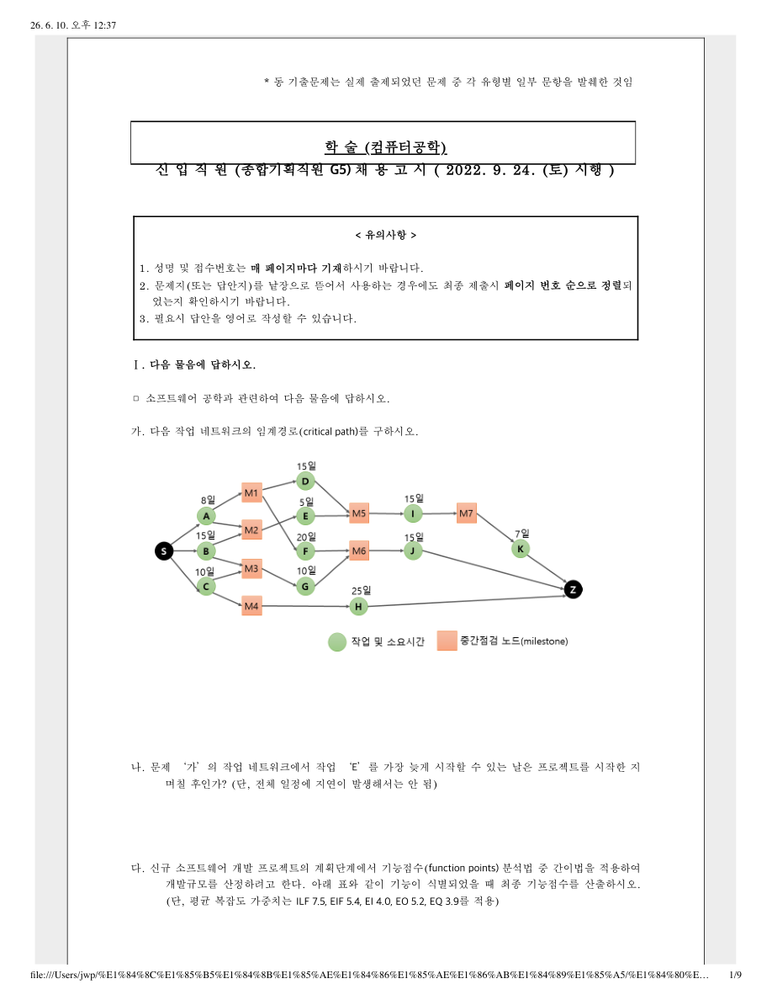

### 추출 텍스트

```text
학 술 (컴퓨터공학)
신 입 직 원 (종합기획직원 G5) 채 용 고 시 ( 2022. 9. 24. (토) 시행 )
< 유의사항 >
1. 성명 및 접수번호는 매 페이지마다 기재하시기 바랍니다.
2. 문제지(또는 답안지)를 낱장으로 뜯어서 사용하는 경우에도 최종 제출시 페이지 번호 순으로 정렬되
었는지 확인하시기 바랍니다.
3. 필요시 답안을 영어로 작성할 수 있습니다.
Ⅰ. 다음 물음에 답하시오.
□ 소프트웨어 공학과 관련하여 다음 물음에 답하시오.
가. 다음 작업 네트워크의 임계경로(critical path)를 구하시오.
나. 문제 ‘가’의 작업 네트워크에서 작업 ‘E’를 가장 늦게 시작할 수 있는 날은 프로젝트를 시작한 지
며칠 후인가? (단, 전체 일정에 지연이 발생해서는 안 됨)
다. 신규 소프트웨어 개발 프로젝트의 계획단계에서 기능점수(function points) 분석법 중 간이법을 적용하여
개발규모를 산정하려고 한다. 아래 표와 같이 기능이 식별되었을 때 최종 기능점수를 산출하시오.
(단, 평균 복잡도 가중치는 ILF 7.5, EIF 5.4, EI 4.0, EO 5.2, EQ 3.9를 적용)
* 동 기출문제는 실제 출제되었던 문제 중 각 유형별 일부 문항을 발췌한 것임
26. 6. 10. 오후 12:37
file:///Users/jwp/%E1%84%8C%E1%85%B5%E1%84%8B%E1%85%AE%E1%84%86%E1%85%AE%E1%86%AB%E1%84%89%E1%85%A5/%E1%84%80%E…
1/9
```


---

## Page 2

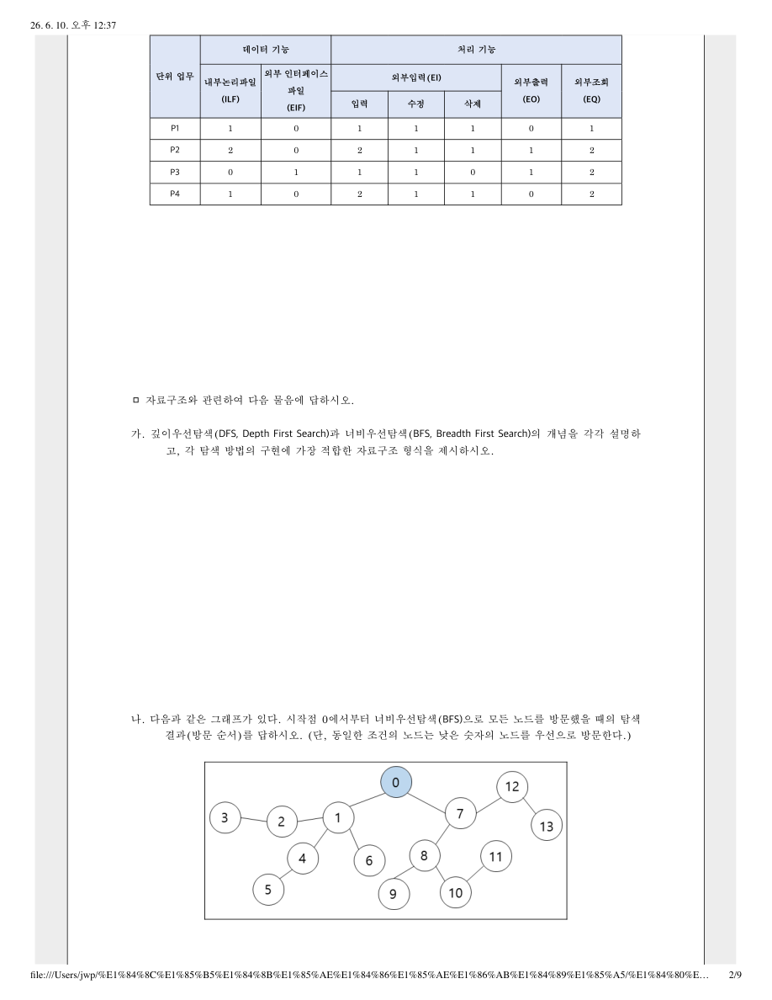

### 추출 텍스트

```text
단위 업무
데이터 기능
처리 기능
내부논리파일
(ILF)
외부 인터페이스
파일
(EIF)
외부입력(EI)
외부출력
(EO)
외부조회
(EQ)
입력
수정
삭제
P1
1
0
1
1
1
0
1
P2
2
0
2
1
1
1
2
P3
0
1
1
1
0
1
2
P4
1
0
2
1
1
0
2
□ 자료구조와 관련하여 다음 물음에 답하시오.
가. 깊이우선탐색(DFS, Depth First Search)과 너비우선탐색(BFS, Breadth First Search)의 개념을 각각 설명하
고, 각 탐색 방법의 구현에 가장 적합한 자료구조 형식을 제시하시오.
나. 다음과 같은 그래프가 있다. 시작점 0에서부터 너비우선탐색(BFS)으로 모든 노드를 방문했을 때의 탐색
결과(방문 순서)를 답하시오. (단, 동일한 조건의 노드는 낮은 숫자의 노드를 우선으로 방문한다.)
26. 6. 10. 오후 12:37
file:///Users/jwp/%E1%84%8C%E1%85%B5%E1%84%8B%E1%85%AE%E1%84%86%E1%85%AE%E1%86%AB%E1%84%89%E1%85%A5/%E1%84%80%E…
2/9
```


---

## Page 3

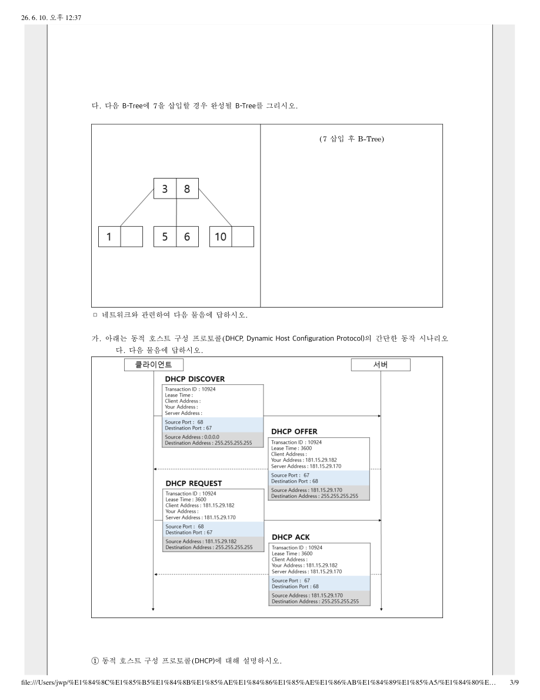

### 추출 텍스트

```text
다. 다음 B-Tree에 7을 삽입할 경우 완성될 B-Tree를 그리시오.
(7 삽입 후 B-Tree)
□ 네트워크와 관련하여 다음 물음에 답하시오.
가. 아래는 동적 호스트 구성 프로토콜(DHCP, Dynamic Host Configuration Protocol)의 간단한 동작 시나리오
다. 다음 물음에 답하시오.
① 동적 호스트 구성 프로토콜(DHCP)에 대해 설명하시오.
26. 6. 10. 오후 12:37
file:///Users/jwp/%E1%84%8C%E1%85%B5%E1%84%8B%E1%85%AE%E1%84%86%E1%85%AE%E1%86%AB%E1%84%89%E1%85%A5/%E1%84%80%E…
3/9
```


---

## Page 4

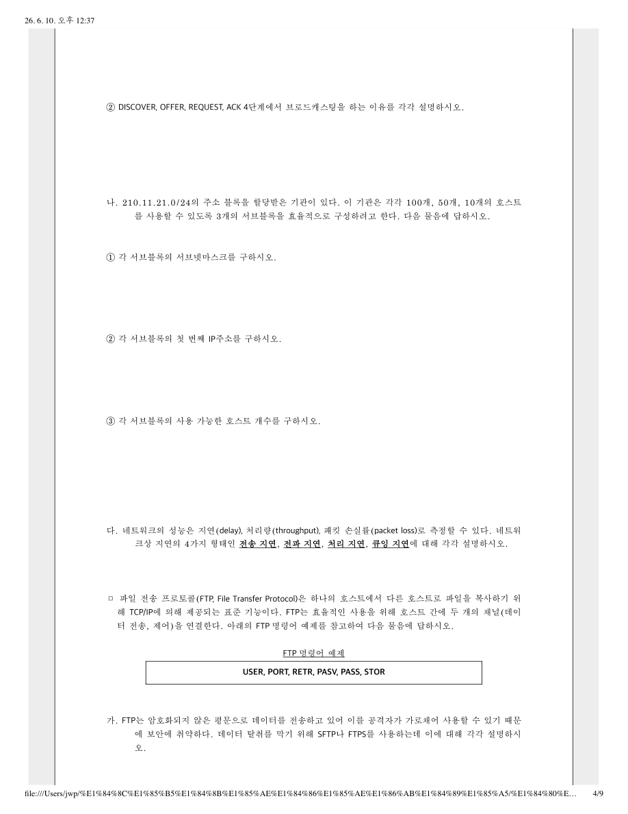

### 추출 텍스트

```text
② DISCOVER, OFFER, REQUEST, ACK 4단계에서 브로드캐스팅을 하는 이유를 각각 설명하시오.
나. 210.11.21.0/24의 주소 블록을 할당받은 기관이 있다. 이 기관은 각각 100개, 50개, 10개의 호스트
를 사용할 수 있도록 3개의 서브블록을 효율적으로 구성하려고 한다. 다음 물음에 답하시오.
① 각 서브블록의 서브넷마스크를 구하시오.
② 각 서브블록의 첫 번째 IP주소를 구하시오.
③ 각 서브블록의 사용 가능한 호스트 개수를 구하시오.
다. 네트워크의 성능은 지연(delay), 처리량(throughput), 패킷 손실률(packet loss)로 측정할 수 있다. 네트워
크상 지연의 4가지 형태인 전송 지연, 전파 지연, 처리 지연, 큐잉 지연에 대해 각각 설명하시오.
□ 파일 전송 프로토콜(FTP, File Transfer Protocol)은 하나의 호스트에서 다른 호스트로 파일을 복사하기 위
해 TCP/IP에 의해 제공되는 표준 기능이다. FTP는 효율적인 사용을 위해 호스트 간에 두 개의 채널(데이
터 전송, 제어)을 연결한다. 아래의 FTP 명령어 예제를 참고하여 다음 물음에 답하시오.
FTP 명령어 예제
USER, PORT, RETR, PASV, PASS, STOR
가. FTP는 암호화되지 않은 평문으로 데이터를 전송하고 있어 이를 공격자가 가로채어 사용할 수 있기 때문
에 보안에 취약하다. 데이터 탈취를 막기 위해 SFTP나 FTPS를 사용하는데 이에 대해 각각 설명하시
오.
26. 6. 10. 오후 12:37
file:///Users/jwp/%E1%84%8C%E1%85%B5%E1%84%8B%E1%85%AE%E1%84%86%E1%85%AE%E1%86%AB%E1%84%89%E1%85%A5/%E1%84%80%E…
4/9
```


---

## Page 5

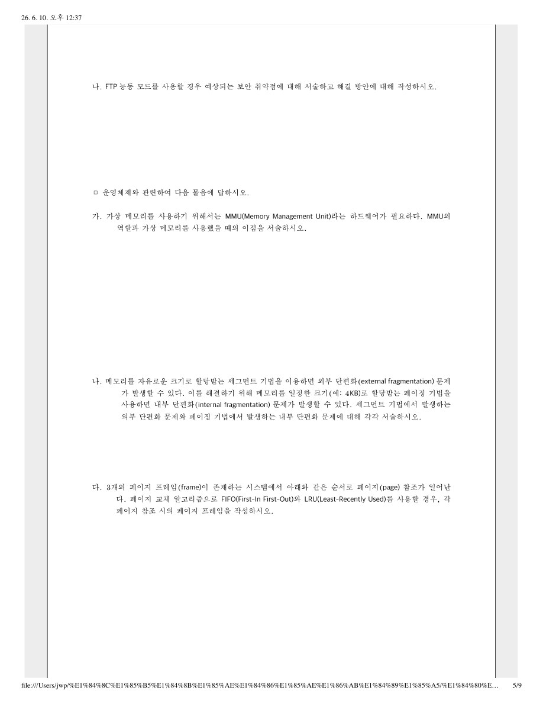

### 추출 텍스트

```text
나. FTP 능동 모드를 사용할 경우 예상되는 보안 취약점에 대해 서술하고 해결 방안에 대해 작성하시오.
□ 운영체제와 관련하여 다음 물음에 답하시오.
가. 가상 메모리를 사용하기 위해서는 MMU(Memory Management Unit)라는 하드웨어가 필요하다. MMU의
역할과 가상 메모리를 사용했을 때의 이점을 서술하시오.
나. 메모리를 자유로운 크기로 할당받는 세그먼트 기법을 이용하면 외부 단편화(external fragmentation) 문제
가 발생할 수 있다. 이를 해결하기 위해 메모리를 일정한 크기(예: 4KB)로 할당받는 페이징 기법을
사용하면 내부 단편화(internal fragmentation) 문제가 발생할 수 있다. 세그먼트 기법에서 발생하는
외부 단편화 문제와 페이징 기법에서 발생하는 내부 단편화 문제에 대해 각각 서술하시오.
다. 3개의 페이지 프레임(frame)이 존재하는 시스템에서 아래와 같은 순서로 페이지(page) 참조가 일어난
다. 페이지 교체 알고리즘으로 FIFO(First-In First-Out)와 LRU(Least-Recently Used)를 사용할 경우, 각
페이지 참조 시의 페이지 프레임을 작성하시오.
26. 6. 10. 오후 12:37
file:///Users/jwp/%E1%84%8C%E1%85%B5%E1%84%8B%E1%85%AE%E1%84%86%E1%85%AE%E1%86%AB%E1%84%89%E1%85%A5/%E1%84%80%E…
5/9
```


---

## Page 6

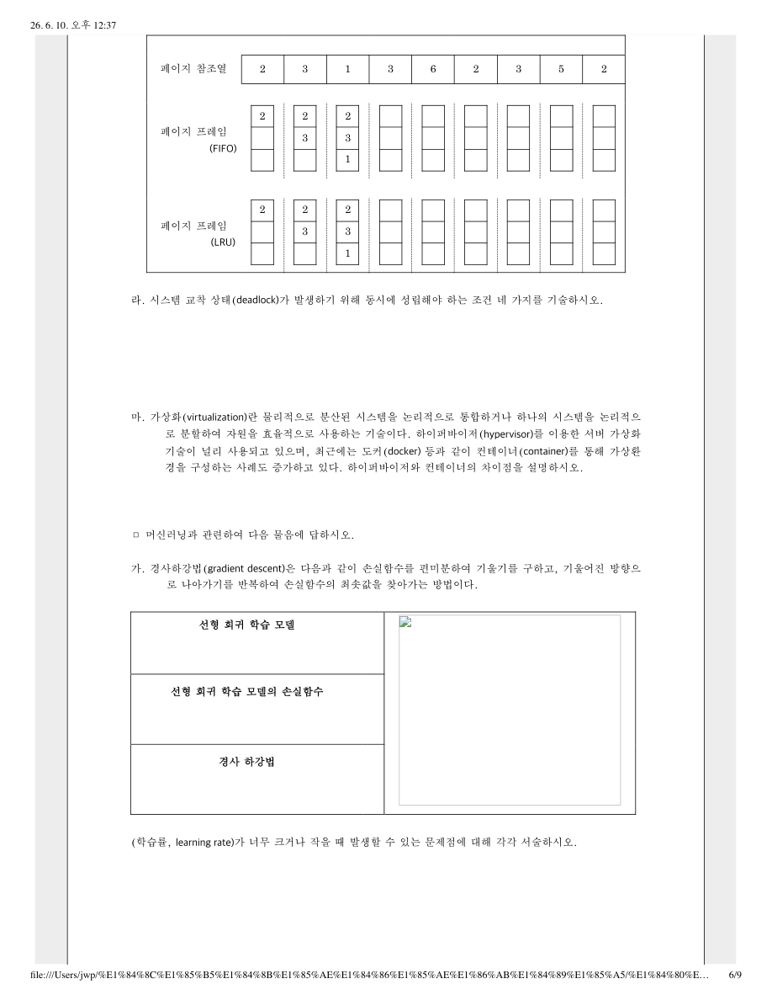

### 추출 텍스트

```text
페이지 참조열
2
3
1
3
6
2
3
5
2
페이지 프레임
(FIFO)
2
2
3
2
3
1
페이지 프레임
(LRU)
2
2
3
2
3
1
라. 시스템 교착 상태(deadlock)가 발생하기 위해 동시에 성립해야 하는 조건 네 가지를 기술하시오.
마. 가상화(virtualization)란 물리적으로 분산된 시스템을 논리적으로 통합하거나 하나의 시스템을 논리적으
로 분할하여 자원을 효율적으로 사용하는 기술이다. 하이퍼바이저(hypervisor)를 이용한 서버 가상화
기술이 널리 사용되고 있으며, 최근에는 도커(docker) 등과 같이 컨테이너(container)를 통해 가상환
경을 구성하는 사례도 증가하고 있다. 하이퍼바이저와 컨테이너의 차이점을 설명하시오.
□ 머신러닝과 관련하여 다음 물음에 답하시오.
가. 경사하강법(gradient descent)은 다음과 같이 손실함수를 편미분하여 기울기를 구하고, 기울어진 방향으
로 나아가기를 반복하여 손실함수의 최솟값을 찾아가는 방법이다.
선형 회귀 학습 모델
선형 회귀 학습 모델의 손실함수
경사 하강법
(학습률, learning rate)가 너무 크거나 작을 때 발생할 수 있는 문제점에 대해 각각 서술하시오.
26. 6. 10. 오후 12:37
file:///Users/jwp/%E1%84%8C%E1%85%B5%E1%84%8B%E1%85%AE%E1%84%86%E1%85%AE%E1%86%AB%E1%84%89%E1%85%A5/%E1%84%80%E…
6/9
```


---

## Page 7

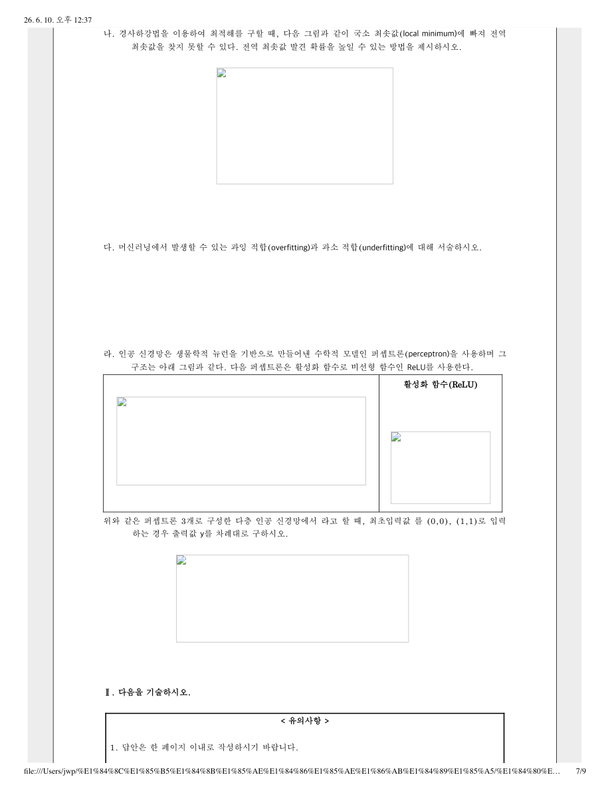

### 추출 텍스트

```text
나. 경사하강법을 이용하여 최적해를 구할 때, 다음 그림과 같이 국소 최솟값(local minimum)에 빠져 전역
최솟값을 찾지 못할 수 있다. 전역 최솟값 발견 확률을 높일 수 있는 방법을 제시하시오.
다. 머신러닝에서 발생할 수 있는 과잉 적합(overfitting)과 과소 적합(underfitting)에 대해 서술하시오.
라. 인공 신경망은 생물학적 뉴런을 기반으로 만들어낸 수학적 모델인 퍼셉트론(perceptron)을 사용하며 그
구조는 아래 그림과 같다. 다음 퍼셉트론은 활성화 함수로 비선형 함수인 ReLU를 사용한다.
활성화 함수(ReLU)
위와 같은 퍼셉트론 3개로 구성한 다층 인공 신경망에서 라고 할 때, 최초입력값 를 (0,0), (1,1)로 입력
하는 경우 출력값 y를 차례대로 구하시오.
Ⅱ. 다음을 기술하시오.
< 유의사항 >
1. 답안은 한 페이지 이내로 작성하시기 바랍니다.
26. 6. 10. 오후 12:37
file:///Users/jwp/%E1%84%8C%E1%85%B5%E1%84%8B%E1%85%AE%E1%84%86%E1%85%AE%E1%86%AB%E1%84%89%E1%85%A5/%E1%84%80%E…
7/9
```


---

## Page 8

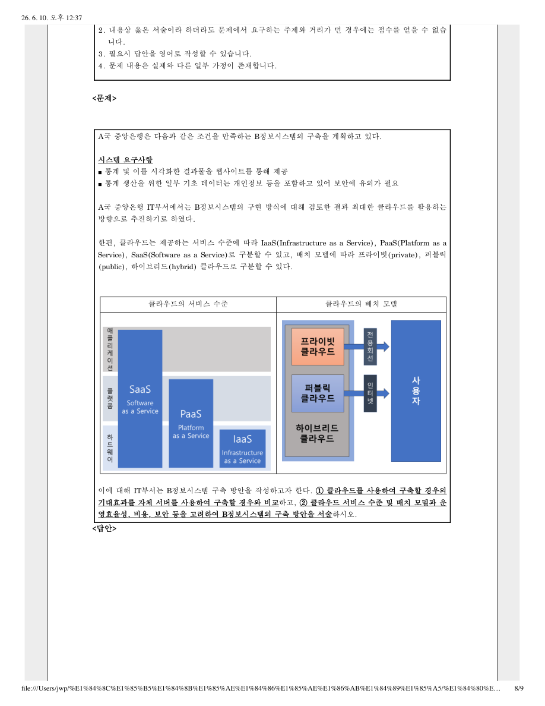

### 추출 텍스트

```text
2. 내용상 옳은 서술이라 하더라도 문제에서 요구하는 주제와 거리가 먼 경우에는 점수를 얻을 수 없습
니다.
3. 필요시 답안을 영어로 작성할 수 있습니다.
4. 문제 내용은 실제와 다른 일부 가정이 존재합니다.
<문제>
A국 중앙은행은 다음과 같은 조건을 만족하는 B정보시스템의 구축을 계획하고 있다.
시스템 요구사항
￭ 통계 및 이를 시각화한 결과물을 웹사이트를 통해 제공
￭ 통계 생산을 위한 일부 기초 데이터는 개인정보 등을 포함하고 있어 보안에 유의가 필요
A국 중앙은행 IT부서에서는 B정보시스템의 구현 방식에 대해 검토한 결과 최대한 클라우드를 활용하는
방향으로 추진하기로 하였다.
한편, 클라우드는 제공하는 서비스 수준에 따라 IaaS(Infrastructure as a Service), PaaS(Platform as a
Service), SaaS(Software as a Service)로 구분할 수 있고, 배치 모델에 따라 프라이빗(private), 퍼블릭
(public), 하이브리드(hybrid) 클라우드로 구분할 수 있다.
클라우드의 서비스 수준
클라우드의 배치 모델
이에 대해 IT부서는 B정보시스템 구축 방안을 작성하고자 한다. ① 클라우드를 사용하여 구축할 경우의
기대효과를 자체 서버를 사용하여 구축할 경우와 비교하고, ② 클라우드 서비스 수준 및 배치 모델과 운
영효율성, 비용, 보안 등을 고려하여 B정보시스템의 구축 방안을 서술하시오.
<답안>
26. 6. 10. 오후 12:37
file:///Users/jwp/%E1%84%8C%E1%85%B5%E1%84%8B%E1%85%AE%E1%84%86%E1%85%AE%E1%86%AB%E1%84%89%E1%85%A5/%E1%84%80%E…
8/9
```


---

## Page 9

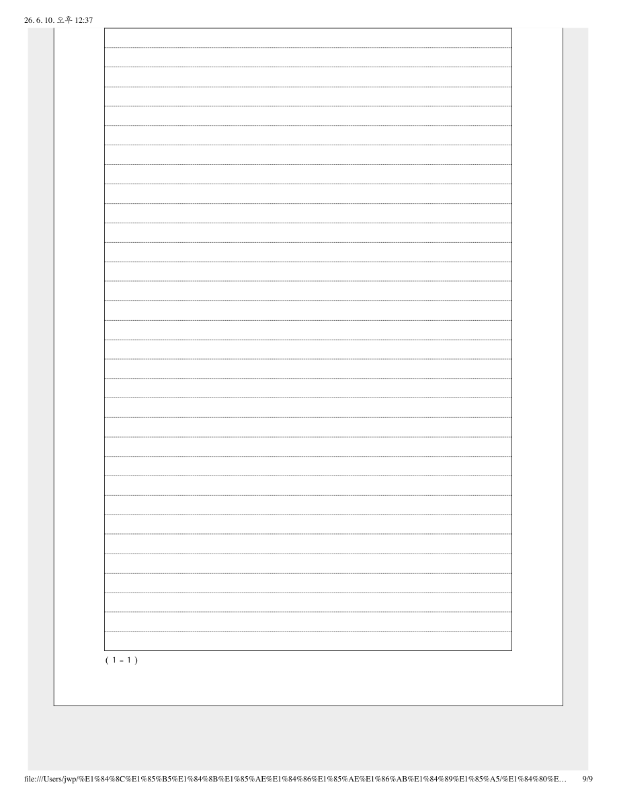

### 추출 텍스트

```text
( 1 - 1 )
26. 6. 10. 오후 12:37
file:///Users/jwp/%E1%84%8C%E1%85%B5%E1%84%8B%E1%85%AE%E1%84%86%E1%85%AE%E1%86%AB%E1%84%89%E1%85%A5/%E1%84%80%E…
9/9
```


# 한국은행 2022 컴퓨터공학 학술

- 개별 파일: `한국은행_2022_컴퓨터공학_학술_문제.md`


---

## Page 1

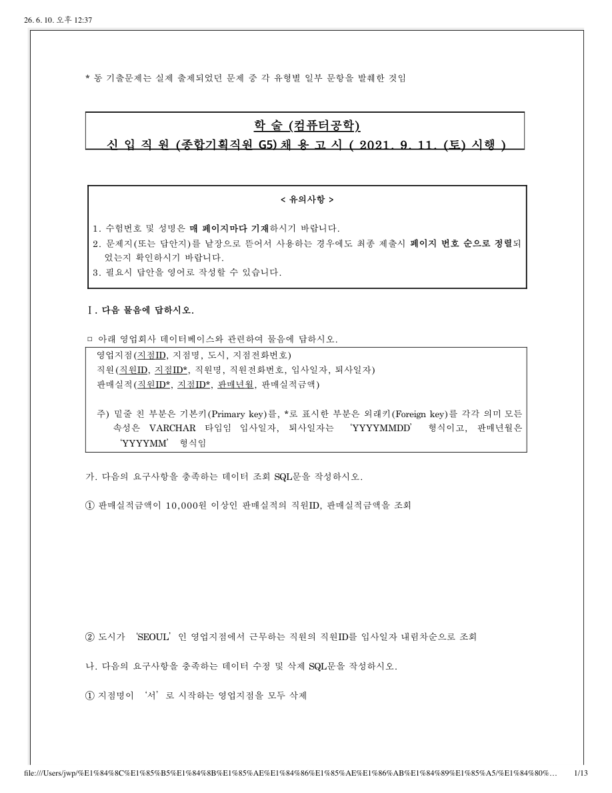

### 추출 텍스트

```text
학 술 (컴퓨터공학)
신 입 직 원 (종합기획직원 G5) 채 용 고 시 ( 2021. 9. 11. (토) 시행 )
< 유의사항 >
1. 수험번호 및 성명은 매 페이지마다 기재하시기 바랍니다.
2. 문제지(또는 답안지)를 낱장으로 뜯어서 사용하는 경우에도 최종 제출시 페이지 번호 순으로 정렬되
었는지 확인하시기 바랍니다.
3. 필요시 답안을 영어로 작성할 수 있습니다.
Ⅰ. 다음 물음에 답하시오.
□ 아래 영업회사 데이터베이스와 관련하여 물음에 답하시오.
영업지점(지점ID, 지점명, 도시, 지점전화번호)
직원(직원ID, 지점ID*, 직원명, 직원전화번호, 입사일자, 퇴사일자)
판매실적(직원ID*, 지점ID*, 판매년월, 판매실적금액)
주) 밑줄 친 부분은 기본키(Primary key)를, *로 표시한 부분은 외래키(Foreign key)를 각각 의미 모든
속성은 VARCHAR 타입임 입사일자, 퇴사일자는 ‘YYYYMMDD’ 형식이고, 판매년월은
‘YYYYMM’ 형식임
가. 다음의 요구사항을 충족하는 데이터 조회 SQL문을 작성하시오.
① 판매실적금액이 10,000원 이상인 판매실적의 직원ID, 판매실적금액을 조회
② 도시가 ‘SEOUL’인 영업지점에서 근무하는 직원의 직원ID를 입사일자 내림차순으로 조회
나. 다음의 요구사항을 충족하는 데이터 수정 및 삭제 SQL문을 작성하시오.
① 지점명이 ‘서’로 시작하는 영업지점을 모두 삭제
* 동 기출문제는 실제 출제되었던 문제 중 각 유형별 일부 문항을 발췌한 것임
26. 6. 10. 오후 12:37
file:///Users/jwp/%E1%84%8C%E1%85%B5%E1%84%8B%E1%85%AE%E1%84%86%E1%85%AE%E1%86%AB%E1%84%89%E1%85%A5/%E1%84%80%…
1/13
```


---

## Page 2

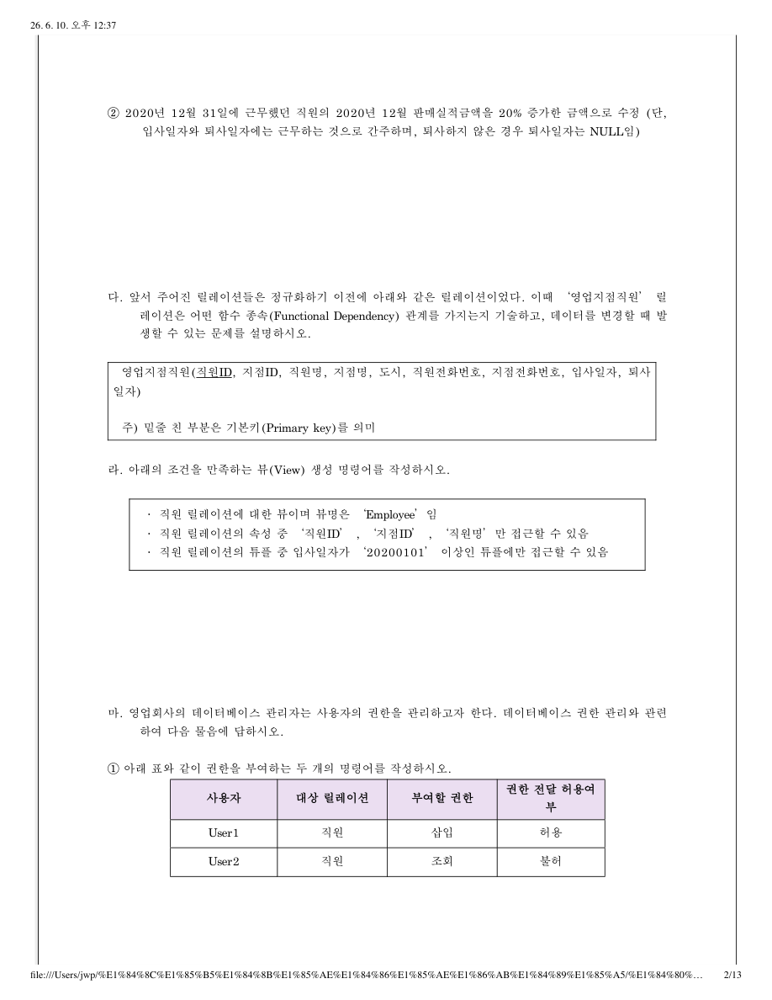

### 추출 텍스트

```text
② 2020년 12월 31일에 근무했던 직원의 2020년 12월 판매실적금액을 20% 증가한 금액으로 수정 (단,
입사일자와 퇴사일자에는 근무하는 것으로 간주하며, 퇴사하지 않은 경우 퇴사일자는 NULL임)
다. 앞서 주어진 릴레이션들은 정규화하기 이전에 아래와 같은 릴레이션이었다. 이때 ‘영업지점직원’ 릴
레이션은 어떤 함수 종속(Functional Dependency) 관계를 가지는지 기술하고, 데이터를 변경할 때 발
생할 수 있는 문제를 설명하시오.
영업지점직원(직원ID, 지점ID, 직원명, 지점명, 도시, 직원전화번호, 지점전화번호, 입사일자, 퇴사
일자)
주) 밑줄 친 부분은 기본키(Primary key)를 의미
라. 아래의 조건을 만족하는 뷰(View) 생성 명령어를 작성하시오.
· 직원 릴레이션에 대한 뷰이며 뷰명은 ‘Employee’임
· 직원 릴레이션의 속성 중 ‘직원ID’ , ‘지점ID’ , ‘직원명’만 접근할 수 있음
· 직원 릴레이션의 튜플 중 입사일자가 ‘20200101’ 이상인 튜플에만 접근할 수 있음
마. 영업회사의 데이터베이스 관리자는 사용자의 권한을 관리하고자 한다. 데이터베이스 권한 관리와 관련
하여 다음 물음에 답하시오.
① 아래 표와 같이 권한을 부여하는 두 개의 명령어를 작성하시오.
사용자
대상 릴레이션
부여할 권한
권한 전달 허용여
부
User1
직원
삽입
허용
User2
직원
조회
불허
26. 6. 10. 오후 12:37
file:///Users/jwp/%E1%84%8C%E1%85%B5%E1%84%8B%E1%85%AE%E1%84%86%E1%85%AE%E1%86%AB%E1%84%89%E1%85%A5/%E1%84%80%…
2/13
```


---

## Page 3

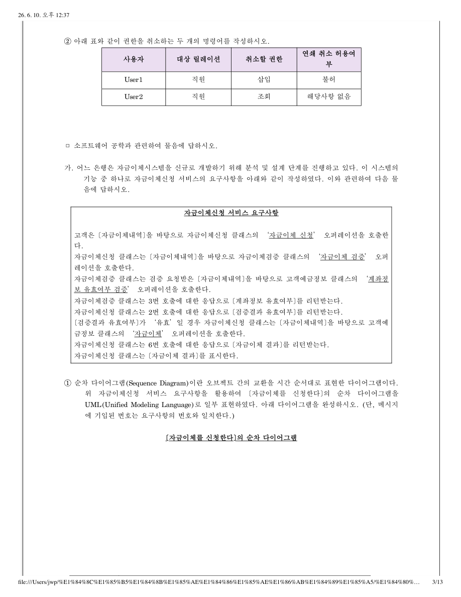

### 추출 텍스트

```text
② 아래 표와 같이 권한을 취소하는 두 개의 명령어를 작성하시오.
사용자
대상 릴레이션
취소할 권한
연쇄 취소 허용여
부
User1
직원
삽입
불허
User2
직원
조회
해당사항 없음
□ 소프트웨어 공학과 관련하여 물음에 답하시오.
가. 어느 은행은 자금이체시스템을 신규로 개발하기 위해 분석 및 설계 단계를 진행하고 있다. 이 시스템의
기능 중 하나로 자금이체신청 서비스의 요구사항을 아래와 같이 작성하였다. 이와 관련하여 다음 물
음에 답하시오.
자금이체신청 서비스 요구사항
고객은 [자금이체내역]을 바탕으로 자금이체신청 클래스의 ‘자금이체 신청’ 오퍼레이션을 호출한
다.
자금이체신청 클래스는 [자금이체내역]을 바탕으로 자금이체검증 클래스의 ‘자금이체 검증’ 오퍼
레이션을 호출한다.
자금이체검증 클래스는 검증 요청받은 [자금이체내역]을 바탕으로 고객예금정보 클래스의 ‘계좌정
보 유효여부 검증’ 오퍼레이션을 호출한다.
자금이체검증 클래스는 3번 호출에 대한 응답으로 [계좌정보 유효여부]를 리턴받는다.
자금이체신청 클래스는 2번 호출에 대한 응답으로 [검증결과 유효여부]를 리턴받는다.
[검증결과 유효여부]가 ‘유효’일 경우 자금이체신청 클래스는 [자금이체내역]을 바탕으로 고객예
금정보 클래스의 ‘자금이체’ 오퍼레이션을 호출한다.
자금이체신청 클래스는 6번 호출에 대한 응답으로 [자금이체 결과]를 리턴받는다.
자금이체신청 클래스는 [자금이체 결과]를 표시한다.
① 순차 다이어그램(Sequence Diagram)이란 오브젝트 간의 교환을 시간 순서대로 표현한 다이어그램이다.
위 자금이체신청 서비스 요구사항을 활용하여 [자금이체를 신청한다]의 순차 다이어그램을
UML(Unified Modeling Language)로 일부 표현하였다. 아래 다이어그램을 완성하시오. (단, 메시지
에 기입된 번호는 요구사항의 번호와 일치한다.)
[자금이체를 신청한다]의 순차 다이어그램
26. 6. 10. 오후 12:37
file:///Users/jwp/%E1%84%8C%E1%85%B5%E1%84%8B%E1%85%AE%E1%84%86%E1%85%AE%E1%86%AB%E1%84%89%E1%85%A5/%E1%84%80%…
3/13
```


---

## Page 4

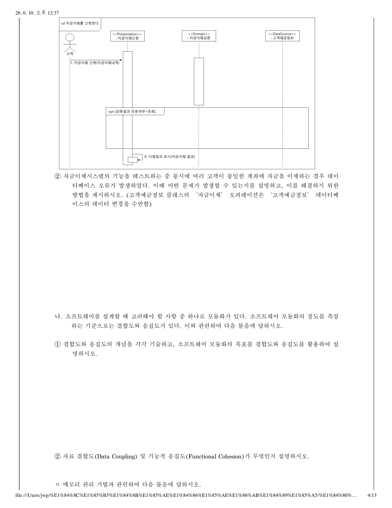

### 추출 텍스트

```text
② 자금이체시스템의 기능을 테스트하는 중 동시에 여러 고객이 동일한 계좌에 자금을 이체하는 경우 데이
터베이스 오류가 발생하였다. 이때 어떤 문제가 발생할 수 있는지를 설명하고, 이를 해결하기 위한
방법을 제시하시오. (고객예금정보 클래스의 ‘자금이체’ 오퍼레이션은 ‘고객예금정보’ 데이터베
이스의 데이터 변경을 수반함)
나. 소프트웨어를 설계할 때 고려해야 할 사항 중 하나로 모듈화가 있다. 소프트웨어 모듈화의 정도를 측정
하는 기준으로는 결합도와 응집도가 있다. 이와 관련하여 다음 물음에 답하시오.
① 결합도와 응집도의 개념을 각각 기술하고, 소프트웨어 모듈화의 목표를 결합도와 응집도를 활용하여 설
명하시오.
② 자료 결합도(Data Coupling) 및 기능적 응집도(Functional Cohesion)가 무엇인지 설명하시오.
□ 메모리 관리 기법과 관련하여 다음 물음에 답하시오.
26. 6. 10. 오후 12:37
file:///Users/jwp/%E1%84%8C%E1%85%B5%E1%84%8B%E1%85%AE%E1%84%86%E1%85%AE%E1%86%AB%E1%84%89%E1%85%A5/%E1%84%80%…
4/13
```


---

## Page 5

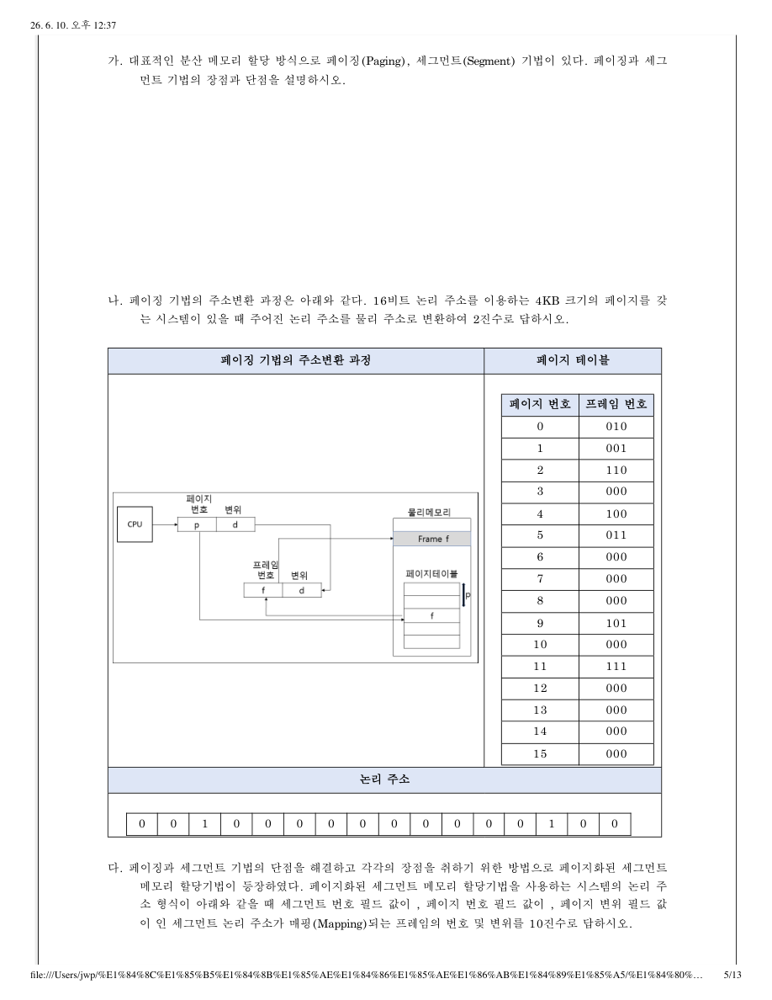

### 추출 텍스트

```text
가. 대표적인 분산 메모리 할당 방식으로 페이징(Paging), 세그먼트(Segment) 기법이 있다. 페이징과 세그
먼트 기법의 장점과 단점을 설명하시오.
나. 페이징 기법의 주소변환 과정은 아래와 같다. 16비트 논리 주소를 이용하는 4KB 크기의 페이지를 갖
는 시스템이 있을 때 주어진 논리 주소를 물리 주소로 변환하여 2진수로 답하시오.
페이징 기법의 주소변환 과정
페이지 테이블
페이지 번호
프레임 번호
0
010
1
001
2
110
3
000
4
100
5
011
6
000
7
000
8
000
9
101
10
000
11
111
12
000
13
000
14
000
15
000
논리 주소
0
0
1
0
0
0
0
0
0
0
0
0
0
1
0
0
다. 페이징과 세그먼트 기법의 단점을 해결하고 각각의 장점을 취하기 위한 방법으로 페이지화된 세그먼트
메모리 할당기법이 등장하였다. 페이지화된 세그먼트 메모리 할당기법을 사용하는 시스템의 논리 주
소 형식이 아래와 같을 때 세그먼트 번호 필드 값이 , 페이지 번호 필드 값이 , 페이지 변위 필드 값
이 인 세그먼트 논리 주소가 매핑(Mapping)되는 프레임의 번호 및 변위를 10진수로 답하시오.
26. 6. 10. 오후 12:37
file:///Users/jwp/%E1%84%8C%E1%85%B5%E1%84%8B%E1%85%AE%E1%84%86%E1%85%AE%E1%86%AB%E1%84%89%E1%85%A5/%E1%84%80%…
5/13
```


---

## Page 6

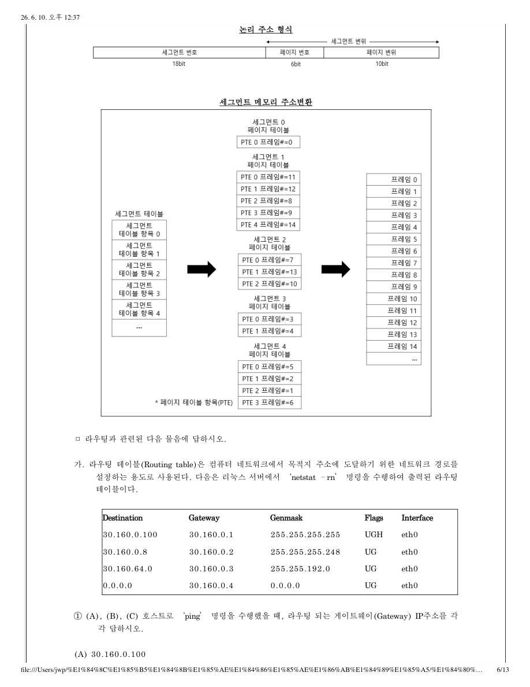

### 추출 텍스트

```text
논리 주소 형식
세그먼트 메모리 주소변환
□ 라우팅과 관련된 다음 물음에 답하시오.
가. 라우팅 테이블(Routing table)은 컴퓨터 네트워크에서 목적지 주소에 도달하기 위한 네트워크 경로를
설정하는 용도로 사용된다. 다음은 리눅스 서버에서 ‘netstat –rn’ 명령을 수행하여 출력된 라우팅
테이블이다.
Destination
Gateway
Genmask
Flags
Interface
30.160.0.100
30.160.0.1
255.255.255.255
UGH
eth0
30.160.0.8
30.160.0.2
255.255.255.248
UG
eth0
30.160.64.0
30.160.0.3
255.255.192.0
UG
eth0
0.0.0.0
30.160.0.4
0.0.0.0
UG
eth0
① (A), (B), (C) 호스트로 ‘ping’ 명령을 수행했을 때, 라우팅 되는 게이트웨이(Gateway) IP주소를 각
각 답하시오.
(A) 30.160.0.100
26. 6. 10. 오후 12:37
file:///Users/jwp/%E1%84%8C%E1%85%B5%E1%84%8B%E1%85%AE%E1%84%86%E1%85%AE%E1%86%AB%E1%84%89%E1%85%A5/%E1%84%80%…
6/13
```


---

## Page 7

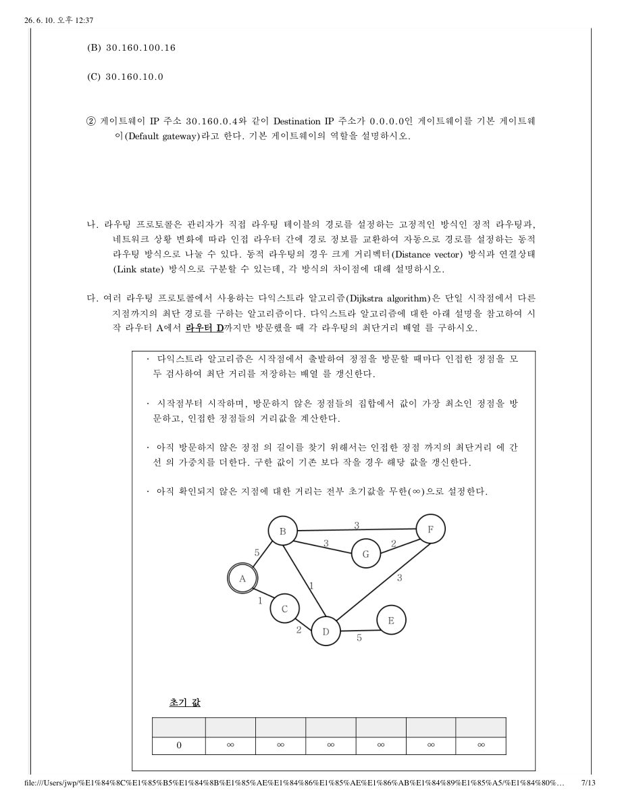

### 추출 텍스트

```text
(B) 30.160.100.16
(C) 30.160.10.0
② 게이트웨이 IP 주소 30.160.0.4와 같이 Destination IP 주소가 0.0.0.0인 게이트웨이를 기본 게이트웨
이(Default gateway)라고 한다. 기본 게이트웨이의 역할을 설명하시오.
나. 라우팅 프로토콜은 관리자가 직접 라우팅 테이블의 경로를 설정하는 고정적인 방식인 정적 라우팅과,
네트워크 상황 변화에 따라 인접 라우터 간에 경로 정보를 교환하여 자동으로 경로를 설정하는 동적
라우팅 방식으로 나눌 수 있다. 동적 라우팅의 경우 크게 거리벡터(Distance vector) 방식과 연결상태
(Link state) 방식으로 구분할 수 있는데, 각 방식의 차이점에 대해 설명하시오.
다. 여러 라우팅 프로토콜에서 사용하는 다익스트라 알고리즘(Dijkstra algorithm)은 단일 시작점에서 다른
지점까지의 최단 경로를 구하는 알고리즘이다. 다익스트라 알고리즘에 대한 아래 설명을 참고하여 시
작 라우터 A에서 라우터 D까지만 방문했을 때 각 라우팅의 최단거리 배열 를 구하시오.
· 다익스트라 알고리즘은 시작점에서 출발하여 정점을 방문할 때마다 인접한 정점을 모
두 검사하여 최단 거리를 저장하는 배열 를 갱신한다.
· 시작점부터 시작하며, 방문하지 않은 정점들의 집합에서 값이 가장 최소인 정점을 방
문하고, 인접한 정점들의 거리값을 계산한다.
· 아직 방문하지 않은 정점 의 길이를 찾기 위해서는 인접한 정점 까지의 최단거리 에 간
선 의 가중치를 더한다. 구한 값이 기존 보다 작을 경우 해당 값을 갱신한다.
· 아직 확인되지 않은 지점에 대한 거리는 전부 초기값을 무한(∞)으로 설정한다.
초기 값
0
∞
∞
∞
∞
∞
∞
26. 6. 10. 오후 12:37
file:///Users/jwp/%E1%84%8C%E1%85%B5%E1%84%8B%E1%85%AE%E1%84%86%E1%85%AE%E1%86%AB%E1%84%89%E1%85%A5/%E1%84%80%…
7/13
```


---

## Page 8

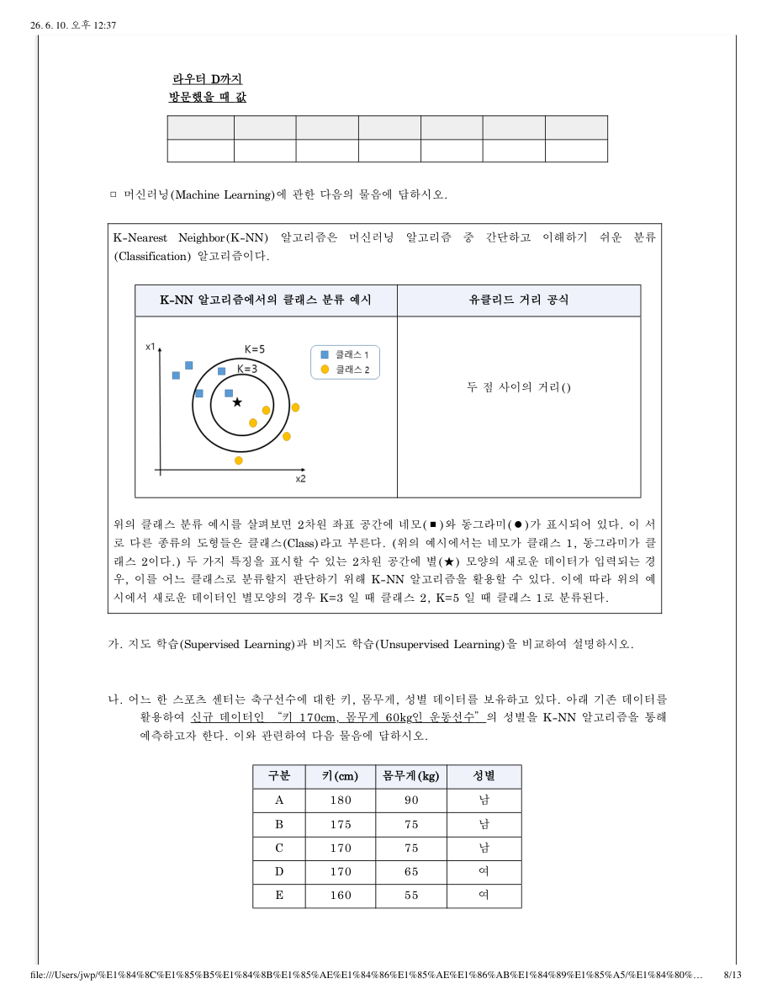

### 추출 텍스트

```text
라우터 D까지
방문했을 때 값
□ 머신러닝(Machine Learning)에 관한 다음의 물음에 답하시오.
K-Nearest Neighbor(K-NN) 알고리즘은 머신러닝 알고리즘 중 간단하고 이해하기 쉬운 분류
(Classification) 알고리즘이다.
K-NN 알고리즘에서의 클래스 분류 예시
유클리드 거리 공식
두 점 사이의 거리()
위의 클래스 분류 예시를 살펴보면 2차원 좌표 공간에 네모(■)와 동그라미(●)가 표시되어 있다. 이 서
로 다른 종류의 도형들은 클래스(Class)라고 부른다. (위의 예시에서는 네모가 클래스 1, 동그라미가 클
래스 2이다.) 두 가지 특징을 표시할 수 있는 2차원 공간에 별(★) 모양의 새로운 데이터가 입력되는 경
우, 이를 어느 클래스로 분류할지 판단하기 위해 K-NN 알고리즘을 활용할 수 있다. 이에 따라 위의 예
시에서 새로운 데이터인 별모양의 경우 K=3 일 때 클래스 2, K=5 일 때 클래스 1로 분류된다.
가. 지도 학습(Supervised Learning)과 비지도 학습(Unsupervised Learning)을 비교하여 설명하시오.
나. 어느 한 스포츠 센터는 축구선수에 대한 키, 몸무게, 성별 데이터를 보유하고 있다. 아래 기존 데이터를
활용하여 신규 데이터인 “키 170cm, 몸무게 60kg인 운동선수”의 성별을 K-NN 알고리즘을 통해
예측하고자 한다. 이와 관련하여 다음 물음에 답하시오.
구분
키(cm)
몸무게(kg)
성별
A
180
90
남
B
175
75
남
C
170
75
남
D
170
65
여
E
160
55
여
26. 6. 10. 오후 12:37
file:///Users/jwp/%E1%84%8C%E1%85%B5%E1%84%8B%E1%85%AE%E1%84%86%E1%85%AE%E1%86%AB%E1%84%89%E1%85%A5/%E1%84%80%…
8/13
```


---

## Page 9

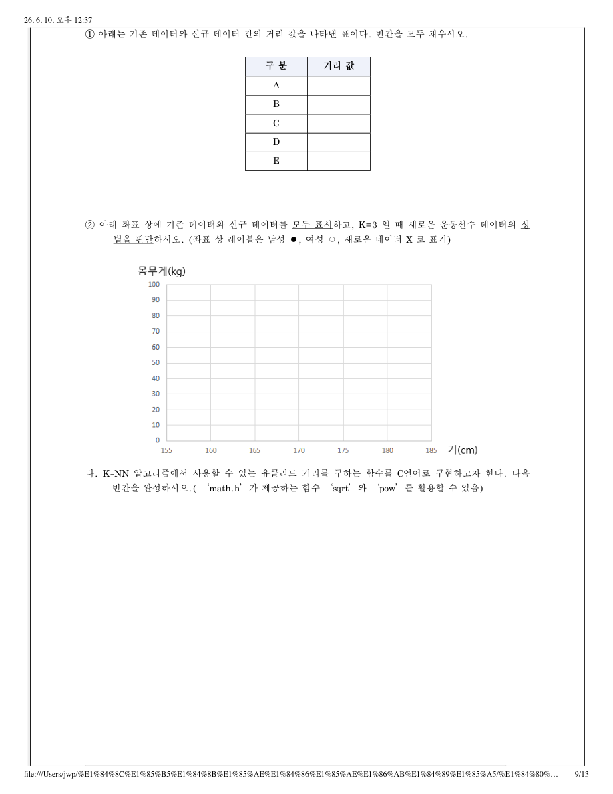

### 추출 텍스트

```text
① 아래는 기존 데이터와 신규 데이터 간의 거리 값을 나타낸 표이다. 빈칸을 모두 채우시오.
구 분
거리 값
A
B
C
D
E
② 아래 좌표 상에 기존 데이터와 신규 데이터를 모두 표시하고, K=3 일 때 새로운 운동선수 데이터의 성
별을 판단하시오. (좌표 상 레이블은 남성 ●, 여성 ○, 새로운 데이터 X 로 표기)
다. K-NN 알고리즘에서 사용할 수 있는 유클리드 거리를 구하는 함수를 C언어로 구현하고자 한다. 다음
빈칸을 완성하시오.( ‘math.h’가 제공하는 함수 ‘sqrt’와 ‘pow’를 활용할 수 있음)
26. 6. 10. 오후 12:37
file:///Users/jwp/%E1%84%8C%E1%85%B5%E1%84%8B%E1%85%AE%E1%84%86%E1%85%AE%E1%86%AB%E1%84%89%E1%85%A5/%E1%84%80%…
9/13
```


---

## Page 10

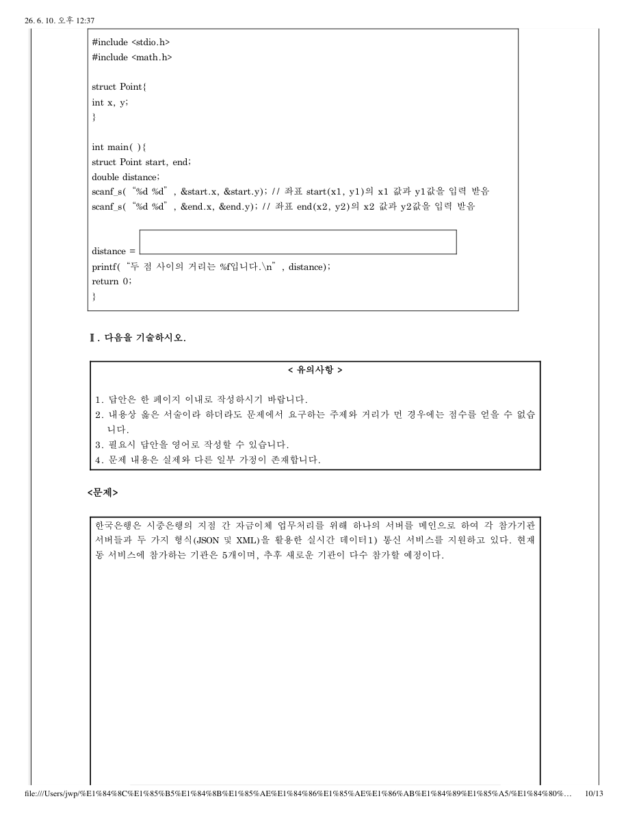

### 추출 텍스트

```text
#include <stdio.h>
#include <math.h>
struct Point{
int x, y;
}
int main( ){
struct Point start, end;
double distance;
scanf_s(“%d %d”, &start.x, &start.y); // 좌표 start(x1, y1)의 x1 값과 y1값을 입력 받음
scanf_s(“%d %d”, &end.x, &end.y); // 좌표 end(x2, y2)의 x2 값과 y2값을 입력 받음
distance = 
printf(“두 점 사이의 거리는 %f입니다.\n”, distance);
return 0;
}
Ⅱ. 다음을 기술하시오.
< 유의사항 >
1. 답안은 한 페이지 이내로 작성하시기 바랍니다.
2. 내용상 옳은 서술이라 하더라도 문제에서 요구하는 주제와 거리가 먼 경우에는 점수를 얻을 수 없습
니다.
3. 필요시 답안을 영어로 작성할 수 있습니다.
4. 문제 내용은 실제와 다른 일부 가정이 존재합니다.
<문제>
한국은행은 시중은행의 지점 간 자금이체 업무처리를 위해 하나의 서버를 메인으로 하여 각 참가기관
서버들과 두 가지 형식(JSON 및 XML)을 활용한 실시간 데이터1) 통신 서비스를 지원하고 있다. 현재
동 서비스에 참가하는 기관은 5개이며, 추후 새로운 기관이 다수 참가할 예정이다.
26. 6. 10. 오후 12:37
file:///Users/jwp/%E1%84%8C%E1%85%B5%E1%84%8B%E1%85%AE%E1%84%86%E1%85%AE%E1%86%AB%E1%84%89%E1%85%A5/%E1%84%80%…
10/13
```


---

## Page 11

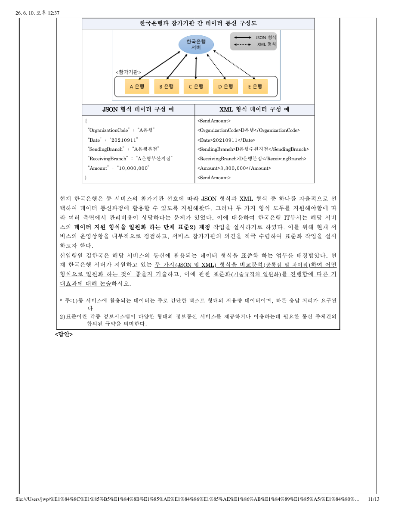

### 추출 텍스트

```text
한국은행과 참가기관 간 데이터 통신 구성도
JSON 형식 데이터 구성 예
XML 형식 데이터 구성 예
{
“OrganizationCode”:“A은행”
“Date”:“20210911”
“SendingBranch”:“A은행본점”
“ReceivingBranch”:“A은행부산지점”
“Amount”:“10,000,000”
}
<SendAmount>
<OrganizationCode>D은행</OrganizationCode>
<Date>20210911</Date>
<SendingBranch>D은행수원지점</SendingBranch>
<ReceivingBranch>D은행본점</ReceivingBranch>
<Amount>3,300,000</Amount>
<SendAmount>
현재 한국은행은 동 서비스의 참가기관 선호에 따라 JSON 형식과 XML 형식 중 하나를 자율적으로 선
택하여 데이터 통신과정에 활용할 수 있도록 지원해왔다. 그러나 두 가지 형식 모두를 지원해야함에 따
라 여러 측면에서 관리비용이 상당하다는 문제가 있었다. 이에 대응하여 한국은행 IT부서는 해당 서비
스의 데이터 지원 형식을 일원화 하는 단체 표준2) 제정 작업을 실시하기로 하였다. 이를 위해 현재 서
비스의 운영상황을 내부적으로 점검하고, 서비스 참가기관의 의견을 적극 수렴하여 표준화 작업을 실시
하고자 한다.
신입행원 김한국은 해당 서비스의 통신에 활용되는 데이터 형식을 표준화 하는 업무를 배정받았다. 현
재 한국은행 서버가 지원하고 있는 두 가지(JSON 및 XML) 형식을 비교분석(공통점 및 차이점)하여 어떤
형식으로 일원화 하는 것이 좋을지 기술하고, 이에 관한 표준화(기술규격의 일원화)를 진행함에 따른 기
대효과에 대해 논술하시오.
* 주:1)동 서비스에 활용되는 데이터는 주로 간단한 텍스트 형태의 저용량 데이터이며, 빠른 응답 처리가 요구된
다.
2)표준이란 각종 정보시스템이 다양한 형태의 정보통신 서비스를 제공하거나 이용하는데 필요한 통신 주체간의
합의된 규약을 의미한다.
<답안>
26. 6. 10. 오후 12:37
file:///Users/jwp/%E1%84%8C%E1%85%B5%E1%84%8B%E1%85%AE%E1%84%86%E1%85%AE%E1%86%AB%E1%84%89%E1%85%A5/%E1%84%80%…
11/13
```


---

## Page 12

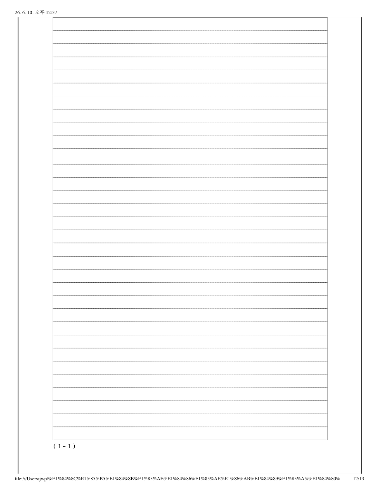

### 추출 텍스트

```text
( 1 - 1 )
26. 6. 10. 오후 12:37
file:///Users/jwp/%E1%84%8C%E1%85%B5%E1%84%8B%E1%85%AE%E1%84%86%E1%85%AE%E1%86%AB%E1%84%89%E1%85%A5/%E1%84%80%…
12/13
```


---

## Page 13


### 추출 텍스트

```text
26. 6. 10. 오후 12:37
file:///Users/jwp/%E1%84%8C%E1%85%B5%E1%84%8B%E1%85%AE%E1%84%86%E1%85%AE%E1%86%AB%E1%84%89%E1%85%A5/%E1%84%80%…
13/13
```


# 한국은행 2021 컴퓨터공학 학술

- 개별 파일: `한국은행_2021_컴퓨터공학_학술_문제.md`


---

## Page 1

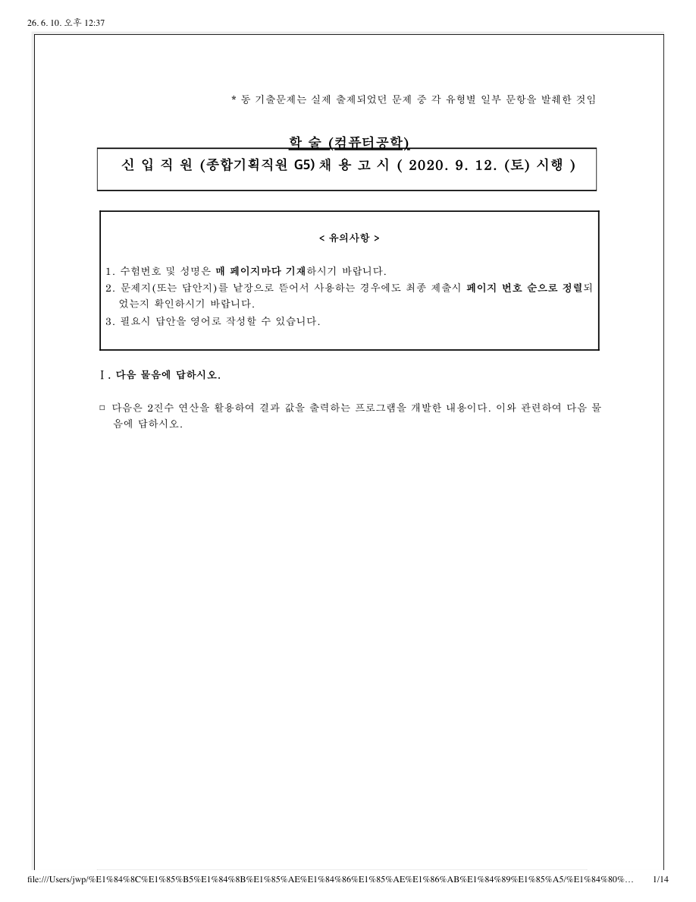

### 추출 텍스트

```text
학 술 (컴퓨터공학)
신 입 직 원 (종합기획직원 G5) 채 용 고 시 ( 2020. 9. 12. (토) 시행 )
< 유의사항 >
1. 수험번호 및 성명은 매 페이지마다 기재하시기 바랍니다.
2. 문제지(또는 답안지)를 낱장으로 뜯어서 사용하는 경우에도 최종 제출시 페이지 번호 순으로 정렬되
었는지 확인하시기 바랍니다.
3. 필요시 답안을 영어로 작성할 수 있습니다.
Ⅰ. 다음 물음에 답하시오.
□ 다음은 2진수 연산을 활용하여 결과 값을 출력하는 프로그램을 개발한 내용이다. 이와 관련하여 다음 물
음에 답하시오.
* 동 기출문제는 실제 출제되었던 문제 중 각 유형별 일부 문항을 발췌한 것임
26. 6. 10. 오후 12:37
file:///Users/jwp/%E1%84%8C%E1%85%B5%E1%84%8B%E1%85%AE%E1%84%86%E1%85%AE%E1%86%AB%E1%84%89%E1%85%A5/%E1%84%80%…
1/14
```


---

## Page 2

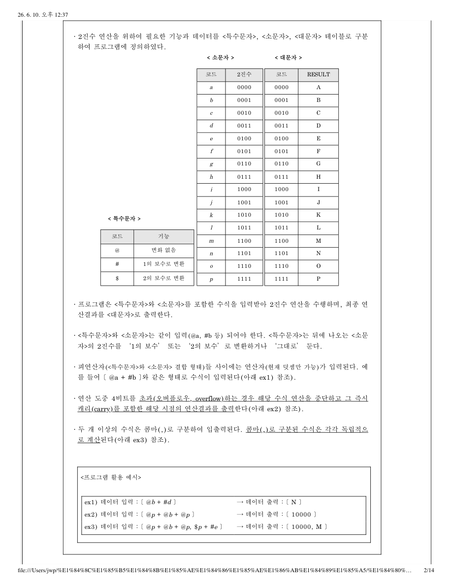

### 추출 텍스트

```text
·2진수 연산을 위하여 필요한 기능과 데이터를 <특수문자>, <소문자>, <대문자> 테이블로 구분
하여 프로그램에 정의하였다.
< 특수문자 >
코드
기능
@
변화 없음
#
1의 보수로 변환
$
2의 보수로 변환
 
< 소문자 >
코드
2진수
a
0000
b
0001
c
0010
d
0011
e
0100
f
0101
g
0110
h
0111
i
1000
j
1001
k
1010
l
1011
m
1100
n
1101
o
1110
p
1111
 
< 대문자 >
코드
RESULT
0000
A
0001
B
0010
C
0011
D
0100
E
0101
F
0110
G
0111
H
1000
I
1001
J
1010
K
1011
L
1100
M
1101
N
1110
O
1111
P
·프로그램은 <특수문자>와 <소문자>를 포함한 수식을 입력받아 2진수 연산을 수행하며, 최종 연
산결과를 <대문자>로 출력한다.
·<특수문자>와 <소문자>는 같이 입력(@a, #b 등) 되어야 한다. <특수문자>는 뒤에 나오는 <소문
자>의 2진수를 ‘1의 보수’ 또는 ‘2의 보수’로 변환하거나 ‘그대로’ 둔다.
·피연산자(<특수문자>와 <소문자> 결합 형태)들 사이에는 연산자(현재 덧셈만 가능)가 입력된다. 예
를 들어 [ @a + #b ]와 같은 형태로 수식이 입력된다(아래 ex1) 참조).
·연산 도중 4비트를 초과(오버플로우, overflow)하는 경우 해당 수식 연산을 중단하고 그 즉시
캐리(carry)를 포함한 해당 시점의 연산결과를 출력한다(아래 ex2) 참조).
·두 개 이상의 수식은 콤마(,)로 구분하여 입출력된다. 콤마(,)로 구분된 수식은 각각 독립적으
로 계산된다(아래 ex3) 참조).
<프로그램 활용 예시>
ex1) 데이터 입력 : [ @b + #d ]
→ 데이터 출력 : [ N ]
ex2) 데이터 입력 : [ @p + @b + @p ]
→ 데이터 출력 : [ 10000 ]
ex3) 데이터 입력 : [ @p + @b + @p, $p + #e ]
→ 데이터 출력 : [ 10000, M ]
26. 6. 10. 오후 12:37
file:///Users/jwp/%E1%84%8C%E1%85%B5%E1%84%8B%E1%85%AE%E1%84%86%E1%85%AE%E1%86%AB%E1%84%89%E1%85%A5/%E1%84%80%…
2/14
```


---

## Page 3

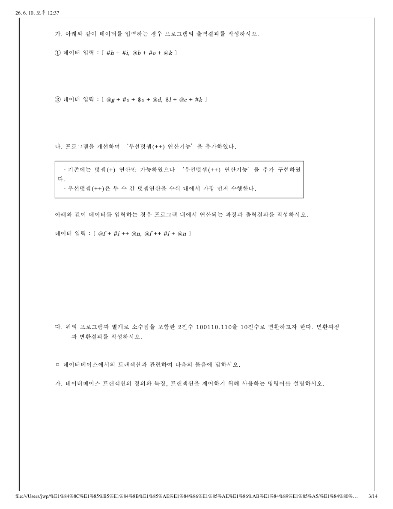

### 추출 텍스트

```text
가. 아래와 같이 데이터를 입력하는 경우 프로그램의 출력결과를 작성하시오.
① 데이터 입력 : [ #h + #i, @b + #o + @k ]
② 데이터 입력 : [ @g + #o + $o + @d, $l + @c + #k ]
나. 프로그램을 개선하여 ‘우선덧셈(++) 연산기능’을 추가하였다.
·기존에는 덧셈(+) 연산만 가능하였으나 ‘우선덧셈(++) 연산기능’을 추가 구현하였
다.
·우선덧셈(++)은 두 수 간 덧셈연산을 수식 내에서 가장 먼저 수행한다.
아래와 같이 데이터를 입력하는 경우 프로그램 내에서 연산되는 과정과 출력결과를 작성하시오.
데이터 입력 : [ @f + #i ++ @n, @f ++ #i + @n ]
다. 위의 프로그램과 별개로 소수점을 포함한 2진수 100110.110을 10진수로 변환하고자 한다. 변환과정
과 변환결과를 작성하시오.
□ 데이터베이스에서의 트랜잭션과 관련하여 다음의 물음에 답하시오.
가. 데이터베이스 트랜잭션의 정의와 특징, 트랜잭션을 제어하기 위해 사용하는 명령어를 설명하시오.
26. 6. 10. 오후 12:37
file:///Users/jwp/%E1%84%8C%E1%85%B5%E1%84%8B%E1%85%AE%E1%84%86%E1%85%AE%E1%86%AB%E1%84%89%E1%85%A5/%E1%84%80%…
3/14
```


---

## Page 4

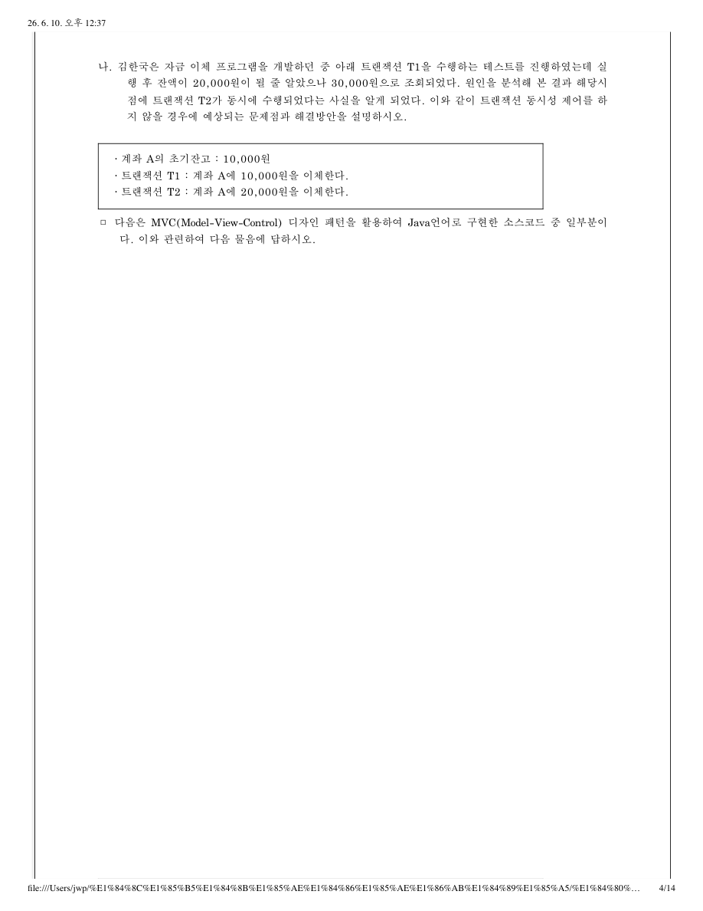

### 추출 텍스트

```text
나. 김한국은 자금 이체 프로그램을 개발하던 중 아래 트랜잭션 T1을 수행하는 테스트를 진행하였는데 실
행 후 잔액이 20,000원이 될 줄 알았으나 30,000원으로 조회되었다. 원인을 분석해 본 결과 해당시
점에 트랜잭션 T2가 동시에 수행되었다는 사실을 알게 되었다. 이와 같이 트랜잭션 동시성 제어를 하
지 않을 경우에 예상되는 문제점과 해결방안을 설명하시오.
·계좌 A의 초기잔고 : 10,000원
·트랜잭션 T1 : 계좌 A에 10,000원을 이체한다.
·트랜잭션 T2 : 계좌 A에 20,000원을 이체한다.
□ 다음은 MVC(Model-View-Control) 디자인 패턴을 활용하여 Java언어로 구현한 소스코드 중 일부분이
다. 이와 관련하여 다음 물음에 답하시오.
26. 6. 10. 오후 12:37
file:///Users/jwp/%E1%84%8C%E1%85%B5%E1%84%8B%E1%85%AE%E1%84%86%E1%85%AE%E1%86%AB%E1%84%89%E1%85%A5/%E1%84%80%…
4/14
```


---

## Page 5

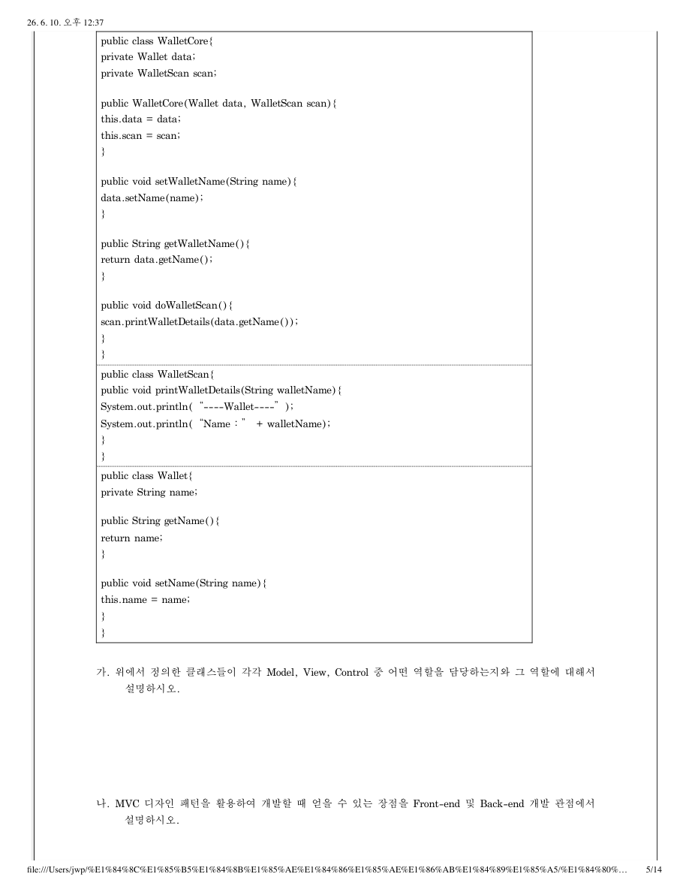

### 추출 텍스트

```text
public class WalletCore{
private Wallet data;
private WalletScan scan;
public WalletCore(Wallet data, WalletScan scan){
this.data = data;
this.scan = scan;
}
public void setWalletName(String name){
data.setName(name);
}
public String getWalletName(){
return data.getName();
}
public void doWalletScan(){
scan.printWalletDetails(data.getName());
}
}
public class WalletScan{
public void printWalletDetails(String walletName){
System.out.println(“----Wallet----”);
System.out.println(“Name : ” + walletName);
}
}
public class Wallet{
private String name;
public String getName(){
return name;
}
public void setName(String name){
this.name = name;
}
}
가. 위에서 정의한 클래스들이 각각 Model, View, Control 중 어떤 역할을 담당하는지와 그 역할에 대해서
설명하시오.
나. MVC 디자인 패턴을 활용하여 개발할 때 얻을 수 있는 장점을 Front-end 및 Back-end 개발 관점에서
설명하시오.
26. 6. 10. 오후 12:37
file:///Users/jwp/%E1%84%8C%E1%85%B5%E1%84%8B%E1%85%AE%E1%84%86%E1%85%AE%E1%86%AB%E1%84%89%E1%85%A5/%E1%84%80%…
5/14
```


---

## Page 6

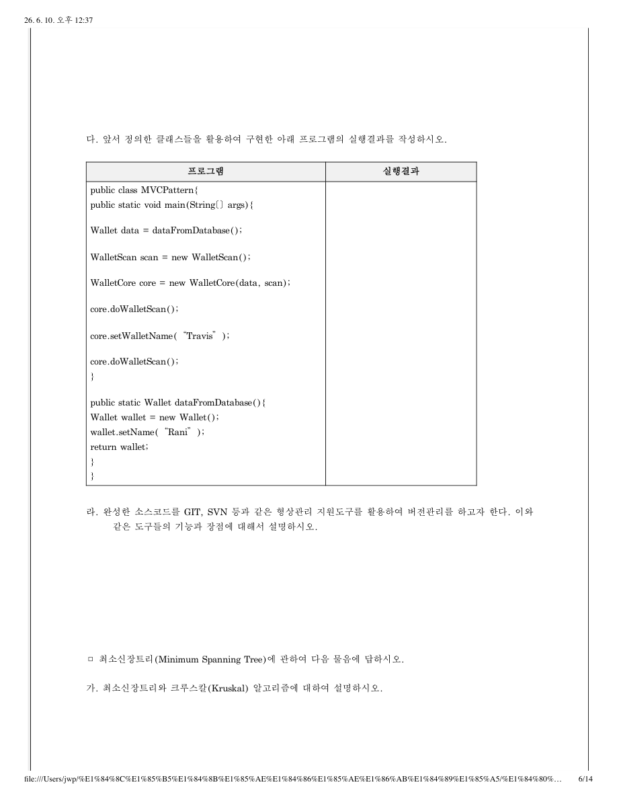

### 추출 텍스트

```text
다. 앞서 정의한 클래스들을 활용하여 구현한 아래 프로그램의 실행결과를 작성하시오.
프로그램
실행결과
public class MVCPattern{
public static void main(String[] args){
Wallet data = dataFromDatabase();
WalletScan scan = new WalletScan();
WalletCore core = new WalletCore(data, scan);
core.doWalletScan();
core.setWalletName(“Travis”);
core.doWalletScan();
}
public static Wallet dataFromDatabase(){
Wallet wallet = new Wallet();
wallet.setName(“Rani”);
return wallet;
}
}
라. 완성한 소스코드를 GIT, SVN 등과 같은 형상관리 지원도구를 활용하여 버전관리를 하고자 한다. 이와
같은 도구들의 기능과 장점에 대해서 설명하시오.
□ 최소신장트리(Minimum Spanning Tree)에 관하여 다음 물음에 답하시오.
가. 최소신장트리와 크루스칼(Kruskal) 알고리즘에 대하여 설명하시오.
26. 6. 10. 오후 12:37
file:///Users/jwp/%E1%84%8C%E1%85%B5%E1%84%8B%E1%85%AE%E1%84%86%E1%85%AE%E1%86%AB%E1%84%89%E1%85%A5/%E1%84%80%…
6/14
```


---

## Page 7

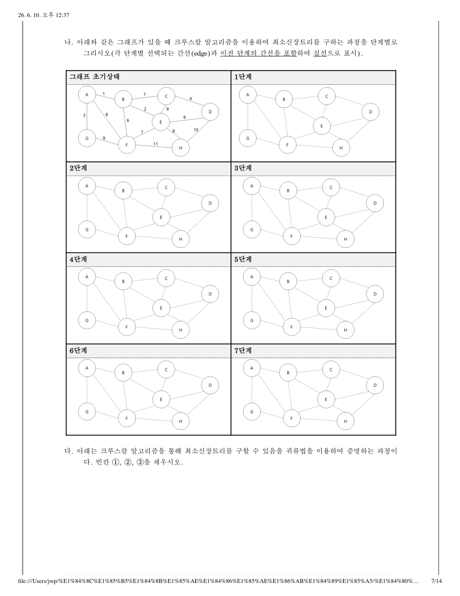

### 추출 텍스트

```text
나. 아래와 같은 그래프가 있을 때 크루스칼 알고리즘을 이용하여 최소신장트리를 구하는 과정을 단계별로
그리시오(각 단계별 선택되는 간선(edge)과 이전 단계의 간선을 포함하여 실선으로 표시).
그래프 초기상태
1단계
2단계
3단계
4단계
5단계
6단계
7단계
다. 아래는 크루스칼 알고리즘을 통해 최소신장트리를 구할 수 있음을 귀류법을 이용하여 증명하는 과정이
다. 빈칸 ①, ②, ③을 채우시오.
26. 6. 10. 오후 12:37
file:///Users/jwp/%E1%84%8C%E1%85%B5%E1%84%8B%E1%85%AE%E1%84%86%E1%85%AE%E1%86%AB%E1%84%89%E1%85%A5/%E1%84%80%…
7/14
```


---

## Page 8

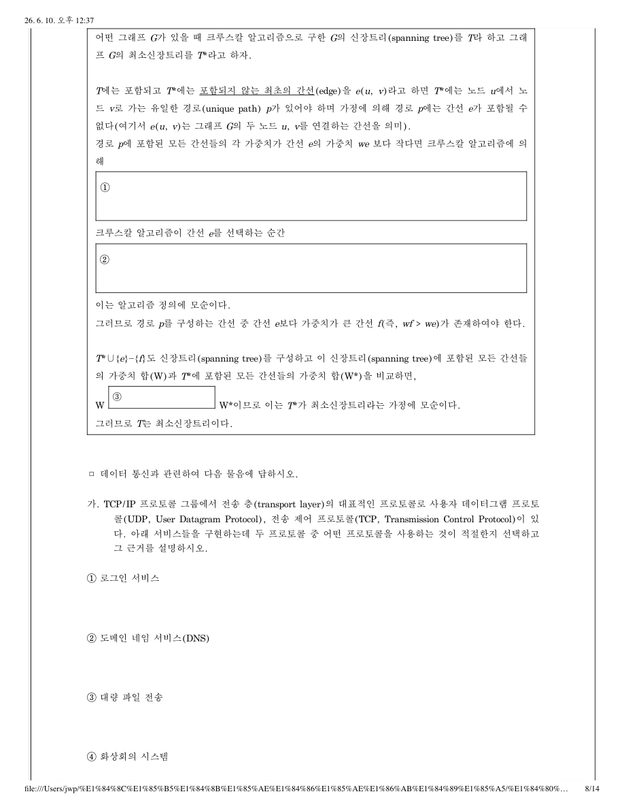

### 추출 텍스트

```text
어떤 그래프 G가 있을 때 크루스칼 알고리즘으로 구한 G의 신장트리(spanning tree)를 T라 하고 그래
프 G의 최소신장트리를 T*라고 하자.
T에는 포함되고 T*에는 포함되지 않는 최초의 간선(edge)을 e(u, v)라고 하면 T*에는 노드 u에서 노
드 v로 가는 유일한 경로(unique path) p가 있어야 하며 가정에 의해 경로 p에는 간선 e가 포함될 수
없다(여기서 e(u, v)는 그래프 G의 두 노드 u, v를 연결하는 간선을 의미).
경로 p에 포함된 모든 간선들의 각 가중치가 간선 e의 가중치 we 보다 작다면 크루스칼 알고리즘에 의
해
①
크루스칼 알고리즘이 간선 e를 선택하는 순간
②
이는 알고리즘 정의에 모순이다.
그러므로 경로 p를 구성하는 간선 중 간선 e보다 가중치가 큰 간선 f(즉, wf > we)가 존재하여야 한다.
T*∪{e}−{f}도 신장트리(spanning tree)를 구성하고 이 신장트리(spanning tree)에 포함된 모든 간선들
의 가중치 합(W)과 T*에 포함된 모든 간선들의 가중치 합(W*)을 비교하면,
W 
③
 W*이므로 이는 T*가 최소신장트리라는 가정에 모순이다.
그러므로 T는 최소신장트리이다.
□ 데이터 통신과 관련하여 다음 물음에 답하시오.
가. TCP/IP 프로토콜 그룹에서 전송 층(transport layer)의 대표적인 프로토콜로 사용자 데이터그램 프로토
콜(UDP, User Datagram Protocol), 전송 제어 프로토콜(TCP, Transmission Control Protocol)이 있
다. 아래 서비스들을 구현하는데 두 프로토콜 중 어떤 프로토콜을 사용하는 것이 적절한지 선택하고
그 근거를 설명하시오.
① 로그인 서비스
② 도메인 네임 서비스(DNS)
③ 대량 파일 전송
④ 화상회의 시스템
26. 6. 10. 오후 12:37
file:///Users/jwp/%E1%84%8C%E1%85%B5%E1%84%8B%E1%85%AE%E1%84%86%E1%85%AE%E1%86%AB%E1%84%89%E1%85%A5/%E1%84%80%…
8/14
```


---

## Page 9

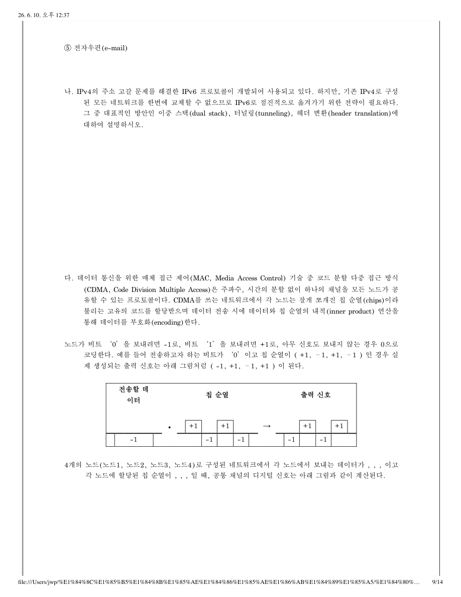

### 추출 텍스트

```text
⑤ 전자우편(e-mail)
나. IPv4의 주소 고갈 문제를 해결한 IPv6 프로토콜이 개발되어 사용되고 있다. 하지만, 기존 IPv4로 구성
된 모든 네트워크를 한번에 교체할 수 없으므로 IPv6로 점진적으로 옮겨가기 위한 전략이 필요하다.
그 중 대표적인 방안인 이중 스택(dual stack), 터널링(tunneling), 헤더 변환(header translation)에
대하여 설명하시오.
다. 데이터 통신을 위한 매체 접근 제어(MAC, Media Access Control) 기술 중 코드 분할 다중 접근 방식
(CDMA, Code Division Multiple Access)은 주파수, 시간의 분할 없이 하나의 채널을 모든 노드가 공
유할 수 있는 프로토콜이다. CDMA를 쓰는 네트워크에서 각 노드는 잘게 쪼개진 칩 순열(chips)이라
불리는 고유의 코드를 할당받으며 데이터 전송 시에 데이터와 칩 순열의 내적(inner product) 연산을
통해 데이터를 부호화(encoding)한다.
노드가 비트 ‘0’을 보내려면 -1로, 비트 ‘1’을 보내려면 +1로, 아무 신호도 보내지 않는 경우 0으로
코딩한다. 예를 들어 전송하고자 하는 비트가 ‘0’이고 칩 순열이 ( +1, –1, +1, –1 ) 인 경우 실
제 생성되는 출력 신호는 아래 그림처럼 ( -1, +1, –1, +1 ) 이 된다.
전송할 데
이터
칩 순열
출력 신호
●
+1
+1
→
+1
+1
-1
-1
-1
-1
-1
4개의 노드(노드1, 노드2, 노드3, 노드4)로 구성된 네트워크에서 각 노드에서 보내는 데이터가 , , , 이고
각 노드에 할당된 칩 순열이 , , , 일 때, 공통 채널의 디지털 신호는 아래 그림과 같이 계산된다.
26. 6. 10. 오후 12:37
file:///Users/jwp/%E1%84%8C%E1%85%B5%E1%84%8B%E1%85%AE%E1%84%86%E1%85%AE%E1%86%AB%E1%84%89%E1%85%A5/%E1%84%80%…
9/14
```


---

## Page 10

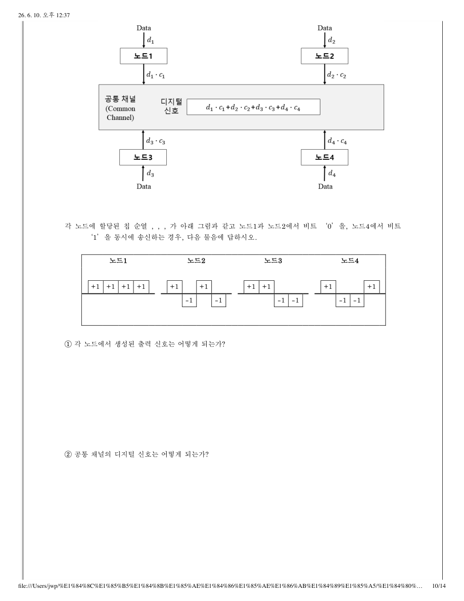

### 추출 텍스트

```text
각 노드에 할당된 칩 순열 , , , 가 아래 그림과 같고 노드1과 노드2에서 비트 ‘0’을, 노드4에서 비트
‘1’을 동시에 송신하는 경우, 다음 물음에 답하시오.
노드1
노드2
노드3
노드4
+1
+1
+1
+1
+1
+1
+1
+1
+1
+1
-1
-1
-1
-1
-1
-1
① 각 노드에서 생성된 출력 신호는 어떻게 되는가?
② 공통 채널의 디지털 신호는 어떻게 되는가?
26. 6. 10. 오후 12:37
file:///Users/jwp/%E1%84%8C%E1%85%B5%E1%84%8B%E1%85%AE%E1%84%86%E1%85%AE%E1%86%AB%E1%84%89%E1%85%A5/%E1%84%80%…
10/14
```


---

## Page 11

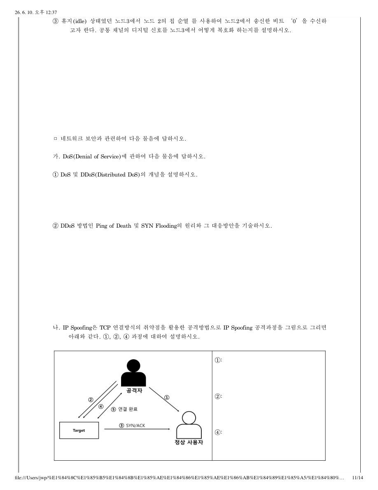

### 추출 텍스트

```text
③ 휴지(idle) 상태였던 노드3에서 노드 2의 칩 순열 를 사용하여 노드2에서 송신한 비트 ‘0’을 수신하
고자 한다. 공통 채널의 디지털 신호를 노드3에서 어떻게 복호화 하는지를 설명하시오.
□ 네트워크 보안과 관련하여 다음 물음에 답하시오.
가. DoS(Denial of Service)에 관하여 다음 물음에 답하시오.
① DoS 및 DDoS(Distributed DoS)의 개념을 설명하시오.
② DDoS 방법인 Ping of Death 및 SYN Flooding의 원리와 그 대응방안을 기술하시오.
나. IP Spoofing은 TCP 연결방식의 취약점을 활용한 공격방법으로 IP Spoofing 공격과정을 그림으로 그리면
아래와 같다. ①, ②, ④ 과정에 대하여 설명하시오.
①:
②:
④:
26. 6. 10. 오후 12:37
file:///Users/jwp/%E1%84%8C%E1%85%B5%E1%84%8B%E1%85%AE%E1%84%86%E1%85%AE%E1%86%AB%E1%84%89%E1%85%A5/%E1%84%80%…
11/14
```


---

## Page 12

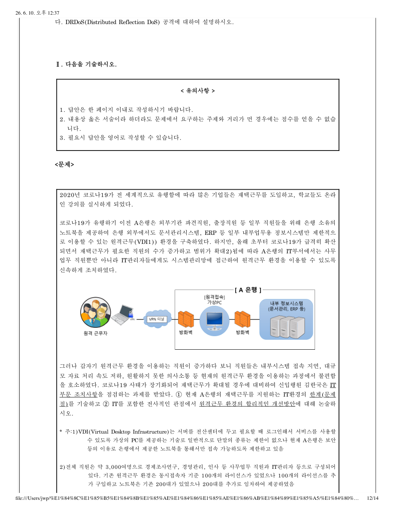

### 추출 텍스트

```text
다. DRDoS(Distributed Reflection DoS) 공격에 대하여 설명하시오.
Ⅱ. 다음을 기술하시오.
< 유의사항 >
1. 답안은 한 페이지 이내로 작성하시기 바랍니다.
2. 내용상 옳은 서술이라 하더라도 문제에서 요구하는 주제와 거리가 먼 경우에는 점수를 얻을 수 없습
니다.
3. 필요시 답안을 영어로 작성할 수 있습니다.
<문제>
2020년 코로나19가 전 세계적으로 유행함에 따라 많은 기업들은 재택근무를 도입하고, 학교들도 온라
인 강의를 실시하게 되었다.
코로나19가 유행하기 이전 A은행은 외부기관 파견직원, 출장직원 등 일부 직원들을 위해 은행 소유의
노트북을 제공하여 은행 외부에서도 문서관리시스템, ERP 등 일부 내부업무용 정보시스템만 제한적으
로 이용할 수 있는 원격근무(VDI1)) 환경을 구축하였다. 하지만, 올해 초부터 코로나19가 급격히 확산
되면서 재택근무가 필요한 직원의 수가 증가하고 범위가 확대2)됨에 따라 A은행의 IT부서에서는 사무
업무 직원뿐만 아니라 IT관리자들에게도 시스템관리망에 접근하여 원격근무 환경을 이용할 수 있도록
신속하게 조치하였다.
그러나 갑자기 원격근무 환경을 이용하는 직원이 증가하다 보니 직원들은 내부시스템 접속 지연, 대규
모 자료 처리 속도 저하, 원활하지 못한 의사소통 등 현재의 원격근무 환경을 이용하는 과정에서 불편함
을 호소하였다. 코로나19 사태가 장기화되어 재택근무가 확대될 경우에 대비하여 신입행원 김한국은 IT
부문 조치사항을 점검하는 과제를 받았다. ① 현재 A은행의 재택근무를 지원하는 IT환경의 한계(문제
점)를 기술하고 ② IT를 포함한 전사적인 관점에서 원격근무 환경의 합리적인 개선방안에 대해 논술하
시오.
* 주:1)VDI(Virtual Desktop Infrastructure)는 서버를 전산센터에 두고 필요할 때 로그인해서 서비스를 사용할
수 있도록 가상의 PC를 제공하는 기술로 일반적으로 단말의 종류는 제한이 없으나 현재 A은행은 보안
등의 이유로 은행에서 제공한 노트북을 통해서만 접속 가능하도록 제한하고 있음
2)전체 직원은 약 3,000여명으로 경제조사연구, 경영관리, 인사 등 사무업무 직원과 IT관리자 등으로 구성되어
있다. 기존 원격근무 환경은 동시접속자 기준 100개의 라이선스가 있었으나 100개의 라이선스를 추
가 구입하고 노트북은 기존 200대가 있었으나 200대를 추가로 임차하여 제공하였음
26. 6. 10. 오후 12:37
file:///Users/jwp/%E1%84%8C%E1%85%B5%E1%84%8B%E1%85%AE%E1%84%86%E1%85%AE%E1%86%AB%E1%84%89%E1%85%A5/%E1%84%80%…
12/14
```


---

## Page 13

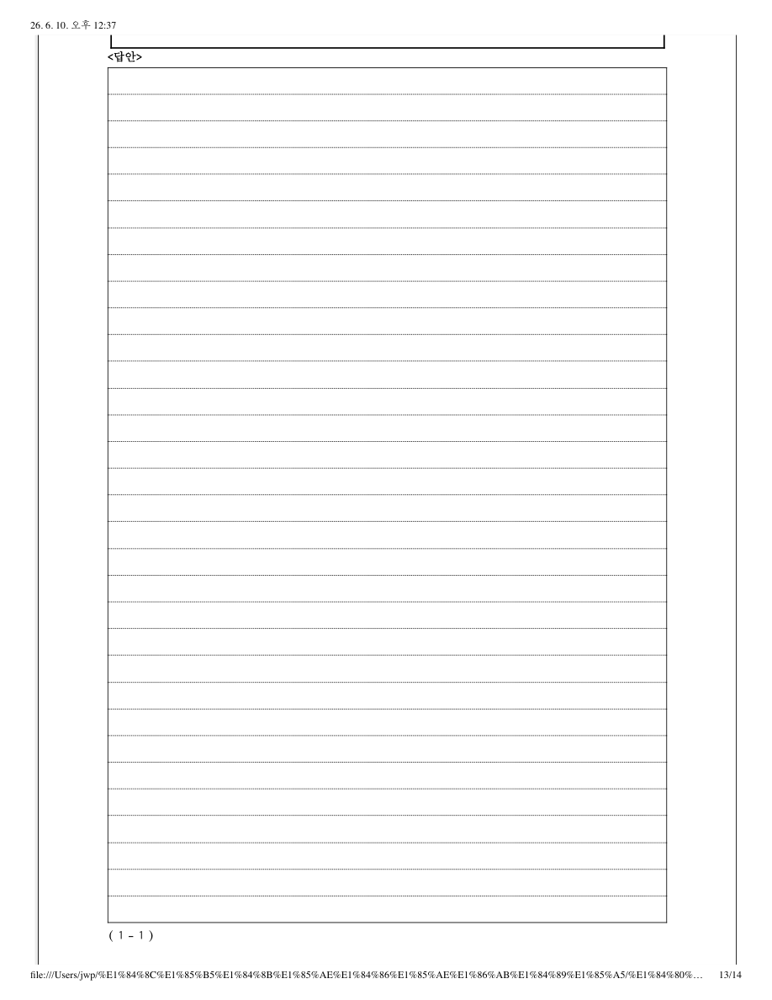

### 추출 텍스트

```text
<답안>
( 1 - 1 )
26. 6. 10. 오후 12:37
file:///Users/jwp/%E1%84%8C%E1%85%B5%E1%84%8B%E1%85%AE%E1%84%86%E1%85%AE%E1%86%AB%E1%84%89%E1%85%A5/%E1%84%80%…
13/14
```


---

## Page 14


### 추출 텍스트

```text
26. 6. 10. 오후 12:37
file:///Users/jwp/%E1%84%8C%E1%85%B5%E1%84%8B%E1%85%AE%E1%84%86%E1%85%AE%E1%86%AB%E1%84%89%E1%85%A5/%E1%84%80%…
14/14
```


# 한국은행 2019 컴퓨터공학 학술

- 개별 파일: `한국은행_2019_컴퓨터공학_학술_문제.md`


---

## Page 1

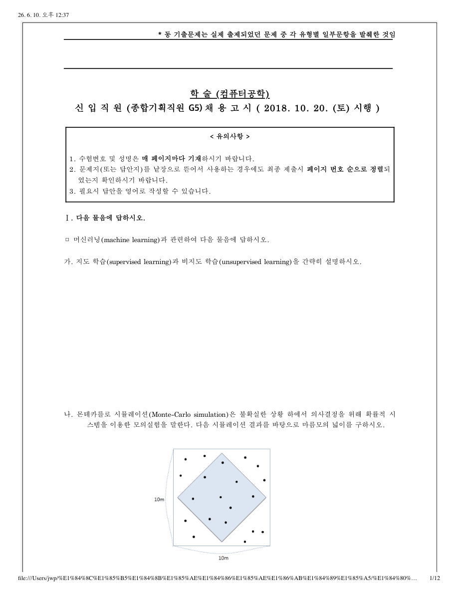

### 추출 텍스트

```text
학 술 (컴퓨터공학)
신 입 직 원 (종합기획직원 G5) 채 용 고 시 ( 2018. 10. 20. (토) 시행 )
< 유의사항 >
1. 수험번호 및 성명은 매 페이지마다 기재하시기 바랍니다.
2. 문제지(또는 답안지)를 낱장으로 뜯어서 사용하는 경우에도 최종 제출시 페이지 번호 순으로 정렬되
었는지 확인하시기 바랍니다.
3. 필요시 답안을 영어로 작성할 수 있습니다.
Ⅰ. 다음 물음에 답하시오.
□ 머신러닝(machine learning)과 관련하여 다음 물음에 답하시오.
가. 지도 학습(supervised learning)과 비지도 학습(unsupervised learning)을 간략히 설명하시오.
나. 몬테카를로 시뮬레이션(Monte-Carlo simulation)은 불확실한 상황 하에서 의사결정을 위해 확률적 시
스템을 이용한 모의실험을 말한다. 다음 시뮬레이션 결과를 바탕으로 마름모의 넓이를 구하시오.
* 동 기출문제는 실제 출제되었던 문제 중 각 유형별 일부문항을 발췌한 것임
26. 6. 10. 오후 12:37
file:///Users/jwp/%E1%84%8C%E1%85%B5%E1%84%8B%E1%85%AE%E1%84%86%E1%85%AE%E1%86%AB%E1%84%89%E1%85%A5/%E1%84%80%…
1/12
```


---

## Page 2

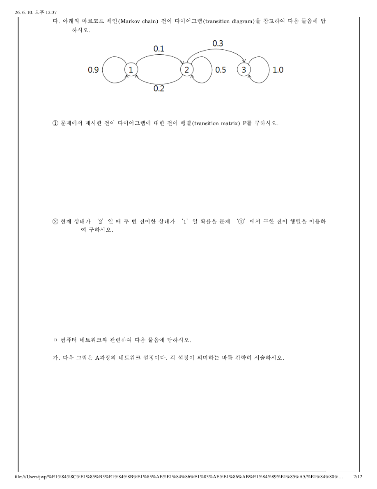

### 추출 텍스트

```text
다. 아래의 마르코프 체인(Markov chain) 전이 다이어그램(transition diagram)을 참고하여 다음 물음에 답
하시오.
① 문제에서 제시한 전이 다이어그램에 대한 전이 행렬(transition matrix) P를 구하시오.
② 현재 상태가 ‘2’일 때 두 번 전이한 상태가 ‘1’일 확률을 문제 ‘①’에서 구한 전이 행렬을 이용하
여 구하시오.
□ 컴퓨터 네트워크와 관련하여 다음 물음에 답하시오.
가. 다음 그림은 A과장의 네트워크 설정이다. 각 설정이 의미하는 바를 간략히 서술하시오.
26. 6. 10. 오후 12:37
file:///Users/jwp/%E1%84%8C%E1%85%B5%E1%84%8B%E1%85%AE%E1%84%86%E1%85%AE%E1%86%AB%E1%84%89%E1%85%A5/%E1%84%80%…
2/12
```


---

## Page 3

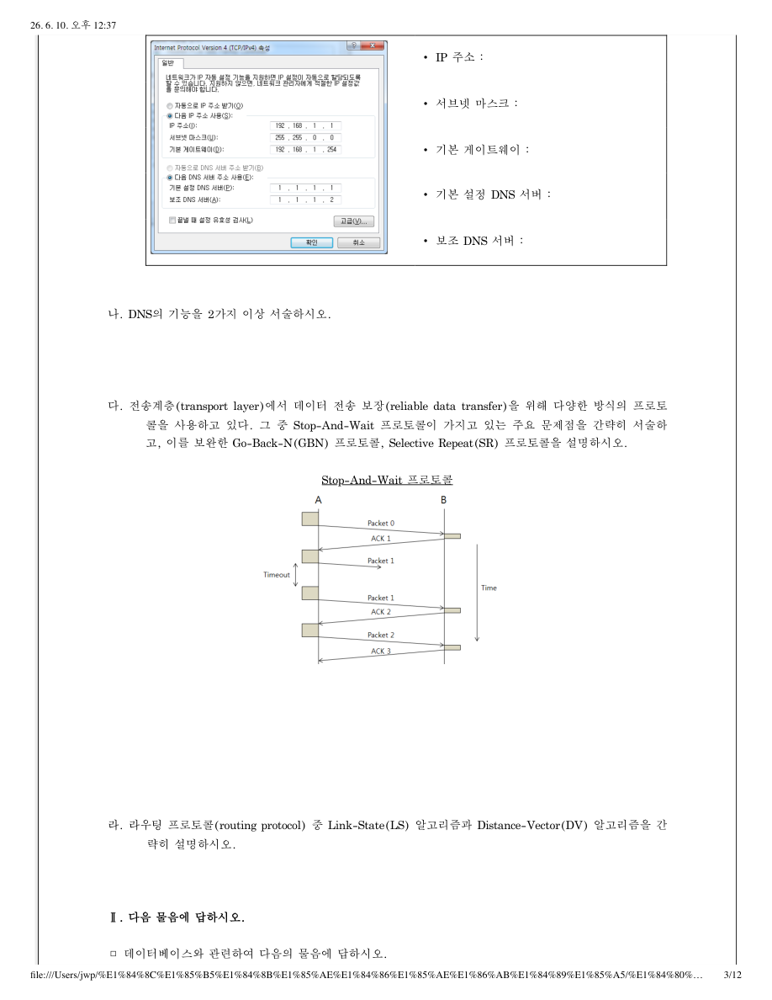

### 추출 텍스트

```text
• IP 주소 :
• 서브넷 마스크 :
• 기본 게이트웨이 :
• 기본 설정 DNS 서버 :
• 보조 DNS 서버 :
나. DNS의 기능을 2가지 이상 서술하시오.
다. 전송계층(transport layer)에서 데이터 전송 보장(reliable data transfer)을 위해 다양한 방식의 프로토
콜을 사용하고 있다. 그 중 Stop-And-Wait 프로토콜이 가지고 있는 주요 문제점을 간략히 서술하
고, 이를 보완한 Go-Back-N(GBN) 프로토콜, Selective Repeat(SR) 프로토콜을 설명하시오.
Stop-And-Wait 프로토콜
라. 라우팅 프로토콜(routing protocol) 중 Link-State(LS) 알고리즘과 Distance-Vector(DV) 알고리즘을 간
략히 설명하시오.
Ⅱ. 다음 물음에 답하시오.
□ 데이터베이스와 관련하여 다음의 물음에 답하시오.
26. 6. 10. 오후 12:37
file:///Users/jwp/%E1%84%8C%E1%85%B5%E1%84%8B%E1%85%AE%E1%84%86%E1%85%AE%E1%86%AB%E1%84%89%E1%85%A5/%E1%84%80%…
3/12
```


---

## Page 4

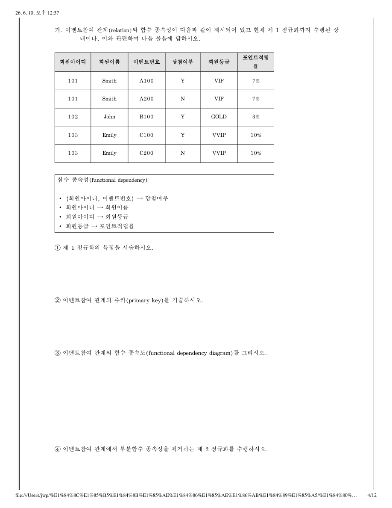

### 추출 텍스트

```text
가. 이벤트참여 관계(relation)와 함수 종속성이 다음과 같이 제시되어 있고 현재 제 1 정규화까지 수행된 상
태이다. 이와 관련하여 다음 물음에 답하시오.
회원아이디
회원이름
이벤트번호
당첨여부
회원등급
포인트적립
률
101
Smith
A100
Y
VIP
7%
101
Smith
A200
N
VIP
7%
102
John
B100
Y
GOLD
3%
103
Emily
C100
Y
VVIP
10%
103
Emily
C200
N
VVIP
10%
함수 종속성(functional dependency)
• {회원아이디, 이벤트번호} → 당첨여부
• 회원아이디 → 회원이름
• 회원아이디 → 회원등급
• 회원등급 → 포인트적립률
① 제 1 정규화의 특징을 서술하시오.
② 이벤트참여 관계의 주키(primary key)를 기술하시오.
③ 이벤트참여 관계의 함수 종속도(functional dependency diagram)를 그리시오.
④ 이벤트참여 관계에서 부분함수 종속성을 제거하는 제 2 정규화를 수행하시오.
26. 6. 10. 오후 12:37
file:///Users/jwp/%E1%84%8C%E1%85%B5%E1%84%8B%E1%85%AE%E1%84%86%E1%85%AE%E1%86%AB%E1%84%89%E1%85%A5/%E1%84%80%…
4/12
```


---

## Page 5

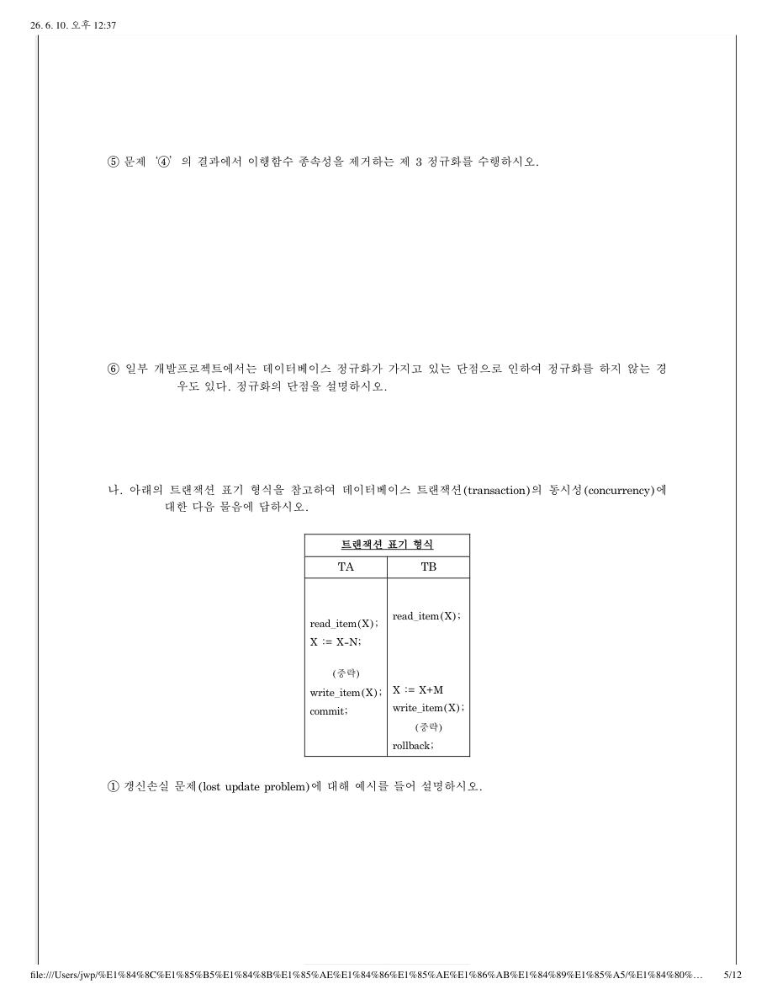

### 추출 텍스트

```text
⑤ 문제‘④’의 결과에서 이행함수 종속성을 제거하는 제 3 정규화를 수행하시오.
⑥ 일부 개발프로젝트에서는 데이터베이스 정규화가 가지고 있는 단점으로 인하여 정규화를 하지 않는 경
우도 있다. 정규화의 단점을 설명하시오.
나. 아래의 트랜잭션 표기 형식을 참고하여 데이터베이스 트랜잭션(transaction)의 동시성(concurrency)에
대한 다음 물음에 답하시오.
트랜잭션 표기 형식
TA
TB
read_item(X);
X := X-N;
(중략)
write_item(X);
commit;
read_item(X);
X := X+M
write_item(X);
(중략)
rollback;
① 갱신손실 문제(lost update problem)에 대해 예시를 들어 설명하시오.
26. 6. 10. 오후 12:37
file:///Users/jwp/%E1%84%8C%E1%85%B5%E1%84%8B%E1%85%AE%E1%84%86%E1%85%AE%E1%86%AB%E1%84%89%E1%85%A5/%E1%84%80%…
5/12
```


---

## Page 6

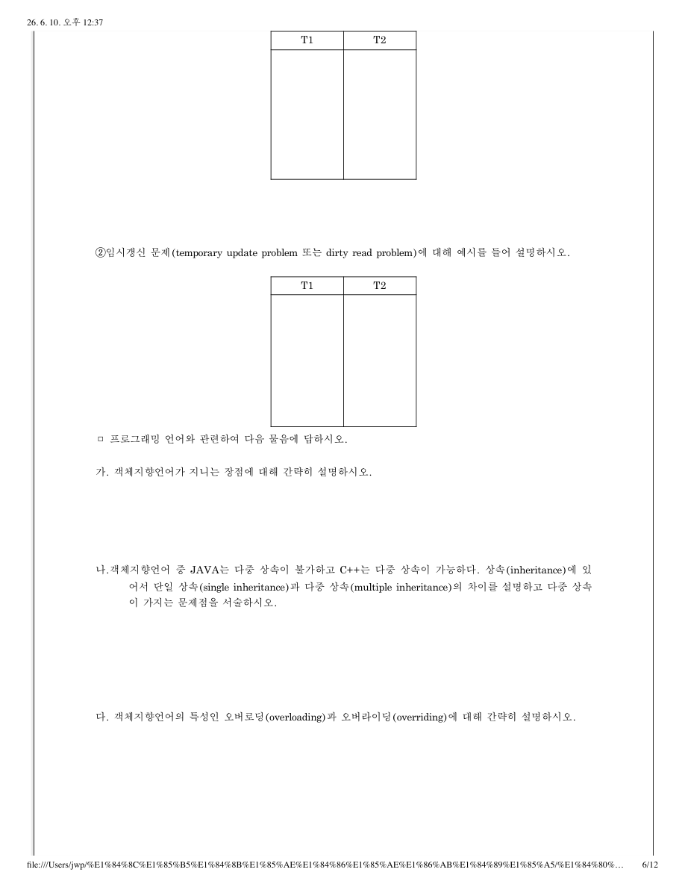

### 추출 텍스트

```text
T1
T2
②임시갱신 문제(temporary update problem 또는 dirty read problem)에 대해 예시를 들어 설명하시오.
T1
T2
□ 프로그래밍 언어와 관련하여 다음 물음에 답하시오.
가. 객체지향언어가 지니는 장점에 대해 간략히 설명하시오.
나.객체지향언어 중 JAVA는 다중 상속이 불가하고 C++는 다중 상속이 가능하다. 상속(inheritance)에 있
어서 단일 상속(single inheritance)과 다중 상속(multiple inheritance)의 차이를 설명하고 다중 상속
이 가지는 문제점을 서술하시오.
다. 객체지향언어의 특성인 오버로딩(overloading)과 오버라이딩(overriding)에 대해 간략히 설명하시오.
26. 6. 10. 오후 12:37
file:///Users/jwp/%E1%84%8C%E1%85%B5%E1%84%8B%E1%85%AE%E1%84%86%E1%85%AE%E1%86%AB%E1%84%89%E1%85%A5/%E1%84%80%…
6/12
```


---

## Page 7

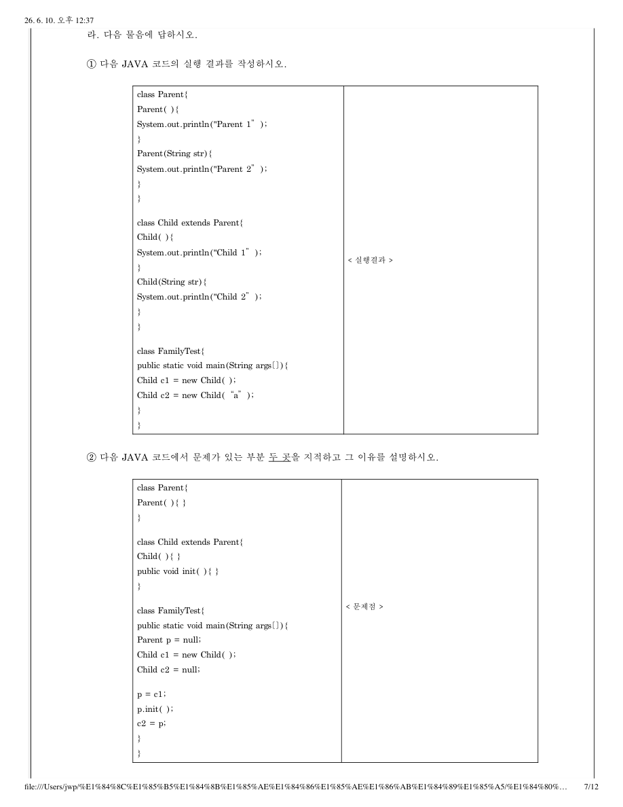

### 추출 텍스트

```text
라. 다음 물음에 답하시오.
① 다음 JAVA 코드의 실행 결과를 작성하시오.
class Parent{
Parent( ){
System.out.println("Parent 1”);
}
Parent(String str){
System.out.println("Parent 2”);
}
}
class Child extends Parent{
Child( ){
System.out.println("Child 1”);
}
Child(String str){
System.out.println("Child 2”);
}
}
class FamilyTest{
public static void main(String args[]){
Child c1 = new Child( );
Child c2 = new Child(“a”);
}
}
< 실행결과 >
② 다음 JAVA 코드에서 문제가 있는 부분 두 곳을 지적하고 그 이유를 설명하시오.
class Parent{
Parent( ){ }
}
class Child extends Parent{
Child( ){ }
public void init( ){ }
}
class FamilyTest{
public static void main(String args[]){
Parent p = null;
Child c1 = new Child( );
Child c2 = null;
p = c1;
p.init( );
c2 = p;
}
}
< 문제점 >
26. 6. 10. 오후 12:37
file:///Users/jwp/%E1%84%8C%E1%85%B5%E1%84%8B%E1%85%AE%E1%84%86%E1%85%AE%E1%86%AB%E1%84%89%E1%85%A5/%E1%84%80%…
7/12
```


---

## Page 8

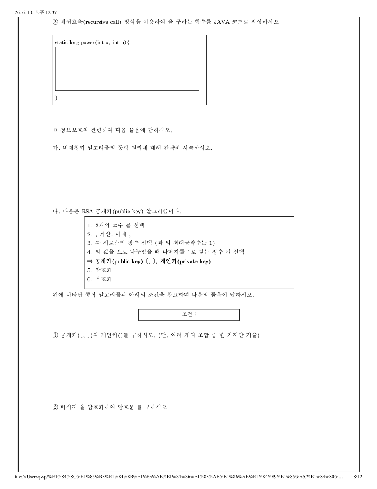

### 추출 텍스트

```text
③ 재귀호출(recursive call) 방식을 이용하여 을 구하는 함수를 JAVA 코드로 작성하시오.
static long power(int x, int n){
}
□ 정보보호와 관련하여 다음 물음에 답하시오.
가. 비대칭키 알고리즘의 동작 원리에 대해 간략히 서술하시오.
나. 다음은 RSA 공개키(public key) 알고리즘이다.
1. 2개의 소수 를 선택
2. , 계산. 이때 ,
3. 과 서로소인 정수 선택 (와 의 최대공약수는 1)
4. 의 값을 으로 나누었을 때 나머지를 1로 갖는 정수 값 선택
⇒ 공개키(public key) [, ], 개인키(private key)
5. 암호화 :
6. 복호화 :
위에 나타난 동작 알고리즘과 아래의 조건을 참고하여 다음의 물음에 답하시오.
조건 :
① 공개키([, ])와 개인키()를 구하시오. (단, 여러 개의 조합 중 한 가지만 기술)
② 메시지 을 암호화하여 암호문 를 구하시오.
26. 6. 10. 오후 12:37
file:///Users/jwp/%E1%84%8C%E1%85%B5%E1%84%8B%E1%85%AE%E1%84%86%E1%85%AE%E1%86%AB%E1%84%89%E1%85%A5/%E1%84%80%…
8/12
```


---

## Page 9

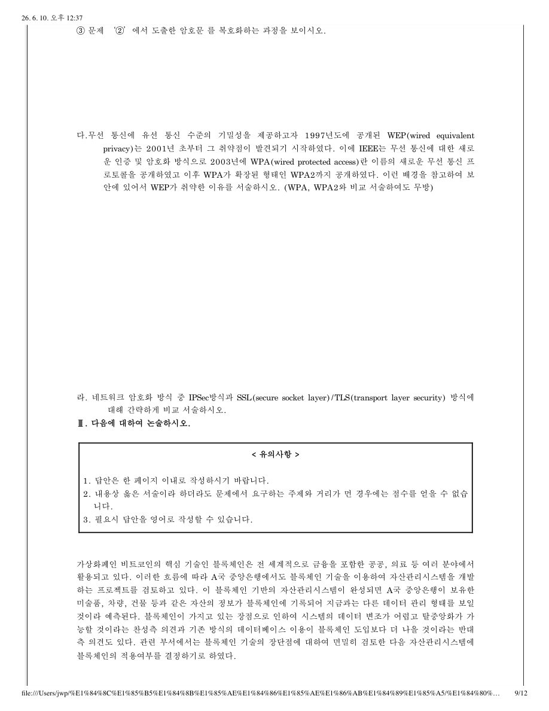

### 추출 텍스트

```text
③ 문제 ‘②’에서 도출한 암호문 를 복호화하는 과정을 보이시오.
다.무선 통신에 유선 통신 수준의 기밀성을 제공하고자 1997년도에 공개된 WEP(wired equivalent
privacy)는 2001년 초부터 그 취약점이 발견되기 시작하였다. 이에 IEEE는 무선 통신에 대한 새로
운 인증 및 암호화 방식으로 2003년에 WPA(wired protected access)란 이름의 새로운 무선 통신 프
로토콜을 공개하였고 이후 WPA가 확장된 형태인 WPA2까지 공개하였다. 이런 배경을 참고하여 보
안에 있어서 WEP가 취약한 이유를 서술하시오. (WPA, WPA2와 비교 서술하여도 무방)
라. 네트워크 암호화 방식 중 IPSec방식과 SSL(secure socket layer)/TLS(transport layer security) 방식에
대해 간략하게 비교 서술하시오.
Ⅲ. 다음에 대하여 논술하시오.
< 유의사항 >
1. 답안은 한 페이지 이내로 작성하시기 바랍니다.
2. 내용상 옳은 서술이라 하더라도 문제에서 요구하는 주제와 거리가 먼 경우에는 점수를 얻을 수 없습
니다.
3. 필요시 답안을 영어로 작성할 수 있습니다.
가상화폐인 비트코인의 핵심 기술인 블록체인은 전 세계적으로 금융을 포함한 공공, 의료 등 여러 분야에서
활용되고 있다. 이러한 흐름에 따라 A국 중앙은행에서도 블록체인 기술을 이용하여 자산관리시스템을 개발
하는 프로젝트를 검토하고 있다. 이 블록체인 기반의 자산관리시스템이 완성되면 A국 중앙은행이 보유한
미술품, 차량, 건물 등과 같은 자산의 정보가 블록체인에 기록되어 지금과는 다른 데이터 관리 형태를 보일
것이라 예측된다. 블록체인이 가지고 있는 장점으로 인하여 시스템의 데이터 변조가 어렵고 탈중앙화가 가
능할 것이라는 찬성측 의견과 기존 방식의 데이터베이스 이용이 블록체인 도입보다 더 나을 것이라는 반대
측 의견도 있다. 관련 부서에서는 블록체인 기술의 장단점에 대하여 면밀히 검토한 다음 자산관리시스템에
블록체인의 적용여부를 결정하기로 하였다.
26. 6. 10. 오후 12:37
file:///Users/jwp/%E1%84%8C%E1%85%B5%E1%84%8B%E1%85%AE%E1%84%86%E1%85%AE%E1%86%AB%E1%84%89%E1%85%A5/%E1%84%80%…
9/12
```


---

## Page 10

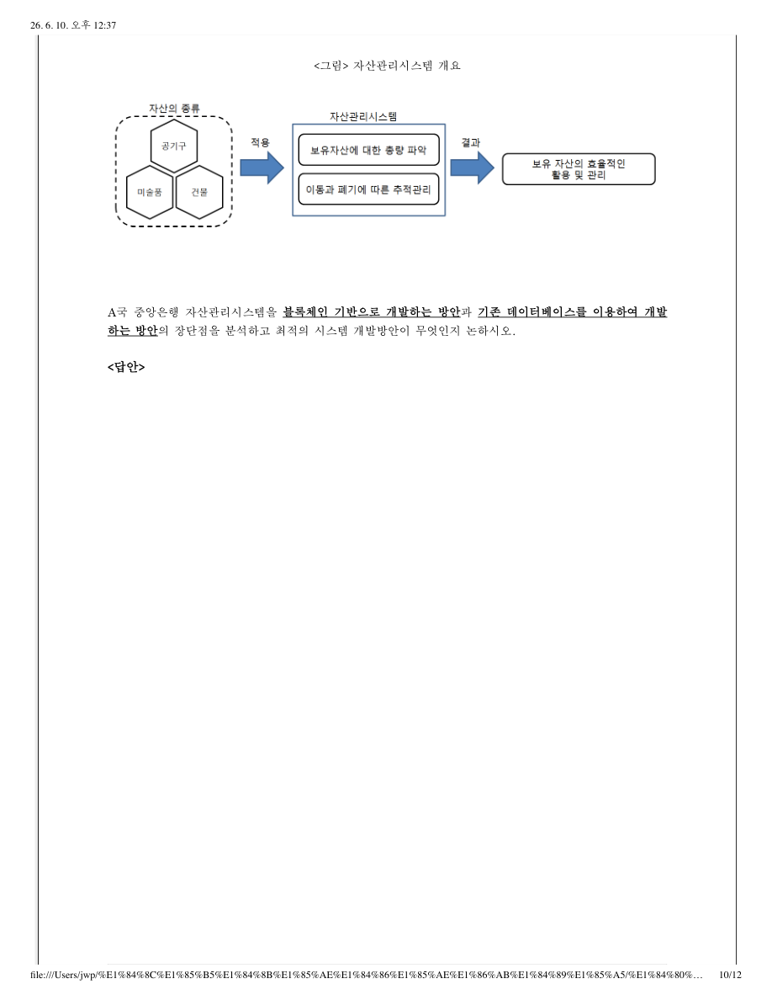

### 추출 텍스트

```text
<그림> 자산관리시스템 개요
A국 중앙은행 자산관리시스템을 블록체인 기반으로 개발하는 방안과 기존 데이터베이스를 이용하여 개발
하는 방안의 장단점을 분석하고 최적의 시스템 개발방안이 무엇인지 논하시오.
<답안>
26. 6. 10. 오후 12:37
file:///Users/jwp/%E1%84%8C%E1%85%B5%E1%84%8B%E1%85%AE%E1%84%86%E1%85%AE%E1%86%AB%E1%84%89%E1%85%A5/%E1%84%80%…
10/12
```


---

## Page 11

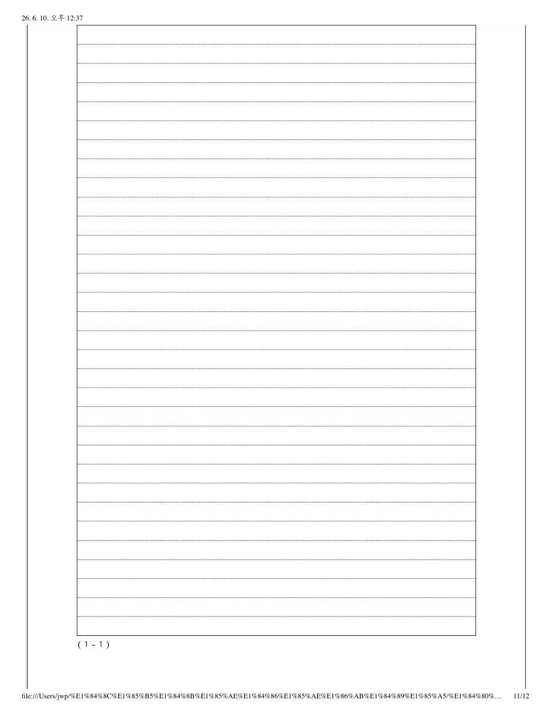

### 추출 텍스트

```text
( 1 - 1 )
26. 6. 10. 오후 12:37
file:///Users/jwp/%E1%84%8C%E1%85%B5%E1%84%8B%E1%85%AE%E1%84%86%E1%85%AE%E1%86%AB%E1%84%89%E1%85%A5/%E1%84%80%…
11/12
```


---

## Page 12


### 추출 텍스트

```text
26. 6. 10. 오후 12:37
file:///Users/jwp/%E1%84%8C%E1%85%B5%E1%84%8B%E1%85%AE%E1%84%86%E1%85%AE%E1%86%AB%E1%84%89%E1%85%A5/%E1%84%80%…
12/12
```
